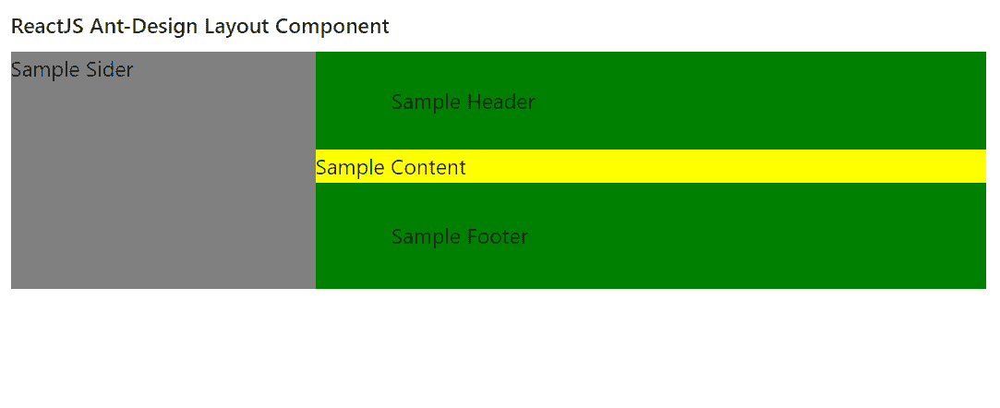

# ReactJS UI Ant 设计布局组件

> 原文:[https://www . geeksforgeeks . org/reactjs-ui-ant-design-layout-component/](https://www.geeksforgeeks.org/reactjs-ui-ant-design-layout-component/)

蚂蚁设计库预建了这个组件，也很容易集成。布局组件用于处理页面的整体布局。我们可以在 ReactJS 中使用以下方法来使用 Ant 设计布局组件。

**布局道具:**

*   **类名:**用于传递容器类名。
*   **hasSider:** 表示儿童体内是否含有 Sider。
*   **样式:**用于自定义样式。

**布局。侧面道具:**

*   **断点:**用于表示响应布局的断点。
*   **类名:**用于传递容器类名。
*   **折叠:**用于设置当前状态。
*   **折叠宽度:**用于表示折叠侧边栏的宽度。
*   **可折叠:**表示是否可以折叠。
*   **默认折叠:**用于设置初始状态。
*   **反转箭头:**用于反转箭头的方向，表示从右侧展开的边。
*   **样式:**用于自定义样式。
*   **主题:**用来表示侧边栏的 Color 主题。
*   **触发:**用于指定自定义触发。
*   **宽度:**用来表示侧边栏的宽度。
*   **零宽度触发器样式:**当 collapsedWidth 为 0 时，用于自定义特殊触发器的样式。
*   **onBreakpoint:** 是断点改变时触发的回调函数。
*   **肿瘤失效:**是点击触发器或激活响应布局时触发的回调函数。

**创建反应应用程序并安装模块:**

*   **步骤 1:** 使用以下命令创建一个反应应用程序:

    ```jsx
    npx create-react-app foldername
    ```

*   **步骤 2:** 创建项目文件夹(即文件夹名**)后，使用以下命令移动到该文件夹中:**

    ```jsx
    cd foldername
    ```

*   **步骤 3:** 创建 ReactJS 应用程序后，使用以下命令安装所需的****模块:****

    ```jsx
    **npm install antd**
    ```

******项目结构:**如下图。****

****

项目结构**** 

******示例:**现在在 **App.js** 文件中写下以下代码。在这里，App 是我们编写代码的默认组件。****

## ****App.js****

```jsx
**import React from 'react'
import "antd/dist/antd.css";
import { Layout } from 'antd';

const { Header, Footer, Sider, Content } = Layout;

export default function App() {

  return (
    <div style={{
      display: 'block', width: 700, padding: 30
    }}>
      <h4>ReactJS Ant-Design Layout Component</h4>
      <>
        <Layout>
          <Sider style={{ backgroundColor: 'grey' }}>
            Sample Sider
          </Sider>
          <Layout style={{ backgroundColor: 'lightblue' }}>
            <Header style={{ backgroundColor: 'green' }}>
              Sample Header
            </Header>
            <Content style={{ backgroundColor: 'yellow' }}>
              Sample Content
            </Content>
            <Footer style={{ backgroundColor: 'green' }}>
              Sample Footer
            </Footer>
          </Layout>
        </Layout>
      </>
    </div>
  );
}**
```

******运行应用程序的步骤:**从项目的根目录使用以下命令运行应用程序:****

```jsx
**npm start**
```

******输出:**现在打开浏览器，转到***http://localhost:3000/***，会看到如下输出:****

********

******参考:**T2】https://ant.design/components/layout/****