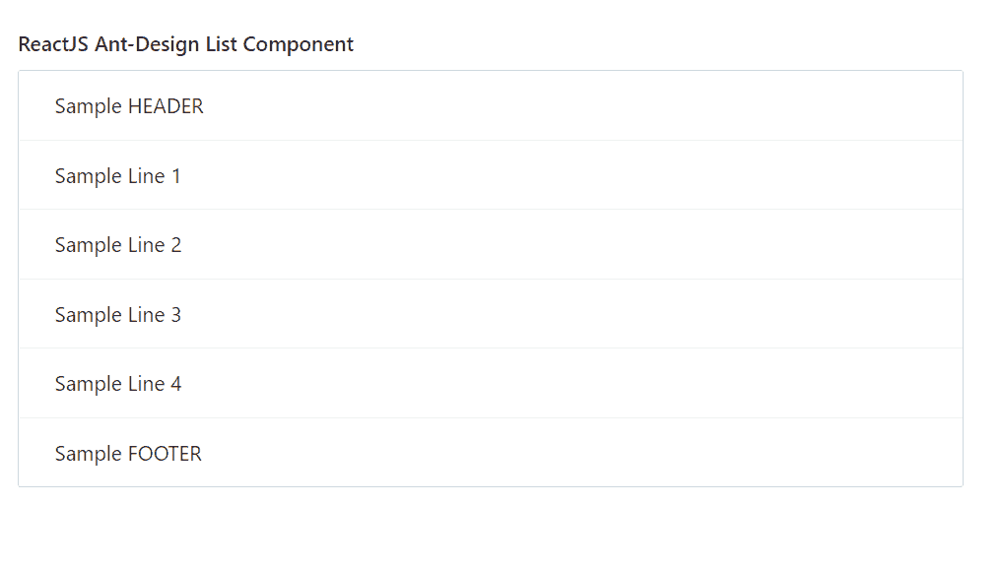

# 重新获取用户界面蚂蚁设计列表组件

> 原文:[https://www . geeksforgeeks . org/reactjs-ui-ant-design-list-component/](https://www.geeksforgeeks.org/reactjs-ui-ant-design-list-component/)

蚂蚁设计库预建了这个组件，也很容易集成。列表组件用于向用户显示一个简单的列表，可以使用显示与单个主题相关的内容。我们可以在 ReactJS 中使用以下方法来使用 Ant 设计列表组件。

**列出道具:**

*   **加边框:**用于切换列表周围边框的渲染。
*   **数据源:**用于表示列表的数据源数组。
*   **页脚:**用于列表页脚渲染器。
*   **网格:**用于表示列表的网格类型。
*   **头:**用于列表头渲染器。
*   **itemLayout:** 用于表示列表的布局。
*   **加载:**用于在取列表内容时显示加载指示符。
*   **loadMore:** 用于显示一个 loadMore 内容。
*   **地区:**是包含空文本的 *i18n* 文本。
*   **分页:**用于定义分页配置。
*   **renderItem:** 用于在使用数据源时自定义列表项。
*   **行键:**用于表示项目的唯一键。
*   **大小:**用于表示列表的大小。
*   **拆分:**用于切换列表项下拆分的渲染。

**页码命题:**

*   **位置:**用于指定分页的位置。

**列出格子道具:**

*   **列:**用于表示网格的列。
*   **天沟:**用于表示网格之间的间距。
*   **xs:** 用于电网的< 576px 柱。
*   **sm:** 用于电网≥576px 的列。
*   **md:** 用于电网≥768px 的列。
*   **lg:** 用于电网≥992px 的列。
*   **xl:** 用于电网≥1200px 的列。
*   **xxl:** 用于电网≥1600px 的列。

**列表。物品道具:**

*   **动作:**表示列表项的动作内容。
*   **extra:** 用于表示列表项的额外内容。

**列表。物品.元道具:**

*   **头像:**用于表示列表项的头像
*   **描述:**用于表示列表项的描述。
*   **标题:**用于表示列表项的标题。

**创建反应应用程序并安装模块:**

*   **步骤 1:** 使用以下命令创建一个反应应用程序:

    ```
    npx create-react-app foldername
    ```

*   **步骤 2:** 创建项目文件夹(即文件夹名**)后，使用以下命令移动到该文件夹中:**

    ```
    cd foldername
    ```

*   **步骤 3:** 创建 ReactJS 应用程序后，使用以下命令安装所需的****模块:****

    ```
    **npm install antd**
    ```

******项目结构:**如下图。****

****

项目结构**** 

******示例:**现在在 **App.js** 文件中写下以下代码。在这里，App 是我们编写代码的默认组件。****

## ****App.js****

```
**import React from 'react'
import "antd/dist/antd.css";
import { List } from 'antd';

export default function App() {
  return (
    <div style={{
      display: 'block', width: 700, padding: 30
    }}>
      <h4>ReactJS Ant-Design List Component</h4>
      <List
        header={<div>Sample HEADER</div>}
        footer={<div>Sample FOOTER</div>}
        bordered
        dataSource={[
          'Sample Line 1',
          'Sample Line 2',
          'Sample Line 3',
          'Sample Line 4',
        ]}
        renderItem={item => (
          <List.Item>
            {item}
          </List.Item>
        )}
      />
    </div>
  );
}**
```

******运行应用程序的步骤:**从项目的根目录使用以下命令运行应用程序:****

```
**npm start**
```

******输出:**现在打开浏览器，转到***http://localhost:3000/***，会看到如下输出:****

********

******参考:**T2】https://ant.design/components/list/****