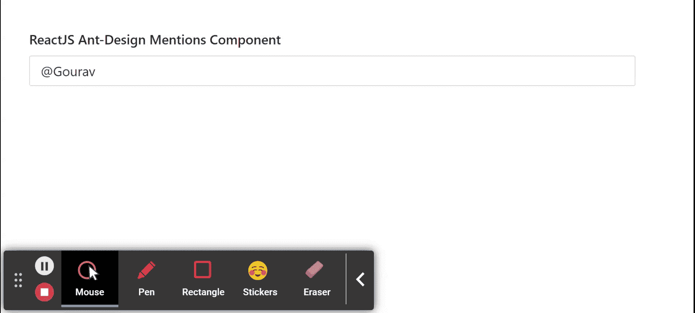

# 反应蚂蚁界面设计提及组件

> 原文:[https://www . geeksforgeeks . org/reactjs-ui-ant-design-attents-component/](https://www.geeksforgeeks.org/reactjs-ui-ant-design-mentions-component/)

蚂蚁设计库预建了这个组件，也很容易集成。提及组件用于提及目的，当用户需要提及某人或某事时使用。我们可以在 ReactJS 中使用以下方法来使用 Ant 设计提及组件。

**提到道具:**

*   **自动对焦:**用于设置组件挂载时的自动对焦。
*   **自动调整:**用于文本区域高度自动调整功能。
*   **默认值:**用于表示默认值。
*   **过滤选项:**用于通过自定义的过滤选项逻辑。
*   **getPopupContainer:** 用于设置建议的挂载 HTML 节点。
*   **notFoundContent:** 用于设置不匹配时的提及内容。
*   **放置:**用于设置弹出放置。
*   **前缀:**用于设置触发前缀关键字。
*   **拆分:**用于设置选中提及前后的拆分字符串。
*   **validateSearch:** 用于自定义触发搜索逻辑。
*   **值:**用于设置提及值。
*   **onbulr:**是一个回调函数，在提及失去焦点时触发。
*   **onChange:** 是值发生变化时触发的回调函数。
*   **onFocus:** 是一个回调函数，在提到获得焦点时触发。
*   **onResize:** 是 Textarea 调整大小时触发的回调函数。
*   **onSearch:** 是前缀命中时触发的回调函数。
*   **onSelect:** 是用户选择选项时触发的回调函数。

**选项道具:**

*   **儿童:**用于建议内容
*   **值:**用于表示建议的值，选择后该值将插入输入栏。

**方法:**

*   **模糊():**此功能用于去除焦点。
*   **focus():** 此功能用于获取焦点。

**创建反应应用程序并安装模块:**

*   **步骤 1:** 使用以下命令创建一个反应应用程序:

    ```
    npx create-react-app foldername
    ```

*   **步骤 2:** 创建项目文件夹(即文件夹名**)后，使用以下命令移动到该文件夹中:**

    ```
    cd foldername
    ```

*   **步骤 3:** 创建 ReactJS 应用程序后，使用以下命令安装所需的****模块:****

    ```
    **npm install antd**
    ```

******项目结构:**如下图。****

****

项目结构**** 

******示例:**现在在 **App.js** 文件中写下以下代码。在这里，App 是我们编写代码的默认组件。****

## ****App.js****

```
**import React from 'react'
import "antd/dist/antd.css";
import { Mentions } from 'antd';

const { Option } = Mentions;

export default function App() {

  return (
    <div style={{
      display: 'block', width: 700, padding: 30
    }}>
      <h4>ReactJS Ant-Design Mentions Component</h4>
      <>
        <Mentions
          defaultValue="@Gourav"
          onChange={(data) => {console.log(data)}}
          onSelect={(option)=> {console.log(option)}}
        >
          <Option value="Gourav">Gourav</Option>
          <Option value="Ashutosh">Ashutosh</Option>
          <Option value="Kartik">Kartik</Option>
          <Option value="Nikhil">Nikhil</Option>
        </Mentions>
      </>
    </div>
  );
}**
```

******运行应用程序的步骤:**从项目的根目录使用以下命令运行应用程序:****

```
**npm start**
```

******输出:**现在打开浏览器，转到***http://localhost:3000/***，会看到如下输出:****

********

******参考:**T2】https://ant.design/components/mentions/****