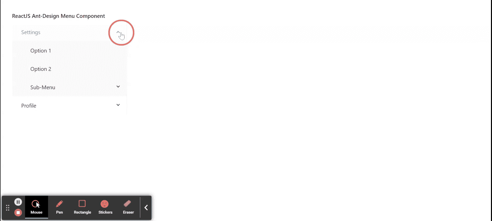

# 重新获取用户界面蚂蚁设计菜单组件

> 原文:[https://www . geeksforgeeks . org/reactjs-ui-ant-design-menu-component/](https://www.geeksforgeeks.org/reactjs-ui-ant-design-menu-component/)

蚂蚁设计库预建了这个组件，也很容易集成。菜单组件用于显示用于导航目的的多功能菜单。我们可以在 ReactJS 中使用以下方法来使用 Ant 设计菜单组件。

**命题菜单:**

*   **defaultOpenKeys:** 用默认打开的子菜单的按键表示数组。
*   **缺省选择键:**用于表示带有缺省选择菜单项的键的数组。
*   **扩展图标:**用于传递子菜单的自定义扩展图标。
*   **forcesubsurunder:**用于在渲染子菜单变得可见之前，强制渲染子菜单进入 DOM。
*   **内嵌折叠:**用于指定菜单处于内嵌模式时的折叠状态。
*   **内嵌缩进:**用于表示每一级内嵌菜单项的缩进量，单位为像素。
*   **模式:**用于表示菜单的类型。
*   **多个:**用于允许选择多个项目。
*   **打开键:**用于表示带有当前打开的子菜单的键的数组。
*   **overowedindicator:**用于菜单折叠时传递自定义图标。
*   **可选:**用于选择菜单项。
*   **selectedKeys:** 用于表示带有当前选中菜单项按键的数组。
*   **样式:**用于定义根节点的样式。
*   **submenucosedelay:**表示鼠标离开时隐藏子菜单的延迟时间，单位为秒。
*   **submenouopendelay:**表示鼠标进入时显示子菜单的延迟时间，单位为秒。
*   **主题:**用于定义菜单的颜色主题。
*   **触发子菜单动作:**是一个可以触发子菜单打开/关闭的回调函数。
*   **onClick:** 是一个回调函数，在点击菜单项时调用。
*   **on select:**是取消选择菜单项时调用的回调函数。
*   **onOpenChange:** 是打开或关闭子菜单时调用的回调函数。
*   **onSelect:** 是选择菜单项时调用的回调函数。

**菜单。项目建议:**

*   **危险:**用于显示危险样式。
*   **禁用:**用于指示菜单项是否禁用。
*   **图标:**用于传递菜单项的图标。
*   **键:**用于表示菜单项的唯一标识。
*   **标题:**用于设置折叠项的显示标题。

**菜单。子菜单道具:**

*   **子菜单:**用于表示子菜单或子菜单项。
*   **禁用:**表示子菜单是否禁用。
*   **图标:**用于传递子菜单的图标。
*   **键:**用于表示子菜单的唯一标识。
*   **popupClassName:** 用于表示子菜单类名。
*   **弹出菜单:**用于表示子菜单偏移。
*   **标题:**用于表示子菜单的标题。
*   **onTitleClick:** 是点击子菜单标题时触发的回调函数。

**菜单。item group props:t1]**

*   **儿童:**用于表示子菜单项。
*   **标题:**用来表示团体的名称。

**菜单。分隔线:**用作菜单项之间的 d 分隔线。该组件仅用于垂直弹出菜单或下拉菜单。

**创建反应应用程序并安装模块:**

*   **步骤 1:** 使用以下命令创建一个反应应用程序:

    ```
    npx create-react-app foldername
    ```

*   **步骤 2:** 创建项目文件夹(即文件夹名**)后，使用以下命令移动到该文件夹中:**

    ```
    cd foldername
    ```

*   **步骤 3:** 创建 ReactJS 应用程序后，使用以下命令安装所需的****模块:****

    ```
    **npm install antd**
    ```

******项目结构:**如下图。****

****

项目结构**** 

******示例:**现在在 **App.js** 文件中写下以下代码。在这里，App 是我们编写代码的默认组件。****

## ****App.js****

```
**import React from 'react';
import "antd/dist/antd.css";
import { Menu } from 'antd';

const { SubMenu } = Menu;

export default function App() {

  return (
    <div style={{
      display: 'block', width: 700, padding: 30
    }}>
      <h4>ReactJS Ant-Design Menu Component</h4>
      <Menu
        defaultOpenKeys={['1']}
        defaultSelectedKeys={['1']}
        style={{ width: 300 }}
        mode="inline"
      >
        <SubMenu key="1" title="Settings">
          <Menu.Item key="2">Option 1</Menu.Item>
          <Menu.Item key="3">Option 2</Menu.Item>
          <SubMenu key="4" title="Sub-Menu">
            <Menu.Item key="5">Option 3</Menu.Item>
            <Menu.Item key="6">Option 4</Menu.Item>
          </SubMenu>
        </SubMenu>
        <SubMenu key="7" title="Profile">
          <Menu.Item key="8">Option 5</Menu.Item>
          <Menu.Item key="9">Option 6</Menu.Item>
          <Menu.Item key="10">Option 7</Menu.Item>
          <Menu.Item key="11">Option 8</Menu.Item>
        </SubMenu>
      </Menu>
    </div>
  );
}**
```

******运行应用程序的步骤:**从项目的根目录使用以下命令运行应用程序:****

```
**npm start**
```

******输出:**现在打开浏览器，转到***http://localhost:3000/***，会看到如下输出:****

********

******参考:**T2】https://ant.design/components/menu/****