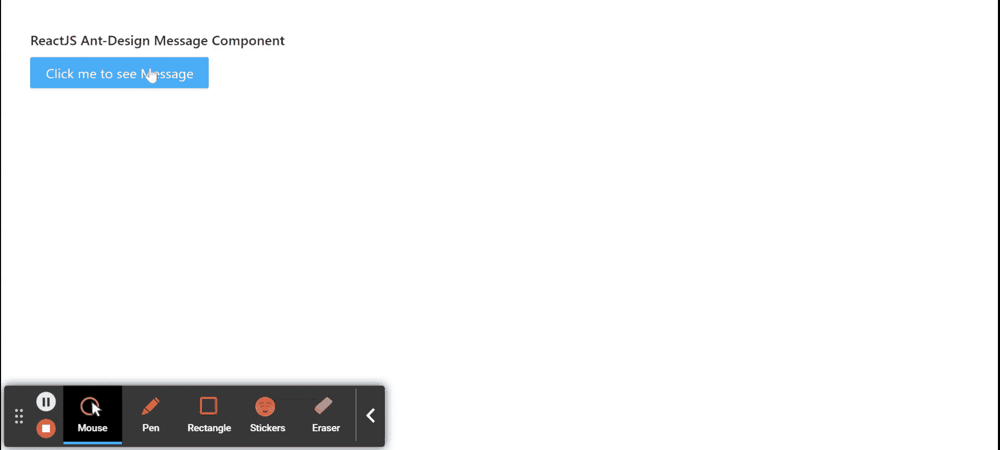

# 反应蚂蚁界面设计消息组件

> 原文:[https://www . geeksforgeeks . org/reactjs-ui-ant-design-message-component/](https://www.geeksforgeeks.org/reactjs-ui-ant-design-message-component/)

蚂蚁设计库预建了这个组件，也很容易集成。在响应用户操作的中，消息组件用于显示全局消息作为反馈 。我们可以在 ReactJS 中使用以下方法来使用 Ant 设计消息组件。

**消息道具:**

*   **内容:**用于表示消息的内容。
*   **持续时间:**用于表示自动关闭前的时间(秒)，设置为 0 则不关闭。
*   **onClose:** 是消息关闭时触发的回调函数。

**消息配置道具:**

*   **类名:**用于自定义 CSS 类。
*   **内容:**用于表示消息的内容。
*   **持续时间:**用于表示自动关闭前的时间(秒)，设置为 0 则不关闭。
*   **图标:**用于自定义图标。
*   **键:**用于报文的唯一标识。
*   **样式:**用于定制的直列样式。
*   **onClick:** 是点击消息时触发的回调函数。
*   **onClose:** 是消息关闭时触发的回调函数。

**消息配置默认道具:**

*   **持续时间:**用于表示自动关闭前的时间(秒)。
*   **getContainer:** 用于返回 Message 的挂载节点。
*   **最大计数:**用于表示最大消息显示。
*   **前缀:**用于消息节点的前缀类名。
*   **rtl:** 表示是否启用 rtl 模式。
*   **顶部:**用于表示距顶部的距离。

**全局静态法:**

*   **message.config(选项):**此方法用于消息的全局配置。它将选项对象作为参数，其道具如上所述(参见消息配置默认道具)。
*   **message.destroy():** 此方法用于删除消息。此方法不接受任何参数。

**创建反应应用程序并安装模块:**

*   **步骤 1:** 使用以下命令创建一个反应应用程序:

    ```jsx
    npx create-react-app foldername
    ```

*   **步骤 2:** 创建项目文件夹(即文件夹名**)后，使用以下命令移动到该文件夹中:**

    ```jsx
    cd foldername
    ```

*   **步骤 3:** 创建 ReactJS 应用程序后，使用以下命令安装所需的****模块:****

    ```jsx
    **npm install antd**
    ```

******项目结构:**如下图。****

****

项目结构**** 

******示例:**现在在 **App.js** 文件中写下以下代码。在这里，App 是我们编写代码的默认组件。****

## ****App.js****

```jsx
**import React from 'react'
import "antd/dist/antd.css";
import { Button, message } from 'antd';

export default function App() {

  return (
    <div style={{
      display: 'block', width: 700, padding: 30
    }}>
      <h4>ReactJS Ant-Design Message Component</h4>
      <>
        <Button type="primary" 
          onClick={() => {
          message.info('Message Content!');
          }}
        >
        Click me to see Message
        </Button>
      </>
    </div>
  );
}**
```

******运行应用程序的步骤:**从项目的根目录使用以下命令运行应用程序:****

```jsx
**npm start**
```

******输出:**现在打开浏览器，转到***http://localhost:3000/***，会看到如下输出:****

********

******参考:**T2】https://ant.design/components/message/****