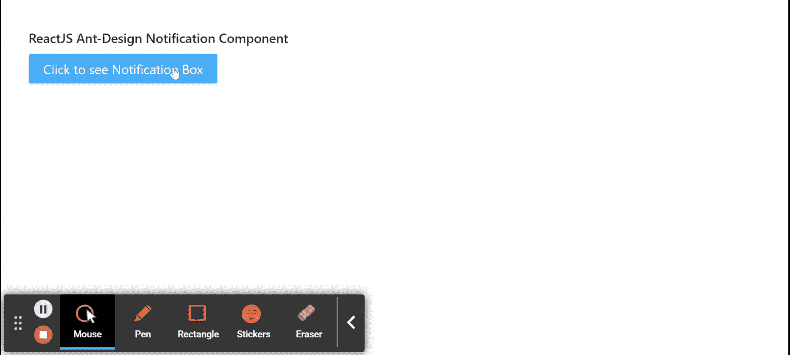

# 重新获取用户界面蚂蚁设计通知组件

> 原文:[https://www . geeksforgeeks . org/reactjs-ui-ant-design-notification-component/](https://www.geeksforgeeks.org/reactjs-ui-ant-design-notification-component/)

蚂蚁设计库预建了这个组件，也很容易集成。通知组件用于全局显示通知消息。我们可以在 ReactJS 中使用以下方法来使用 Ant 设计通知组件。

**通知配置道具:**

*   **底部:**当位置为*右下*或*左下*时，用于表示与视口底部的距离。
*   **btn:** 用于自定义关闭按钮。
*   **类名:**用于自定义 CSS 类。
*   **关闭图标:**用于自定义关闭图标。
*   **说明:**用于表示通知框的内容。
*   **时长:**用于设置通知关闭前的时间。单位是秒。
*   **getContainer:** 用于返回通知的挂载节点。
*   **图标:**用于自定义图标。
*   **键:**用于通知的唯一标识。
*   **消息:**用于表示通知框的标题。
*   **放置:**用于放置通知。值可以是*顶部、顶部右侧、底部左侧、*和*底部右侧*。
*   **样式:**用于定制的直列样式。
*   **顶部:**当放置在*顶部*或*顶部时，i* t 用于表示与视口顶部的距离。
*   **onClick:** 是点击通知时触发的回调函数。
*   **onClose:** 是通知关闭时触发的回调函数。

**通知默认配置道具:**

*   **底部:**当位置为*右下*或*左下*时，用于表示与视口底部的距离。
*   **关闭图标:**用于自定义关闭图标。
*   **时长:**用于设置通知关闭前的时间。单位是秒。
*   **getContainer:** 用于返回通知的挂载节点。
*   **放置:**用于放置通知。值可以是*顶部、顶部右侧、底部左侧、*和*底部右侧*。
*   **rtl:** 表示是否启用 rtl 模式。
*   **顶部:**当放置在*顶部*或*顶部时，i* t 用于表示与视口顶部的距离。

**创建反应应用程序并安装模块:**

*   **步骤 1:** 使用以下命令创建一个反应应用程序:

    ```
    npx create-react-app foldername
    ```

*   **步骤 2:** 创建项目文件夹(即文件夹名**)后，使用以下命令移动到该文件夹中:**

    ```
    cd foldername
    ```

*   **步骤 3:** 创建 ReactJS 应用程序后，使用以下命令安装所需的****模块:****

    ```
    **npm install antd**
    ```

******项目结构:**如下图。****

****

项目结构**** 

******示例:**现在在 **App.js** 文件中写下以下代码。在这里，App 是我们编写代码的默认组件。****

## ****App.js****

```
**import React from 'react'
import "antd/dist/antd.css";
import { Button, notification } from 'antd';

export default function App() {
  return (
    <div style={{
      display: 'block', width: 700, padding: 30
    }}>
      <h4>ReactJS Ant-Design Notification Component</h4>
      <Button type="primary" onClick={() => {
        notification.open({
          message: 'Sample-Notification-Title',
          description:
            'Sample Notification Description',
          onClick: () => {
            console.log('Notification Clicked!');
          },
        });
      }}>
        Click to see Notification Box
      </Button>
    </div>
  );
}**
```

******运行应用程序的步骤:**从项目的根目录使用以下命令运行应用程序:****

```
**npm start**
```

******输出:**现在打开浏览器，转到***http://localhost:3000/***，会看到如下输出:****

********

******参考:**T2】https://ant.design/components/notification/****