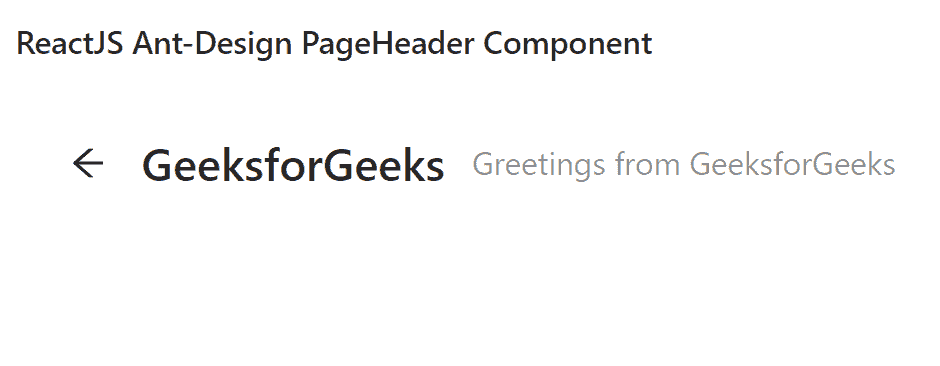

# 重新获取用户界面蚂蚁设计页面标题组件

> 原文:[https://www . geeksforgeeks . org/reactjs-ui-ant-design-page header-component/](https://www.geeksforgeeks.org/reactjs-ui-ant-design-pageheader-component/)

蚂蚁设计库预建了这个组件，也很容易集成。页面标题组件是一个标题，具有内置的常用动作和设计元素。我们可以在 ReactJS 中使用以下方法来使用 Ant 设计页面标题组件。

**语法:**

```
<PageHeader
  onBack={() => {
          // Action on click
        }}
        title=""
        subTitle=" "
        className=" "
/>

```

**页眉道具：**

*   **头像:**就是标题栏旁边的头像。
*   **后退图标:**是自定义后退图标。
*   **面包屑:**用于传递面包屑配置。
*   **面包屑渲染:**用于自定义面包屑区域的内容。
*   **额外:**位于标题行末尾的操作区
*   **页脚:**是页眉页脚，一般用于渲染 TabBar。
*   **ghost:** 是 PageHeader 类型，用于改变背景颜色。
*   **字幕:**用于表示字幕的自定义文本。
*   **标签:**用于表示标题旁边的标签列表
*   **标题:**用于表示标题的自定义文本。
*   **onBack:** 是点击后退图标触发的回调。

**创建反应应用程序并安装模块:**

*   **步骤 1:** 使用以下命令创建一个反应应用程序:

    ```
    npx create-react-app foldername
    ```

*   **步骤 2:** 创建项目文件夹后，即文件夹名称**，**使用以下命令移动到项目文件夹:

    ```
    cd foldername
    ```

*   **步骤 3:** 创建 ReactJS 应用程序后，使用以下命令安装所需的****模块:****

    ```
    **npm install antd**
    ```

******项目结构:**如下图。****

****

项目结构**** 

******示例:**现在在 **App.js** 文件中写下以下代码。在这里，App 是我们编写代码的默认组件。****

## ****App.js****

```
**import React from 'react'
import "antd/dist/antd.css";
import { PageHeader } from 'antd';

export default function App() {

  return (
    <div style={{ display: 'block', width: 700, padding: 30 }}>
      <h4>ReactJS Ant-Design PageHeader Component</h4>
      <PageHeader
        onBack={() => {
          console.log("Action you can perform on Click on Back button")
        }}
        title="GeeksforGeeks"
        subTitle="Greetings from GeeksforGeeks"
        className="site-page-header"
      />
    </div>
  );
}**
```

******运行应用程序的步骤:**从项目的根目录使用以下命令运行应用程序:****

```
**npm start**
```

******输出:**现在打开浏览器，转到***http://localhost:3000/***，会看到如下输出:****

********

******参考:**T2】https://ant.design/components/page-header/****