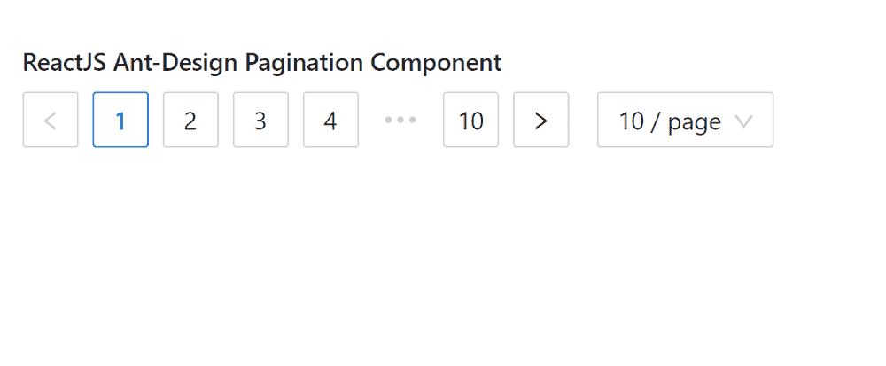

# 重新获取用户界面蚂蚁设计分页组件

> 原文:[https://www . geeksforgeeks . org/reactjs-ui-ant-design-paging-component/](https://www.geeksforgeeks.org/reactjs-ui-ant-design-pagination-component/)

蚂蚁设计库预建了这个组件，也很容易集成。分页组件允许用户通过的下一页和上一页按钮，在显示页码和 在 之间切换 页面。我们可以在 ReactJS 中使用以下方法来使用 Ant 设计分页组件。

**语法:**

```jsx
<Pagination defaultCurrent={ } total={ } />

```

**页码命题:**

*   **当前:**用于表示当前页码的值。
*   **缺省当前:**用于表示初始页码的默认值。
*   **defaultPageSize:** 用于表示每页数据项个数的默认值。
*   **禁用:**用于禁用分页。
*   **隐藏单页:**用于指示是否在单页上隐藏寻呼机。
*   **itemRender:** 用于自定义项目的 innerHTML 内容。
*   **页面大小:**用于表示每页数据项个数的值。
*   **页面大小选项:**用于指定大小转换器的选项。
*   **响应式:**用于在未指定大小的情况下，允许分页根据窗口宽度进行调整。
*   **显示较少的项目:**用于显示较少的项目，即较少的页面项目。
*   **showQuickJumper:** 用于表示是否可以直接跳转到页面。
*   **显示大小改变器:**用于指示是否显示页面大小选择。
*   **显示标题:**用于表示是否显示页面项目的标题。
*   **显示总数:**用于显示游侠和总数。
*   **简单:**表示是否使用简单模式。
*   **大小:**用于指定分页的大小。
*   **total:** 用于表示数据项总数的值。
*   **onChange:** 是页码或页面大小改变时触发的回调函数。
*   **onShowSizeChange:** 是页面大小改变时触发的回调函数。

**创建反应应用程序并安装模块:**

*   **步骤 1:** 使用以下命令创建一个反应应用程序:

    ```jsx
    npx create-react-app foldername
    ```

*   **步骤 2:** 创建项目文件夹后，即文件夹名称**，**使用以下命令移动到项目文件夹:

    ```jsx
    cd foldername
    ```

*   **步骤 3:** 创建 ReactJS 应用程序后，使用以下命令安装所需的****模块:****

    ```jsx
    **npm install antd**
    ```

******项目结构:**如下图。****

****

项目结构**** 

******示例:**现在在 **App.js** 文件中写下以下代码。在这里，App 是我们编写代码的默认组件。****

## ****App.js****

```jsx
**import React from 'react'
import "antd/dist/antd.css";
import { Pagination } from 'antd';

export default function App() {

  return (
    <div style={{ display: 'block', width: 700, padding: 30 }}>
      <h4>ReactJS Ant-Design Pagination Component</h4>
      <Pagination defaultCurrent={1} total={100} />
    </div>
  );
}**
```

******运行应用程序的步骤:**从项目的根目录使用以下命令运行应用程序:****

```jsx
**npm start**
```

******输出:**现在打开浏览器，转到***http://localhost:3000/***，会看到如下输出:****

********

******参考:**T2】https://ant.design/components/pagination/****