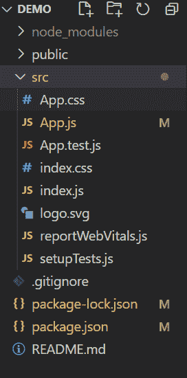

# 反应蚂蚁界面设计程序确认组件

> 原文:[https://www . geeksforgeeks . org/reactjs-ui-ant-design-pop confirm-component/](https://www.geeksforgeeks.org/reactjs-ui-ant-design-popconfirm-component/)

Popconfirm 是一个简单而紧凑的动作确认对话框。基本上是用来要求用户确认的。

蚂蚁设计库已经预建了这个组件，它也很容易集成。我们可以使用下面的过程轻松地使用这个 Popconfirm 组件。

**语法:**

```
<Popconfirm
   title="Open Popconfirm?"
   onConfirm={confirm}
   onCancel={cancel}
   okText="Yes"
   cancelText="No"
 >
   <a href="#">Open Popconfirm</a>
 </Popconfirm>
```

**Popconfirm 属性:**

*   **取消按钮道具:**该属性用于  取消按钮道具
*   **取消文本:**此属性用于取消按钮的文本
*   **禁用:**此属性将在单击其子节点时显示 popconfirm
*   **图标:**该属性用于确认的自定义图标
*   **ok 按钮道具:**该属性用于 ok 按钮道具
*   **确定文本:**该属性将显示确认按钮的文本
*   **确定类型:**该属性用于识别确认按钮的按钮类型
*   **标题:**该属性用于确认框的标题
*   **onCancel:** 这个属性是取消的回调
*   **onConfirm:** 这个属性是确认的回调

**创建反应应用程序并安装模块:**

*   **步骤 1:** 使用以下命令创建一个 React 应用程序。

    ```
    npx create-react-app demo
    ```

*   **步骤 2:** 创建项目文件夹(即演示)后，使用以下命令移动到该文件夹。

    ```
    cd demo
    ```

*   **步骤 3** :创建 ReactJS 应用程序后，使用以下命令安装 antd 库。

    ```
    npm install antd
    ```

**项目结构:**


**示例:**现在在 filename app.js 中编写以下代码。

## app.js

```
import { Popconfirm, message } from "antd";
import "./App.css";
import "antd/dist/antd.css";

function App() {
  function confirm(e) {
    console.log(e);
    message.success("Click on Yes");
  }

  function cancel(e) {
    console.log(e);
    message.error("Click on No");
  }
  return (
    <div className="App">
      <div style={{ padding: "100px" }}>
        <h1>Demo for Popconfirm</h1>
        <Popconfirm
          title="Are you sure to delete this task?"
          onConfirm={confirm}
          onCancel={cancel}
          okText="Yes"
          cancelText="No"
        >
          <a href="#">Delete</a>
        </Popconfirm>
      </div>
    </div>
  );
}

export default App;
```

**运行应用程序:**使用以下命令运行应用程序。

```
npm start
```

**输出:**现在打开浏览器，转到 **http://localhost:3000/** ，会看到如下输出。


**参考链接:**[https://ant.design/components/popconfirm/](https://ant.design/components/popconfirm/)