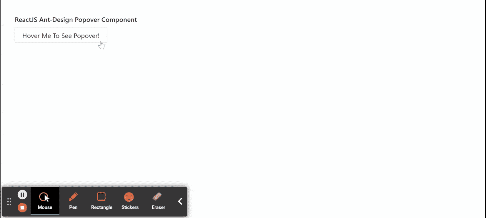

# 重新获取用户界面蚂蚁设计弹出组件

> 原文:[https://www . geeksforgeeks . org/reactjs-ui-ant-design-Popo ver-component/](https://www.geeksforgeeks.org/reactjs-ui-ant-design-popover-component/)

蚂蚁设计库预建了这个组件，也很容易集成。Popover Component 用作浮动卡，通过单击或悬停在元素上弹出。我们可以在 ReactJS 中使用以下方法来使用 Ant 设计 Popover 组件。

**Popover 道具:**

*   **内容:**用于表示卡片的内容。
*   **标题:**用来表示卡片的标题。

**创建反应应用程序并安装模块:**

*   **步骤 1:** 使用以下命令创建一个反应应用程序:

    ```jsx
    npx create-react-app foldername
    ```

*   **步骤 2:** 在创建项目文件夹(即文件夹名**)后，使用以下命令将**移动到该文件夹:

    ```jsx
    cd foldername
    ```

*   **步骤 3:** 创建 ReactJS 应用程序后，使用以下命令安装所需的****模块:****

    ```jsx
    **npm install antd**
    ```

******项目结构:**如下图。****

****

项目结构**** 

******示例:**现在在 **App.js** 文件中写下以下代码。在这里，App 是我们编写代码的默认组件。****

## ****App.js****

```jsx
**import React from 'react'
import "antd/dist/antd.css";
import { Popover, Button } from 'antd';

const contentDIV = (
  <div>
    <h6>Greeting from GeeksforGeeks.</h6>
    <h8>Work Hard!</h8>
  </div>
);

export default function App() {
  return (
    <div style={{
      display: 'block', width: 700, padding: 30
    }}>
      <h4>ReactJS Ant-Design Popover Component</h4>
      <Popover content={contentDIV}
               title="Sample Popover Title">
        <Button type="warning">
         Hover Me To See Popover!
        </Button>
      </Popover>
    </div>
  );
}**
```

******运行应用程序的步骤:**从项目的根目录使用以下命令运行应用程序:****

```jsx
**npm start**
```

******输出:**现在打开浏览器，转到***http://localhost:3000/***，会看到如下输出:****

********

******参考:**T2】https://ant.design/components/popover/****