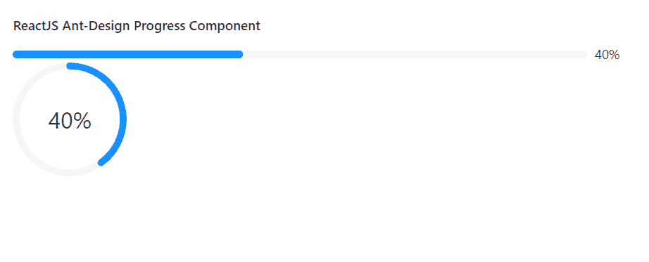

# ReactJS UI Ant 设计进度组件

> 原文:[https://www . geeksforgeeks . org/reactjs-ui-ant-design-progress-component/](https://www.geeksforgeeks.org/reactjs-ui-ant-design-progress-component/)

蚂蚁设计库预建了这个组件，也很容易集成。进度组件用于显示操作流程的当前进度。我们可以在 ReactJS 中使用以下方法来使用 Ant 设计进度组件。

**进度道具:**

*   **格式:**作为内容的模板函数。
*   **百分比:**用于设置完成百分比。
*   **显示信息:**表示是否显示进度值和状态图标。
*   **状态:**用于设置进度的状态。
*   **strokeColor:** 用于表示进度条颜色。
*   **strokeLinecap:** 用于设置进度线帽样式。
*   **成功:**用于成功进度条的配置。
*   **trailColor:** 用于设置未填充部分的颜色。
*   **类型:**用于设置类型。

**type="line "道具:**

*   **步骤:**用于表示总集数。
*   **strokeColor:** 用于表示进度条颜色。
*   **strokeWidth:** 用于设置进度条宽度。

**type="circle "道具:**

*   **strokeColor:** 用于表示循环进度颜色。
*   **strokeWidth:** 用于设置循环进度宽度。
*   **宽度:**用于设置循环进度的画布宽度。

**type= "仪表盘"道具:**

*   **间隙度:**用于表示半圆的间隙度。
*   **间隙位置:**用于表示间隙位置。
*   **strokeWidth:** 用于设置仪表盘进度宽度。
*   **宽度:**用于设置仪表盘进度的画布宽度。

**创建反应应用程序并安装模块:**

*   **步骤 1:** 使用以下命令创建一个反应应用程序:

    ```jsx
    npx create-react-app foldername
    ```

*   **步骤 2:** 创建项目文件夹(即文件夹名**)后，使用以下命令移动到该文件夹中:**

    ```jsx
    cd foldername
    ```

*   **步骤 3:** 创建 ReactJS 应用程序后，使用以下命令安装所需的****模块:****

    ```jsx
    **npm install antd**
    ```

******项目结构:**如下图。****

****

项目结构**** 

******示例:**现在在 **App.js** 文件中写下以下代码。在这里，App 是我们编写代码的默认组件。****

## ****App.js****

```jsx
**import React from 'react'
import "antd/dist/antd.css";
import { Progress } from 'antd';

export default function App() {

  return (
    <div style={{
      display: 'block', width: 700, padding: 30
    }}>
      <h4>ReactJS Ant-Design Progress Component</h4>
      <Progress percent={40} />
      <Progress type="circle" percent={40} />
    </div>
  );
}**
```

******运行应用程序的步骤:**从项目的根目录使用以下命令运行应用程序:****

```jsx
**npm start**
```

******输出:**现在打开浏览器，转到***http://localhost:3000/***，会看到如下输出:****

********

******参考:**T2】https://ant.design/components/progress/****