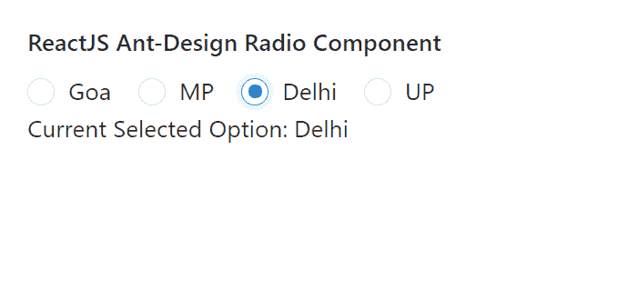

# ReactJS UI Ant 设计无线电组件

> 原文:[https://www . geeksforgeeks . org/reactjs-ui-ant-design-radio-component/](https://www.geeksforgeeks.org/reactjs-ui-ant-design-radio-component/)

蚂蚁设计库预建了这个组件，也很容易集成。无线电组件允许用户从一组中选择一个选项。我们可以在 ReactJS 中使用以下方法来使用 Ant 设计无线电组件。

**无线电方式:**

*   **blur():** 此方法用于去除元素的焦点。
*   **focus():** 此方法用于获取元素的焦点。

**无线电道具:**

*   **自动对焦:**用于安装组件时对焦。
*   **已检查:**表示收音机是否被选择。
*   **默认勾选:**用于指定收音机是否被选中的初始状态。
*   **禁用:**用于禁用收音机。
*   **值:**用于表示所选单选按钮的值。

**RadioGroup 道具:**

*   **按钮样式:**用于表示单选按钮的样式类型。
*   **默认值:**用于定义单选按钮的默认选定值。
*   **禁用:**用于禁用所有单选按钮。
*   **名称:**用于定义所有输入子对象的名称属性，这些子对象的类型为单选*。*
*   **选项:**用于设置孩子可选。
*   **选项类型:**用于指定收音机的选项类型。
*   **大小:**用来表示收音机的大小。
*   **值:**用于设置当前选择的值。
*   **onChange:** 是状态变化时触发的回调函数。

**创建反应应用程序并安装模块:**

*   **步骤 1:** 使用以下命令创建一个反应应用程序:

    ```
    npx create-react-app foldername
    ```

*   **步骤 2:** 创建项目文件夹(即文件夹名**)后，使用以下命令移动到该文件夹中:**

    ```
    cd foldername
    ```

*   **步骤 3:** 创建 ReactJS 应用程序后，使用以下命令安装所需的****模块:****

    ```
    **npm install antd**
    ```

******项目结构:**如下图。****

****

项目结构**** 

******示例:**现在在 **App.js** 文件中写下以下代码。在这里，App 是我们编写代码的默认组件。****

## ****App.js****

```
**import React, { useState } from 'react'
import "antd/dist/antd.css";
import { Radio } from 'antd';

export default function App() {

  const [currentValue, setCurrentValue] = useState("Goa")

  return (
    <div style={{ display: 'block', width: 700, padding: 30 }}>
      <h4>ReactJS Ant-Design Radio Component</h4>  
      <Radio.Group onChange={(e) => {
        setCurrentValue(e.target.value)
      }} value={currentValue}>
        <Radio value={"Goa"}>Goa</Radio>
        <Radio value={"MP"}>MP</Radio>
        <Radio value={"Delhi"}>Delhi</Radio>
        <Radio value={"UP"}>UP</Radio>
      </Radio.Group> <br />
      Current Selected Option: {currentValue}
    </div>
  );
}**
```

******运行应用程序的步骤:**从项目的根目录使用以下命令运行应用程序:****

```
**npm start**
```

******输出:**现在打开浏览器，转到***http://localhost:3000/***，会看到如下输出:****

********

******参考:**T2】https://ant.design/components/radio/****