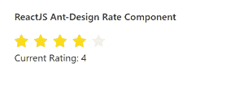

# 反应界面蚂蚁设计率组件

> 原文:[https://www . geeksforgeeks . org/reactjs-ui-ant-design-rate-component/](https://www.geeksforgeeks.org/reactjs-ui-ant-design-rate-component/)

蚂蚁设计库预建了这个组件，也很容易集成。评级组件以评级 的形式帮助捕捉用户反馈。我们可以在 ReactJS 中使用以下方法来使用 Ant 设计速率组件。

**评分方法:**

*   **blur():** 此方法用于去除元素的焦点。
*   **focus():** 此方法用于获取元素的焦点。

**等级道具:**

*   **allowClear:** 用于指定用户再次点击时是否允许清除评级。
*   **allowalf:**表示是否允许评级半选。
*   **自动对焦:**用于在安装组件时获得对焦。
*   **字符:**用于表示费率的自定义字符。
*   **类名:**用于指定费率的类名。
*   **计数:**用于表示开始计数。
*   **默认值:**用于定义费率的默认值。
*   **禁用:**用于禁用组件。
*   **样式:**用于指定费率的自定义样式对象。
*   **工具提示:**用于每个角色自定义工具提示。
*   **值:**用于表示当前值。
*   **onbulr:**是组件失去焦点时触发的回调函数。
*   **onChange:** 是选择值时触发的回调函数。
*   **onFocus:** 是组件获得焦点时触发的回调函数。
*   **on overchange:**是一个回调函数，在项目悬停时触发。
*   **onKeyDown:** 是一个回调函数，在组件上按键时触发

**创建反应应用程序并安装模块:**

*   **步骤 1:** 使用以下命令创建一个反应应用程序:

    ```
    npx create-react-app foldername
    ```

*   **步骤 2:** 创建项目文件夹(即文件夹名**)后，使用以下命令移动到该文件夹中:**

    ```
    cd foldername
    ```

*   **步骤 3:** 创建 ReactJS 应用程序后，使用以下命令安装所需的****模块:****

    ```
    **npm install antd**
    ```

******项目结构:**如下图。****

****

项目结构**** 

******示例:**现在在 **App.js** 文件中写下以下代码。在这里，App 是我们编写代码的默认组件。****

## ****App.js****

```
**import React, { useState } from 'react'
import "antd/dist/antd.css";
import { Rate } from 'antd';

export default function App() {

  const [currentValue, setCurrentValue] = useState(2)

  return (
    <div style={{ display: 'block', width: 700, padding: 30 }}>
      <h4>ReactJS Ant-Design Rate Component</h4>
      <Rate onChange={(value) => {
        setCurrentValue(value)
      }} value={currentValue} /> <br />
      Current Rating: {currentValue}
    </div>
  );
}**
```

******运行应用程序的步骤:**从项目的根目录使用以下命令运行应用程序:****

```
**npm start**
```

******输出:**现在打开浏览器，转到***http://localhost:3000/***，会看到如下输出:****

********

******参考:**T2】https://ant.design/components/rate/****