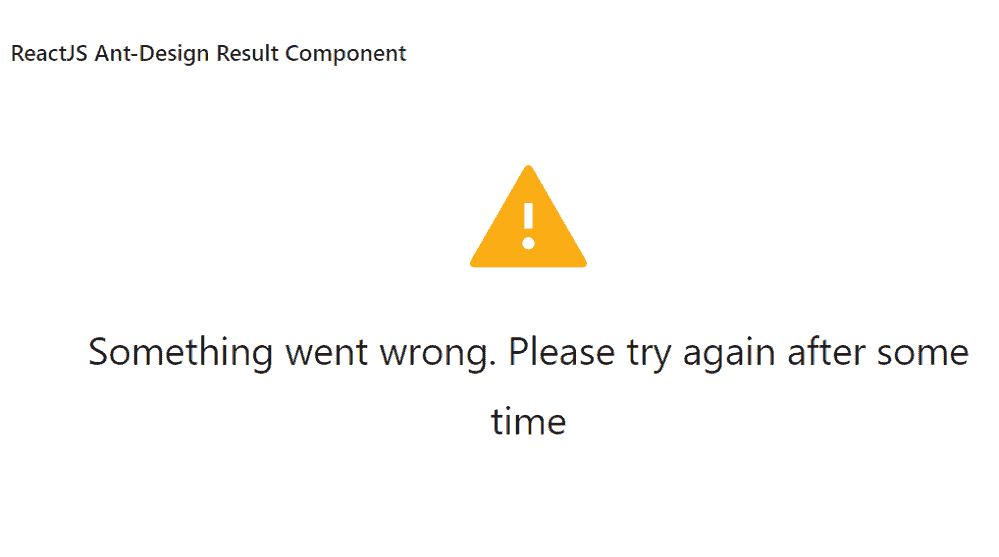

# 重新获取界面蚂蚁设计结果组件

> 原文:[https://www . geeksforgeeks . org/reactjs-ui-ant-design-result-component/](https://www.geeksforgeeks.org/reactjs-ui-ant-design-result-component/)

蚂蚁设计库预建了这个组件，也很容易集成。结果组件用于向反馈一系列作战任务的结果。我们可以在 ReactJS 中使用以下方法来使用 Ant 设计词缀组件。

**结果道具:**

*   **extra:** 用于定义操作区域。
*   **图标:**用于传递自定义后退图标。
*   **状态:**用于表示结果状态、颜色和判定图标。
*   **字幕:**用于定义字幕。
*   **标题:**用于定义标题。

**创建反应应用程序并安装模块:**

*   **步骤 1:** 使用以下命令创建一个反应应用程序:

    ```jsx
    npx create-react-app foldername
    ```

*   **步骤 2:** 在创建项目文件夹(即文件夹名**)后，使用以下命令将**移动到该文件夹:

    ```jsx
    cd foldername
    ```

*   **步骤 3:** 创建 ReactJS 应用程序后，使用以下命令安装所需的模块:

    ```jsx
    npm install antd
    ```

**项目结构:**如下图。


项目结构

**示例:**现在在 **App.js** 文件中写下以下代码。在这里，App 是我们编写代码的默认组件。

## App.js

```jsx
import React from 'react'
import "antd/dist/antd.css";
import { Result } from 'antd';

export default function App() {
  return (
    <div style={{
      display: 'block', width: 700, padding: 30
    }}>
      <h4>ReactJS Ant-Design Result Component</h4>
      <Result
        status="warning"
        title="Something went wrong. Please try again after some time"
      />
    </div>
  );
}
```

**运行应用程序的步骤:**从项目的根目录使用以下命令运行应用程序:

```jsx
npm start
```

**输出:**现在打开浏览器，转到***http://localhost:3000/***，会看到如下输出:



**参考:**T2】https://ant.design/components/result/