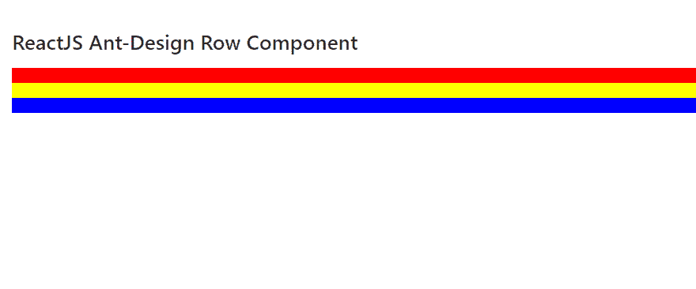
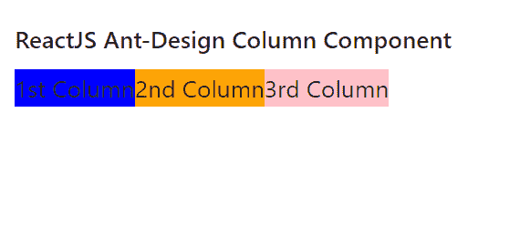

# 重新获取用户界面蚂蚁设计行和列组件

> 原文:[https://www . geeksforgeeks . org/reactjs-ui-ant-design-row-and-col-component/](https://www.geeksforgeeks.org/reactjs-ui-ant-design-row-and-col-component/)

蚂蚁设计库预建了这个组件，也很容易集成。**行**组件T5提供在网格系统中代表一行的方式，用于以行 的形式显示数据。 **列**组件  提供了在网格系统中表示一个列的方式，用于以 列的形式显示数据。我们可以在 ReactJS 中使用以下方法来使用 Ant 设计行和列组件。

**排道具:**

*   **对齐:**用于内容垂直对齐。
*   **【天沟:** 用来表示网格之间的间距。
*   **调整:**用于内容的水平排列。
*   **换行:**用于自动换行。

**Col 道具:**

*   **flex:** 用于表示 flex 布局样式。
*   **偏移量:**用于表示向左偏移 Col 的单元格数。
*   **顺序:**用于栅格顺序。
*   **拉动:**用于表示栅格向左移动的像元数。
*   **push:** 用于表示栅格向右移动的像元数。
*   **span:** 用于栅格要占用的像元数。
*   **xs:** 用于表示分辨率为< 576 像素的超小型设备上要跨越的列数。
*   **sm:** 用于表示分辨率 ≥ 576 像素的小型设备上要跨越的列数。
*   **md:** 用于表示分辨率 ≥ 768 像素的中等设备上要跨越的列数。
*   **lg:** 用于表示分辨率≥ 992 像素的大型设备上要跨越的列数。
*   **xl:** 用于表示分辨率 ≥ 1200 像素的超大设备上要跨越的列数。
*   **xxl:** 用于表示分辨率 ≥ 1600 像素的超大设备上要跨越的列数。

**创建反应应用程序并安装模块:**

*   **步骤 1:** 使用以下命令创建一个反应应用程序:

    ```jsx
    npx create-react-app foldername
    ```

*   **步骤 2:** 创建项目文件夹(即文件夹名**)后，使用以下命令移动到该文件夹中:**

    ```jsx
    cd foldername
    ```

*   **步骤 3:** 创建 ReactJS 应用程序后，使用以下命令安装所需的****模块:****

    ```jsx
    **npm install antd**
    ```

******项目结构:**如下图。****

****

项目结构**** 

******行组件示例:**现在在 **App.js** 文件中写下以下代码。在这里，App 是我们编写代码的默认组件。****

## ****App.js****

```jsx
**import React from 'react'
import "antd/dist/antd.css";
import { Row } from 'antd';

export default function App() {

  return (
    <div style={{ display: 'block', width: 700, padding: 30 }}>
      <h4>ReactJS Ant-Design Row Component</h4>
      <Row style={{backgroundColor: 'red', 
           width: '100%', height: 10}}></Row>
      <Row style={{backgroundColor: 'yellow', 
           width: '100%', height: 10}}></Row>
      <Row style={{backgroundColor: 'blue', 
           width: '100%', height: 10}}></Row>
    </div>
  );
}**
```

******运行应用程序的步骤:**从项目的根目录使用以下命令运行应用程序:****

```jsx
**npm start**
```

******输出:**现在打开浏览器，转到***http://localhost:3000/***，会看到如下输出:****

********

******列组件示例:**现在在 **App.js** 文件中写下以下代码。在这里，App 是我们编写代码的默认组件。****

## ****App.js****

```jsx
**import React from 'react'
import "antd/dist/antd.css";
import { Row, Col } from 'antd';

export default function App() {

  return (
    <div style={{ display: 'block',
                  width: 700, padding: 30 }}>
      <h4>ReactJS Ant-Design Column Component</h4>
      <Row>
        <Col style={{
          backgroundColor: 'blue',
        }}>
          1st Column
        </Col>
        <Col style={{
          backgroundColor: 'orange',
        }}>
          2nd Column
        </Col>
        <Col style={{
          backgroundColor: 'pink',
        }}>
          3rd Column
        </Col>
      </Row>
    </div>
  );
}**
```

******运行应用程序的步骤:**从项目的根目录使用以下命令运行应用程序:****

```jsx
**npm start**
```

******输出:**现在打开浏览器，转到***http://localhost:3000/***，会看到如下输出:****

********

******参考:******

*   ****[https://ant.design/components/grid/#Row](https://ant.design/components/grid/#Row)****
*   ****[https://ant.design/components/grid/#Col](https://ant.design/components/grid/#Col)****