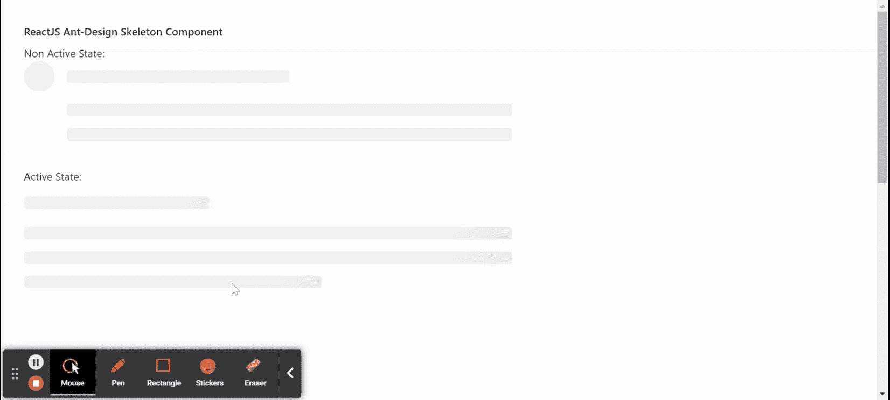

# ReactJS UI Ant 设计骨架组件

> 原文:[https://www . geeksforgeeks . org/reactjs-ui-ant-design-skeleton-component/](https://www.geeksforgeeks.org/reactjs-ui-ant-design-skeleton-component/)

蚂蚁设计库预建了这个组件，也很容易集成。只要数据没有加载，就使用骨架组件。它用于在加载内容时提供占位符。我们可以在 ReactJS 中使用以下方法来使用 Ant 设计框架组件。

**骷髅道具:**

*   **激活:**用于显示动画效果。
*   **头像:**用于显示头像占位符。
*   **加载:**设置为真时显示骨架。
*   **段落:**用于显示段落占位符。
*   **round:** 设置为 true 时显示段落和标题半径。
*   **标题:**用于显示标题占位符。

**骷髅。头像道具:**

*   **激活:**用于显示动画效果。
*   **形状:**用于设置头像的形状。
*   **大小:**用于设置头像的大小。

**骷髅。标题道具:**

*   **宽度:**用于设置标题的宽度。

**骷髅。段落道具:**

*   **行:**用于设置段落的行数。
*   **宽度:**用于设置段落宽度。

**骷髅。按钮道具:**

*   **激活:**用于显示动画效果。
*   **形状:**用于设置按钮的形状。
*   **大小:**用于设置按钮的大小。

**骷髅。输入道具:**

*   **激活:**用于显示动画效果。
*   **大小:**用于设置输入的大小。

**创建反应应用程序并安装模块:**

*   **步骤 1:** 使用以下命令创建一个反应应用程序:

    ```
    npx create-react-app foldername
    ```

*   **步骤 2:** 在创建项目文件夹(即文件夹名**)后，使用以下命令将**移动到该文件夹:

    ```
    cd foldername
    ```

*   **步骤 3:** 创建 ReactJS 应用程序后，使用以下命令安装所需的****模块:****

    ```
    **npm install antd**
    ```

******项目结构:**如下图。****

****

项目结构**** 

******示例:**现在在 **App.js** 文件中写下以下代码。在这里，App 是我们编写代码的默认组件。****

## ****App.js****

```
**import React from 'react'
import "antd/dist/antd.css";
import { Skeleton } from 'antd';

export default function App() {
  return (
    <div style={{
      display: 'block', width: 700, padding: 30, height: 1000,
    }}>
      <h4>ReactJS Ant-Design Skeleton Component</h4>
      Non Active State: <Skeleton avatar paragraph={{ rows: 2 }} /> <br />
      Active State: <Skeleton active />  <br />
    </div>
  );
}**
```

******运行应用程序的步骤:**从项目的根目录使用以下命令运行应用程序:****

```
**npm start**
```

******输出:**现在打开浏览器，转到***http://localhost:3000/***，会看到如下输出:****

********

******参考:**T2】https://ant.design/components/skeleton/****