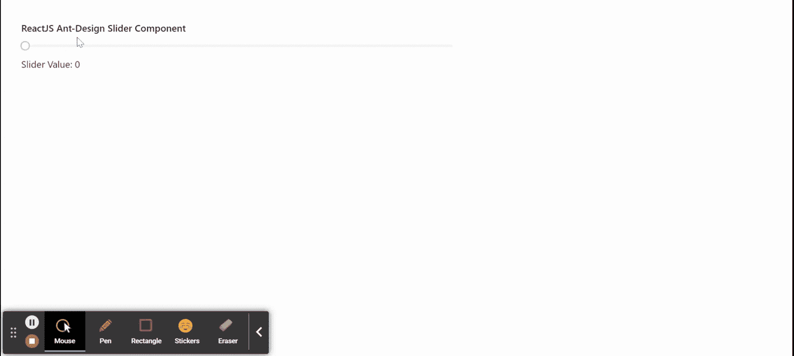

# 重新获取用户界面蚂蚁设计滑块组件

> 原文:[https://www . geeksforgeeks . org/reactjs-ui-ant-design-slider-component/](https://www.geeksforgeeks.org/reactjs-ui-ant-design-slider-component/)

蚂蚁设计库预建了这个组件，也很容易集成。当用户想要从一系列值中进行选择时使用的滑块组件。我们可以在 ReactJS 中使用以下方法来使用 Ant 设计滑块组件。

**滑块方法:**

*   **blur():** 此方法用于去除元素的焦点。
*   **focus():** 此方法用于获取元素的焦点。

**滑块道具:**

*   **自动对焦:**用于在安装组件时获得对焦。
*   **默认值:**用作滑块的默认值。
*   **禁用:**用于禁用滑块。
*   **点:**表示拇指是否只能拖过勾号。
*   **gettooltipopupcontainer:**用于工具提示的 DOM 容器。
*   **包含:**用于标记不为空时产生效果。
*   **标记:**用于定义滑块的刻度线。
*   **max:** 用于表示滑块可以滑动的最大值。
*   **min:** 用于表示滑块可以滑动的最小值。
*   **范围:**用于双拇指模式。
*   **反转:**用于反转组件。
*   **步进:**用于指示滑块可以步进值的粒度。
*   **tipFormatter:** 它用于滑块，以便将它的值传递给 tipFormatter。
*   **工具提示位置:**用于设置工具提示显示位置。
*   **工具提示可见:**表示是否显示工具提示。
*   **值:**用于表示滑块的值。
*   **垂直:**用于指示是否将滑块设置为垂直。
*   **onAfterChange:** 是触发 *onmouseup* 事件时触发的回调函数。
*   **onChange:** 是用户改变滑块值时触发的回调函数。

**范围道具:**

*   **draggableTrack:** 用于表示距离轨迹是否可以拖动。

**创建反应应用程序并安装模块:**

*   **步骤 1:** 使用以下命令创建一个反应应用程序:

    ```
    npx create-react-app foldername
    ```

*   **步骤 2:** 在创建项目文件夹(即文件夹名**)后，使用以下命令将**移动到该文件夹:

    ```
    cd foldername
    ```

*   **步骤 3:** 创建 ReactJS 应用程序后，使用以下命令安装所需的****模块:****

    ```
    **npm install antd**
    ```

******项目结构:**如下图。****

****

项目结构**** 

******示例:**现在在 **App.js** 文件中写下以下代码。在这里，App 是我们编写代码的默认组件。****

## ****java 描述语言****

```
**import React, { useState } from 'react'
import "antd/dist/antd.css";
import { Slider } from 'antd';

export default function App() {

  // State to hold our current value
  const [currentValue, setCurrentValue] = useState(0)

  return (
    <div style={{
      display: 'block', width: 700, padding: 30
    }}>
      <h4>ReactJS Ant-Design Slider Component</h4>
      <Slider defaultValue={0} disabled={false} max={100} onChange={(value)=> {
        setCurrentValue(value)
      }}/>
      Slider Value: {currentValue}
    </div>
  );
}**
```

******运行应用程序的步骤:**从项目的根目录使用以下命令运行应用程序:****

```
**npm start**
```

******输出:**现在打开浏览器，转到***http://localhost:3000/***，会看到如下输出:****

********

******参考:**T2】https://ant.design/components/slider/****