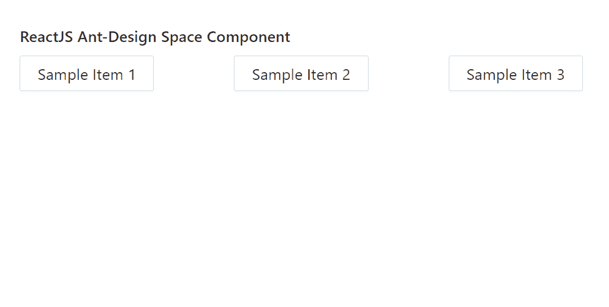

# ReactJS UI Ant 设计空间组件

> 原文:[https://www . geeksforgeeks . org/reactjs-ui-ant-design-space-component/](https://www.geeksforgeeks.org/reactjs-ui-ant-design-space-component/)

蚂蚁设计库预建了这个组件，也很容易集成。空间组件  提供一种设置组件间距 的方式。我们可以在 ReactJS 中使用以下方法来使用 Ant 设计空间组件。

**语法:**

```
<Space>
  Component
</Space>
```

**空间道具:**

*   **对齐:**用于对齐项目。
*   **方向:**用来表示空间的方向。
*   **大小:**用于表示空间大小。
*   **拆分:**用于设置拆分。
*   **换行:**用于自动换行。

**创建反应应用程序并安装模块:**

*   **步骤 1:** 使用以下命令创建一个反应应用程序:

    ```
    npx create-react-app foldername
    ```

*   **步骤 2:** 创建项目文件夹后，即文件夹名称**，**使用以下命令移动到项目文件夹:

    ```
    cd foldername
    ```

*   **步骤 3:** 创建 ReactJS 应用程序后，使用以下命令安装所需的****模块:****

    ```
    **npm install antd**
    ```

******项目结构:**如下图。****

****

项目结构**** 

******示例:**现在在 **App.js** 文件中写下以下代码。在这里，App 是我们编写代码的默认组件。****

## ****App.js****

```
**import React from 'react'
import "antd/dist/antd.css";
import { Space, Button } from 'antd';

export default function App() {

  return (
    <div style={{ display: 'block', width: 700, padding: 30 }}>
      <h4>ReactJS Ant-Design Space Component</h4>
      <Space size="large">
        <Button>Sample Item 1</Button> <br />
        <Button>Sample Item 2</Button> <br />
        <Button>Sample Item 3</Button> <br />
      </Space>
    </div>
  );
}**
```

******运行应用程序的步骤:**从项目的根目录使用以下命令运行应用程序:****

```
**npm start**
```

******输出:**现在打开浏览器，转到***http://localhost:3000/***，会看到如下输出:****

********

******参考:**T2】https://ant.design/components/space/****