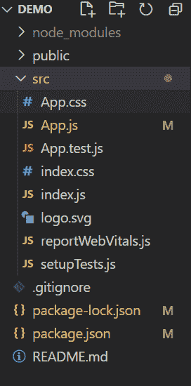
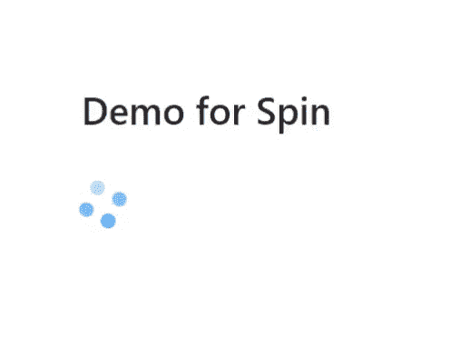

# 反应蚂蚁界面设计旋转组件

> 原文:[https://www . geeksforgeeks . org/reactjs-ui-ant-design-spin-component/](https://www.geeksforgeeks.org/reactjs-ui-ant-design-spin-component/)

微调器用于显示项目中页面或部分的加载状态。它基本上是在页面等待异步数据时或者在渲染过程中使用的，一个合适的加载动画可以有效缓解用户的不安。

蚂蚁设计库已经预建了这个组件，它也很容易集成。我们可以使用下面的方法轻松地使用这个自旋组件。

**语法:**

```jsx
<Spin />
```

**自旋属性:**

*   **延迟:**定义加载动画的延迟时间，单位为毫秒。
*   **指示器:**旋转指示器的反应节点。
*   **大小:**定义微调器的大小，即小、默认和大。
*   **旋转:**这是一个布尔值，定义旋转是否应该旋转。
*   **提示:【Spin 有孩子时自定义描述内容。**
*   **wrapperClassName:** 指定 Spin 有子级时包装器的类名。

**创建反应应用程序:**

**步骤 1:** 使用以下命令创建一个反应应用程序:

```jsx
npx create-react-app demo
```

**步骤 2:** 创建反应应用程序后，使用以下命令进入该应用程序:

```jsx
cd demo
```

**步骤 3** :现在使用以下命令安装 **antd** 库:

```jsx
npm install antd
```

**项目结构:**如下图。



**示例:**现在在 **App.js** 文件中写下以下代码。在这里，App 是我们编写代码的默认组件。

## App.js

```jsx
import { Spin } from "antd";
import "./App.css";
import "antd/dist/antd.css";

function App() {
  return (
    <div className="App">
      <div style={{ padding: "100px" }}>
        <h1 style={{ marginBottom: "2rem" }}>
          Demo for Spin
        </h1>
        <Spin size="large" />
      </div>
    </div>
  );
}

export default App;
```

**运行应用程序的步骤:**从项目的根目录使用以下命令运行应用程序。

```jsx
npm start
```

**输出:**现在打开浏览器，转到***http://localhost:3000/***，会看到如下输出。



**参考:**T2】https://ant.design/components/spin/