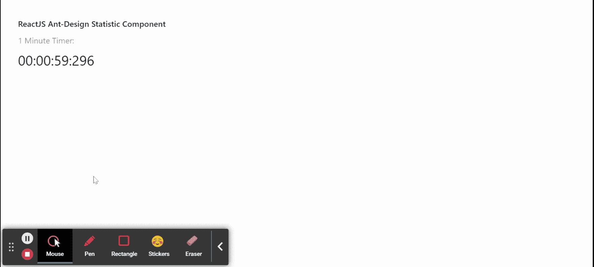

# 反应蚂蚁界面设计统计组件

> 原文:[https://www . geeksforgeeks . org/reactjs-ui-ant-design-statistics-component/](https://www.geeksforgeeks.org/reactjs-ui-ant-design-statistic-component/)

蚂蚁设计库预建了这个组件，也很容易集成。当我们想要显示统计数据数字时，使用统计组件。可以在  应用程序中使用，这些应用程序必须显示统计数据，如游戏应用程序用于分数、板球分数网站等。我们可以在 ReactJS 中使用以下方法来使用 Ant 设计统计组件。

**统计道具:**

*   **十进制分隔符:**用于表示十进制分隔符。
*   **格式化程序:**用于自定义数值显示逻辑。
*   **组分隔符:**用于表示组分隔符。
*   **加载:**表示统计的加载状态。
*   **精度:**用于设置输入值的精度。
*   **前缀:**用于表示值的前缀节点。
*   **后缀:**用于表示值的后缀节点。
*   **标题:**用于描述显示标题。
*   **值:**用于表示显示值。
*   **valueStyle:** 用于设置 CSS 样式的值。

**统计。倒计时道具:**

*   **格式:**用于表示矩的格式。
*   **前缀:**用于表示值的前缀节点。
*   **后缀:**用于表示值的后缀节点。
*   **标题:**用于描述显示标题。
*   **值:**用于设置目标倒计时时间。
*   **valueStyle:** 用于设置 CSS 样式的值。
*   **onFinish:** 是一个回调函数，时间到了就触发。
*   **onChange:** 时间变化时触发。

**创建反应应用程序并安装模块:**

*   **步骤 1:** 使用以下命令创建一个反应应用程序:

    ```
    npx create-react-app foldername
    ```

*   **步骤 2:** 在创建项目文件夹(即文件夹名**)后，使用以下命令将**移动到该文件夹:

    ```
    cd foldername
    ```

*   **步骤 3:** 创建 ReactJS 应用程序后，使用以下命令安装所需的****模块:****

    ```
    **npm install antd**
    ```

******项目结构:**如下图。****

****

项目结构**** 

******示例:**现在在 **App.js** 文件中写下以下代码。在这里，App 是我们编写代码的默认组件。****

## ****App.js****

```
**import React from 'react'
import "antd/dist/antd.css";
import { Statistic } from 'antd';

const { Countdown } = Statistic;
const deadline = Date.now() + 1000 * 60 ; 

export default function App() {
  return (
    <div style={{
      display: 'block', width: 700, padding: 30
    }}>
      <h4>ReactJS Ant-Design Statistic Component</h4>
      <Countdown title="1 Minute Timer:" 
        value={deadline} 
      format="HH:mm:ss:SSS" />
    </div>
  );
}**
```

******运行应用程序的步骤:**从项目的根目录使用以下命令运行应用程序:****

```
**npm start**
```

******输出:**现在打开浏览器，转到***http://localhost:3000/***，会看到如下输出:****

********

******参考:**T2】https://ant.design/components/statistic/****