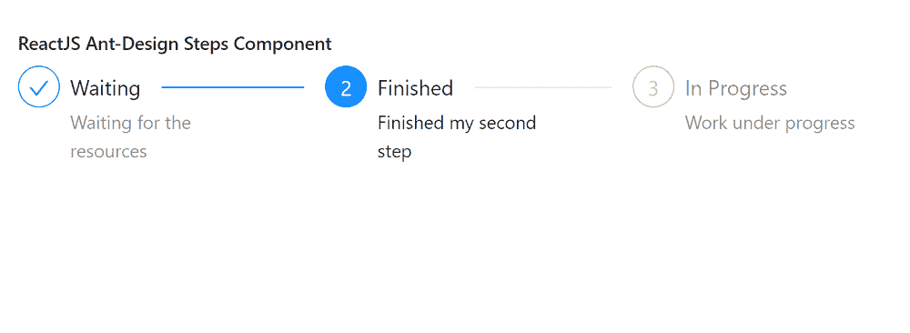

# 重新获取用户界面蚂蚁设计步骤组件

> 原文:[https://www . geeksforgeeks . org/reactjs-ui-ant-design-steps-component/](https://www.geeksforgeeks.org/reactjs-ui-ant-design-steps-component/)

蚂蚁设计库预建了这个组件，也很容易集成。Steps Component 是一种导航栏，它通过引导用户完成任务的步骤 来帮助。我们可以在 ReactJS 中使用以下方法来使用 Ant 设计步骤组件。

**语法:**

```
<Steps current={ }>
  <Step title=" " 
           description=" " />
  <Step title=" " 
           description=" " />
</Steps>

```

**脚步道具:**

*   **类名:**用于定义该组件的附加类。
*   **电流:**从 0 开始计数，设置当前步数。
*   **方向:**用于指定踏步栏的方向，垂直或水平。
*   **初始:**用于从 0 开始计数，设置初始步长。
*   **labelPlacement:** 用于在垂直或水平方向放置标题和描述。
*   **百分比:**用于表示流程状态下当前步骤的进度圈百分比。
*   **进度点:**用于应用进度点样式的步骤。
*   **响应式:**用于屏幕宽度小于 532 像素时改为垂直方向。
*   **尺寸:**用于指定步杆的尺寸。
*   **状态:**用于指定当前步骤的状态。
*   **类型:**用于表示步骤的类型。
*   **onChange:** 是一个回调函数，在步骤改变时触发。

**步数。步骤道具:**

*   **描述:**用于定义步骤的描述。
*   **禁用:**用于禁用点击事件。
*   **图标:**用于定义步骤的图标。
*   **状态:**用于指定状态。
*   **副标题:**用于表示该步骤的副标题。
*   **标题:**用于表示步骤的标题。

**创建反应应用程序并安装模块:**

*   **步骤 1:** 使用以下命令创建一个反应应用程序:

    ```
    npx create-react-app foldername
    ```

*   **步骤 2:** 创建项目文件夹后，即文件夹名称**，**使用以下命令移动到项目文件夹:

    ```
    cd foldername
    ```

*   **步骤 3:** 创建 ReactJS 应用程序后，使用以下命令安装所需的****模块:****

    ```
    **npm install antd**
    ```

******项目结构:**如下图。****

****

项目结构**** 

******示例:**现在在 **App.js** 文件中写下以下代码。在这里，App 是我们编写代码的默认组件。****

## ****App.js****

```
**import React from 'react'
import "antd/dist/antd.css";
import { Steps } from 'antd';

const { Step } = Steps;
export default function App() {

  return (
    <div style={{ display: 'block', width: 700, padding: 30 }}>
      <h4>ReactJS Ant-Design Steps Component</h4>
      <Steps current={1}>
        <Step title="Waiting" 
              description="Waiting for the resources" />
        <Step title="Finished" 
              description="Finished my second step" />
        <Step title="In Progress" 
              description="Work under progress" />
      </Steps>
    </div>
  );
}**
```

******运行应用程序的步骤:**从项目的根目录使用以下命令运行应用程序:****

```
**npm start**
```

******输出:**现在打开浏览器，转到***http://localhost:3000/***，会看到如下输出:****

********

******参考:**T2】https://ant.design/components/steps/****