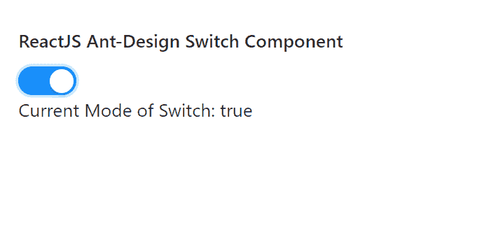

# 反应界面蚂蚁设计开关组件

> 原文:[https://www . geeksforgeeks . org/reactjs-ui-ant-design-switch-component/](https://www.geeksforgeeks.org/reactjs-ui-ant-design-switch-component/)

蚂蚁设计库预建了这个组件，也很容易集成。开关组件是用来 切换单个设置的状态开或关。我们可以在 ReactJS 中使用以下方法来使用 Ant 设计开关组件。

**切换方式:**

*   **blur():** 此方法用于去除元素的焦点。
*   **focus():** 此方法用于获取元素的焦点。

**切换道具:**

*   **自动对焦:**用于安装组件时对焦。
*   **已检查:**表示开关是否检查。
*   **checkedChildren:** 是勾选状态时要显示的内容。
*   **类名:**用于传递该交换机的类名。
*   **默认勾选:**表示是否设置初始状态。
*   **禁用:**用于禁用开关。
*   **加载:**用于显示开关的加载状态。
*   **大小:**用来表示开关的大小。
*   **unCheckedChildren:** 是未选中状态时要显示的内容。
*   **onChange:** 是状态变化时触发的回调函数。
*   **onClick:** 是点击事件触发的回调函数。

**创建反应应用程序并安装模块:**

*   **步骤 1:** 使用以下命令创建一个反应应用程序:

    ```
    npx create-react-app foldername
    ```

*   **步骤 2:** 创建项目文件夹(即文件夹名**)后，使用以下命令移动到该文件夹中:**

    ```
    cd foldername
    ```

*   **步骤 3:** 创建 ReactJS 应用程序后，使用以下命令安装所需的****模块:****

    ```
    **npm install antd**
    ```

******项目结构:**如下图。****

****

项目结构**** 

******示例:**现在在 **App.js** 文件中写下以下代码。在这里，App 是我们编写代码的默认组件。****

## ****App.js****

```
**import React, { useState } from 'react'
import "antd/dist/antd.css";
import { Switch } from 'antd';

export default function App() {

  const [currentValue, setCurrentValue] = useState(false)

  return (
    <div style={{ display: 'block', width: 700, padding: 30 }}>
      <h4>ReactJS Ant-Design Switch Component</h4>
      <Switch onChange={(value) => {
        setCurrentValue(value)
      }} /> <br />
      <p>Current Mode of Switch: {`${currentValue}`} </p>

    </div>
  );
}**
```

******运行应用程序的步骤:**从项目的根目录使用以下命令运行应用程序:****

```
**npm start**
```

******输出:**现在打开浏览器，转到***http://localhost:3000/***，会看到如下输出:****

********

******参考:**T2】https://ant.design/components/switch/****