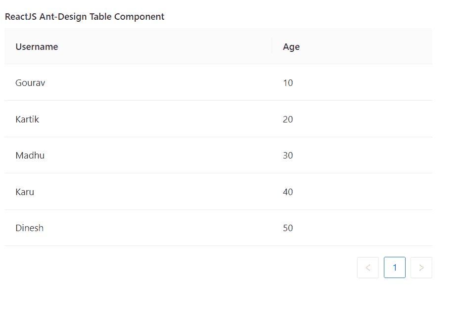

# ReactJS UI Ant 设计表组件

> 原文:[https://www . geeksforgeeks . org/reactjs-ui-ant-design-table-component/](https://www.geeksforgeeks.org/reactjs-ui-ant-design-table-component/)

蚂蚁设计库预建了这个组件，也很容易集成。ReactJS UI Ant 设计表组件用于显示数据行。它用于以表格格式显示数据。我们可以在 ReactJS 中使用以下方法来使用 Ant 设计表组件。

**桌面道具:**

*   **加边框:**表示是否显示所有表格边框。
*   **列:**用于表示表格的列。
*   **组件:**用于覆盖默认表格元素，
*   **数据源:**用于表示要显示的数据记录数组。
*   **可扩展:**用于配置可扩展内容。
*   **页脚:**用于表示表格页脚渲染器。
*   **getPopupContainer:** 是表中下拉的渲染容器。
*   **加载:**用于表示表格的加载状态。
*   **区域设置:**是包含过滤、排序、空文本等的 i18n 文本。
*   **分页:**用于分页的配置。
*   **行类名:**用于表示行的类名。
*   **rowKey:** 用于表示行的唯一键。
*   **行选择:**用于表示行选择配置。
*   **滚动:**表示表格是否可以滚动。
*   **显示表头:**表示是否显示表头。
*   **showsortertoltip:**用于表头显示下一个分拣方向的工具提示。
*   **大小:**用于表示表格的大小。
*   **排序方向:**用于表示排序方向。
*   **粘性:**用于设置粘性表头和滚动条。
*   **摘要:**用于表示摘要内容。
*   **表布局:**表示表元素的表布局属性。
*   **标题:**用于表示表格标题渲染器。
*   **onChange:** 是分页、过滤器或排序器改变时执行的回调函数。
*   **打开标题行:**用于设置每个标题行的道具。
*   **onRow:** 用于设置每行道具。

**柱道具:**

*   **对齐:**用于指定该列的对齐方式。
*   **类名:**用于表示本列的类名。
*   **colSpan:** 用于表示本栏标题的跨度。
*   **数据索引:**用于显示数据记录的字段。
*   **默认过滤值:**用于表示默认过滤值。
*   **默认排序顺序:**用于表示排序值的默认顺序。
*   **可编辑:**表示一列是否可以编辑。
*   **省略号:**用于表示省略号单元格内容。
*   **滤镜下拉菜单:**用于自定义滤镜叠加。
*   **filterdropdowvisible:**用于表示 filterDropdown 是否可见。
*   **过滤:**表示数据源是否过滤。
*   **过滤值:**用于表示受控过滤值，过滤图标会高亮显示。
*   **滤镜图标:**用于自定义滤镜图标。
*   **过滤倍数:**表示是否可以选择多个过滤器。
*   **过滤器:**用于表示过滤器菜单配置。
*   **固定:**用于设置待固定的列。
*   **键:**用于表示该列的唯一键。
*   **渲染:**是表格单元格的渲染器。
*   **响应式:**用于表示显示该列的断点列表。
*   **shoulcellupdate:**用于表示控制单元渲染逻辑。
*   **showsorteroltip:**用于在表头显示下一个分拣器方向工具提示时，覆盖表格中的 showsorteroltip。
*   **排序方向:**用于对表格中的方向进行排序，值可以是*上升*或*下降*。
*   **分类器:**是局部分类的分类功能。
*   **排序顺序:**用于表示排序值的顺序。
*   **标题:**用于表示本栏标题。
*   **宽度:**用于表示该列的宽度。
*   **onCell:** 用于每个单元设置道具。
*   **onFilter:** 是一个回调函数，决定过滤时是否显示该行。
*   **onfilterDropdownVisible change:**当 filterdropdowvisible 更改时触发的回调函数
*   **onHeaderCell:** 用于设置每个表头单元格上的道具。

**柱组道具:**

*   **标题:**用于表示列组的标题。

**创建反应应用程序并安装模块:**

*   **步骤 1:** 使用以下命令创建一个反应应用程序:

    ```jsx
    npx create-react-app foldername
    ```

*   **步骤 2:** 在创建项目文件夹(即文件夹名**)后，使用以下命令将**移动到该文件夹:

    ```jsx
    cd foldername
    ```

*   **步骤 3:** 创建 ReactJS 应用程序后，使用以下命令安装所需的****模块:****

    ```jsx
    **npm install antd**
    ```

******项目结构:**如下图。****

****

项目结构**** 

******示例:**现在在 **App.js** 文件中写下以下代码。在这里，App 是我们编写代码的默认组件。****

## ****App.js****

```jsx
**import React from 'react'
import "antd/dist/antd.css";
import { Table } from 'antd';

export default function App() {

    // Sample Data for the table
    const dataSource = [
        { key: '1', username: 'Gourav', age: 10 },
        { key: '2', username: 'Kartik', age: 20 },
        { key: '3', username: 'Madhu', age: 30 },
        { key: '4', username: 'Karu', age: 40 },
        { key: '5', username: 'Dinesh', age: 50 },
    ];

    // Sample Columns data
    const columns = [
        {
            title: 'Username',
            dataIndex: 'username',
            key: 'username',
        },
        {
            title: 'Age',
            dataIndex: 'age',
            key: 'age',
        },
    ];

    return (
        <div style={{
            display: 'block', width: 700, padding: 30
        }}>
            <h4>ReactJS Ant-Design Table Component</h4>
            <Table dataSource={dataSource} columns={columns} />
        </div>
    );
}**
```

******运行应用程序的步骤:**从项目的根目录使用以下命令运行应用程序:****

```jsx
**npm start**
```

******输出:**现在打开浏览器，转到***http://localhost:3000/***，会看到如下输出:****

********

******参考:**T2】https://ant.design/components/table/****