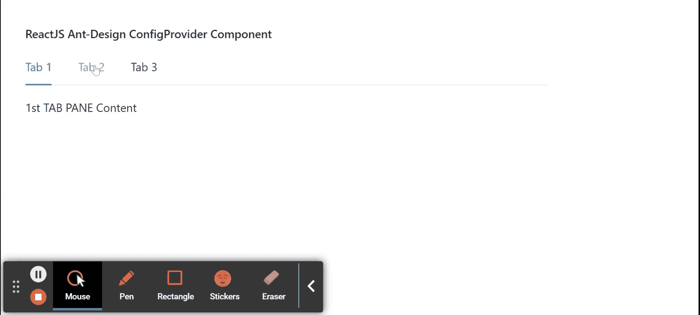

# 重新获取用户界面蚂蚁设计选项卡组件

> 原文:[https://www . geeksforgeeks . org/reactjs-ui-ant-design-tab s-component/](https://www.geeksforgeeks.org/reactjs-ui-ant-design-tabs-component/)

蚂蚁设计库预建了这个组件，也很容易集成。标签组件用作标签，可以方便地在不同视图之间切换。我们可以在 ReactJS 中使用以下方法来使用 Ant 设计选项卡组件。

**标签道具:**

*   **活动键:**用于表示当前标签面板的键。
*   **添加图标:**用于自定义添加图标。
*   **动画:**用于指示是否用动画改变标签页。
*   **居中:**用于制表符居中。
*   **默认激活键:**用于表示初始激活的 TabPane 的键。
*   **隐藏添加:**表示是否隐藏加号图标。
*   **moreIcon:** 用于省略号的自定义图标。
*   **renderTabBar:** 用于替换 TabBar。
*   **尺寸:**用于表示 tab 条尺寸。
*   **tabBarExtraContent:** 用于表示标签栏中的额外内容。
*   **tabBarGutter:** 用于表示制表符之间的间距。
*   **标签栏样式:**用于标签栏样式的对象。
*   **定位标签位置:**用于定位标签。
*   **类型:**表示制表符的基本样式。
*   **onChange:** 是活动标签更改时触发的回调函数。
*   **onEdit:** 是一个回调函数，在添加或移除选项卡时触发。
*   **onTabClick:** 是点击选项卡时触发的回调函数。
*   **onTabScroll:** 是标签滚动时触发的回调函数。

**制表符。tabpane props:t1]**

*   **关闭图标:**用于自定义标签面板头部的关闭图标。
*   **强制渲染:**用于选项卡中内容的强制渲染。
*   **键:**用于表示 TabPane 的键。
*   **tab:** 用于在 TabPane 的头部显示文字。

**创建反应应用程序并安装模块:**

*   **步骤 1:** 使用以下命令创建一个反应应用程序:

    ```
    npx create-react-app foldername
    ```

*   **步骤 2:** 在创建项目文件夹(即文件夹名**)后，使用以下命令将**移动到该文件夹:

    ```
    cd foldername
    ```

*   **步骤 3:** 创建 ReactJS 应用程序后，使用以下命令安装所需的****模块:****

    ```
    **npm install antd**
    ```

******项目结构:**如下图。****

****

项目结构**** 

******示例:**现在在 **App.js** 文件中写下以下代码。在这里，App 是我们编写代码的默认组件。****

## ****App.js****

```
**import React from 'react'
import "antd/dist/antd.css";
import { Tabs } from 'antd';

const { TabPane } = Tabs;

export default function App() {
  return (
    <div style={{
      display: 'block', width: 700, padding: 30
    }}>
      <h4>ReactJS Ant-Design ConfigProvider Component</h4>
      <Tabs>
        <TabPane tab="Tab 1" key="1">
          1st TAB PANE Content
        </TabPane>
        <TabPane tab="Tab 2" key="2">
          2nd TAB PANE Content
        </TabPane>
        <TabPane tab="Tab 3" key="3">
          3rd TAB PANE Content
        </TabPane>
      </Tabs>
    </div>
  );
}**
```

******运行应用程序的步骤:**从项目的根目录使用以下命令运行应用程序:****

```
**npm start**
```

******输出:**现在打开浏览器，转到***http://localhost:3000/***，会看到如下输出:****

********

******参考:**T2】https://ant.design/components/tabs/****