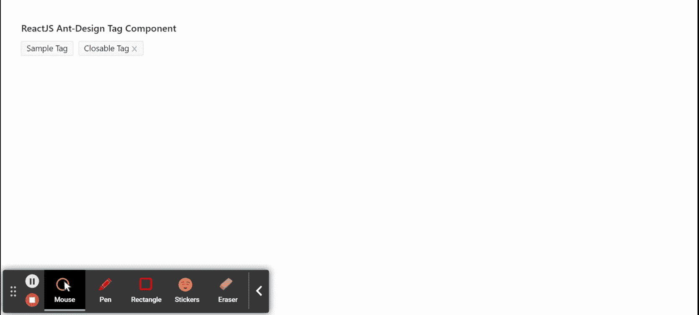

# 重新获取用户界面蚂蚁设计标签组件

> 原文:[https://www . geeksforgeeks . org/reactjs-ui-ant-design-tag-component/](https://www.geeksforgeeks.org/reactjs-ui-ant-design-tag-component/)

蚂蚁设计库预建了这个组件，也很容易集成。标签组件用于分类或标记。当我们想要通过属性或维度来标记时，会用到它。我们可以在 ReactJS 中使用以下方法来使用 Ant 设计标签组件。

**标签道具:**

*   **可关闭:**用于指示标签是否可以关闭。
*   **关闭图标:**用于定义自定义关闭图标。
*   **颜色:**用于表示标签的颜色。
*   **图标:**用于设置标签的图标。
*   **可见:**用于指示标签是否关闭。
*   **onClose:** 是标签关闭时触发的回调函数。

**天。检查板标书:**

*   **勾选:**表示标签勾选状态。
*   **onChange:** 是勾选/不勾选 Tag 时触发的回调函数。

**创建反应应用程序并安装模块:**

*   **步骤 1:** 使用以下命令创建一个反应应用程序:

    ```
    npx create-react-app foldername
    ```

*   **步骤 2:** 在创建项目文件夹(即文件夹名**)后，使用以下命令将**移动到该文件夹:

    ```
    cd foldername
    ```

*   **步骤 3:** 创建 ReactJS 应用程序后，使用以下命令安装所需的****模块:****

    ```
    **npm install antd**
    ```

******项目结构:**如下图。****

****

项目结构**** 

******示例:**现在在 **App.js** 文件中写下以下代码。在这里，App 是我们编写代码的默认组件。****

## ****App.js****

```
**import React from 'react'
import "antd/dist/antd.css";
import { Tag } from 'antd';

export default function App() {
  return (
    <div style={{
      display: 'block', width: 700, padding: 30
    }}>
      <h4>ReactJS Ant-Design Tag Component</h4>
      <Tag>Sample Tag</Tag>
      <Tag closable onClose={() => { console.log("Tag Removed!")}}>
        Closable Tag
    </Tag>
    </div>
  );
}**
```

******运行应用程序的步骤:**从项目的根目录使用以下命令运行应用程序:****

```
**npm start**
```

******输出:**现在打开浏览器，转到***http://localhost:3000/***，会看到如下输出:****

********

******参考:**T2】https://ant.design/components/tag/****