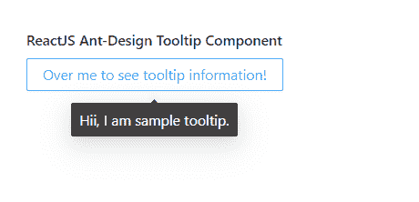

# 重新获取用户界面蚂蚁设计工具提示组件

> 原文:[https://www . geeksforgeeks . org/reactjs-ui-ant-design-tooltip-component/](https://www.geeksforgeeks.org/reactjs-ui-ant-design-tooltip-component/)

蚂蚁设计库预建了这个组件，也很容易集成。工具提示组件用于在用户关注、悬停或点击某个元素 时，以文本形式显示信息。我们可以在 ReactJS 中使用以下方法来使用 Ant 设计工具提示组件。

**工具提示道具：**

*   **标题:**用于描述工具提示中显示的文本。

**常用道具:**以下是工具提示 Popover 和 Popconfirm 共享的一些常用道具。

*   **对齐:**用于将该值合并到布局的配置中。
*   **箭头指向中心:**用于指示箭头是否指向目标的中心。
*   **自动调整窗口流量:**用于指示当弹出窗口离屏时，是否自动调整弹出窗口的位置。
*   **颜色:**用于设置背景颜色。
*   **默认可见:**用于表示浮动工具提示卡默认是否可见。
*   **销毁工具提示侧面:**用于指示隐藏时是否销毁工具提示。
*   **getPopupContainer:** 是提示的 DOM 容器。
*   **鼠标输入延迟:**是鼠标输入显示工具提示前的延迟值，单位为秒。
*   **mouseLeaveDelay:** 是工具提示在鼠标离开时隐藏之前的延迟值，单位为秒。
*   **overlayClassName:** 用于传递工具提示卡的类名。
*   **重叠样式:**用于工具提示卡的样式。
*   **放置:**用于相对于目标定位工具提示。
*   **触发:**用于工具提示触发模式。
*   **可见:**用于指示浮动工具提示卡是否可见。
*   **zIndex:** 用于表示工具提示的配置 z 索引。
*   **onVisibleChange:** 是工具提示卡可见性改变时触发的回调函数。

**创建反应应用程序并安装模块:**

*   **步骤 1:** 使用以下命令创建一个反应应用程序:

    ```jsx
    npx create-react-app foldername
    ```

*   **步骤 2:** 在创建项目文件夹(即文件夹名**)后，使用以下命令将**移动到该文件夹:

    ```jsx
    cd foldername
    ```

*   **步骤 3:** 创建 ReactJS 应用程序后，使用以下命令安装所需的****模块:****

    ```jsx
    **npm install antd**
    ```

******项目结构:**如下图。****

****

项目结构**** 

******示例:**现在在 **App.js** 文件中写下以下代码。在这里，App 是我们编写代码的默认组件。****

## ****App.js****

```jsx
**import React from 'react'
import "antd/dist/antd.css";
import { Tooltip, Button } from 'antd';

export default function App() {
  return (
    <div style={{
      display: 'block', width: 700, padding: 30
    }}>
      <h4>ReactJS Ant-Design Tooltip Component</h4>
      <Tooltip placement="bottom" title={"Hii, I am sample tooltip."}>
        <Button>Over me to see tooltip information!</Button>
      </Tooltip>
    </div>
  );
}**
```

******运行应用程序的步骤:**从项目的根目录使用以下命令运行应用程序:****

```jsx
**npm start**
```

******输出:**现在打开浏览器，转到***http://localhost:3000/***，会看到如下输出:****

********

******参考:**T2】https://ant.design/components/tooltip/****