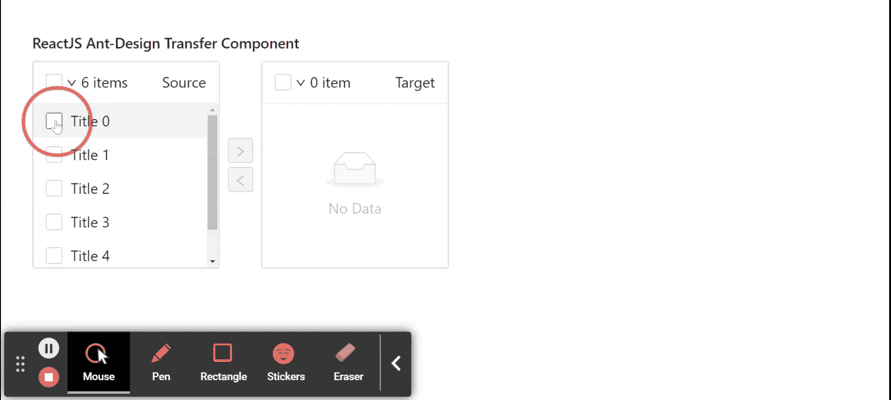

# 反应界面蚂蚁设计转移组件

> 原文:[https://www . geeksforgeeks . org/reactjs-ui-ant-design-transfer-component/](https://www.geeksforgeeks.org/reactjs-ui-ant-design-transfer-component/)

蚂蚁设计库预建了这个组件，也很容易集成。传送组件用于 d 双立柱传送选择框T4。用于有效传递两列之间的项目。我们可以在 ReactJS 中使用以下方法来使用 Ant 设计转移组件。

**传送道具:**

*   **数据源:**用于设置源数据。
*   **禁用:**表示是否禁用转账。
*   **过滤选项:**是检查一个项目是否应该显示在搜索结果列表中的功能。
*   **页脚:**是用于渲染页脚的功能。
*   **列表样式:**用于传递一个自定义的 CSS 样式，用于渲染传输列。
*   **地区:**用于表示 *i18n* 文本，包括过滤器、空文本、项目单元等。
*   **单向:**用于显示为单向样式。
*   **操作:**用于表示从上到下排序的一组操作。
*   **operationStyle:** 用于传递一个自定义的 CSS 样式，用于渲染操作的列。
*   **分页:**用于分页。
*   **渲染:**生成列上显示的项目是一个函数。
*   **选择标签:**用于表示一组自定义标签，用于选择标题上的所有复选框。
*   **selectedKeys:** 用于表示所选项目的一组按键。
*   **显示搜索:**用于表示是否在每一列显示搜索框。
*   **显示选择全部:**用于显示表头的选择所有复选框。
*   **targetKeys:** 用于表示右列所列元素的一组键。
*   **标题:**用来表示从左到右排序的一组标题。
*   **onChange:** 是列间传递完成时触发的回调函数。
*   **onScroll:** 是滚动选项列表时触发的回调函数。
*   **onSearch:** 是搜索字段发生变化时触发的回调函数。
*   **onSelectChange:** 是一个回调函数，在选择的项目发生变化时触发。

**渲染道具:**

*   **方向:**用于表示列表渲染方向。
*   **禁用:**表示是否禁用列表。
*   **过滤编辑:**用于表示过滤后的项目。
*   **选择键:**用于表示选择的项目。
*   **选择:**用于表示所选项目。
*   **选择物品:**用于选择
    一组物品。

**创建反应应用程序并安装模块:**

*   **步骤 1:** 使用以下命令创建一个反应应用程序:

    ```jsx
    npx create-react-app foldername
    ```

*   **步骤 2:** 创建项目文件夹(即文件夹名**)后，使用以下命令移动到该文件夹中:**

    ```jsx
    cd foldername
    ```

*   **步骤 3:** 创建 ReactJS 应用程序后，使用以下命令安装所需的****模块:****

    ```jsx
    **npm install antd**
    ```

******项目结构:**如下图。****

****

项目结构**** 

******示例:**现在在 **App.js** 文件中写下以下代码。在这里，App 是我们编写代码的默认组件。****

## ****App.js****

```jsx
**import React, { useState } from 'react';
import "antd/dist/antd.css";
import { Transfer } from 'antd';

// Our sample Mock Data
const mockData = [
  {key: "0", title: "Title 0", description: "Sample Description 0"}, 
  {key: "1", title: "Title 1", description: "Sample Description 1"},
  {key: "2", title: "Title 2", description: "Sample Description 2"},
  {key: "3", title: "Title 3", description: "Sample Description 3"},
  {key: "4", title: "Title 4", description: "Sample Description 4"},
  {key: "5", title: "Title 5", description: "Sample Description 5"},
];

export default function App() {

  // To set target keys
  const [targetKeys, setTargetKeys] = useState(mockData);

  // Contains the selected keys
  const [selectedKeys, setSelectedKeys] = useState([]);

  return (
    <div style={{
      display: 'block', width: 700, padding: 30
    }}>
      <h4>ReactJS Ant-Design Transfer Component</h4>
      <Transfer
        dataSource={mockData}
        titles={['Source', 'Target']}
        render={item => item.title}
        selectedKeys={selectedKeys}
        targetKeys={targetKeys}
        onChange={(nextTargetKeys) => {
          setTargetKeys(nextTargetKeys);
        }}
        onSelectChange={(sourceSelectedKeys, targetSelectedKeys) => {
          setSelectedKeys([...sourceSelectedKeys, ...targetSelectedKeys]);
        }}
      />
    </div>
  );
}**
```

******运行应用程序的步骤:**从项目的根目录使用以下命令运行应用程序:****

```jsx
**npm start**
```

******输出:**现在打开浏览器，转到***http://localhost:3000/***，会看到如下输出:****

********

******参考:**T2】https://ant.design/components/transfer/****