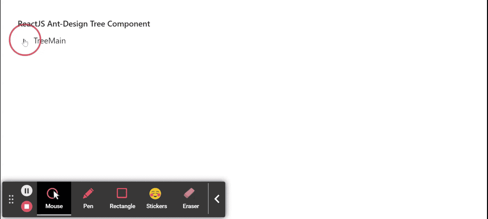

# 重新获取用户界面蚂蚁设计树组件

> 原文:[https://www . geeksforgeeks . org/reactjs-ui-ant-design-tree-component/](https://www.geeksforgeeks.org/reactjs-ui-ant-design-tree-component/)

蚂蚁设计库预建了这个组件，也很容易集成。树组件用于层次列表结构组件。我们可以在 ReactJS 中使用以下方法来使用 Ant 设计树组件。

**树木道具:**

*   **allowDrop:** 用于指示是否允许在节点上丢弃。
*   **自动扩展父节点:**用于指示是否自动扩展父树节点。
*   **blockNode:** 用于表示 treeNode 是否填充剩余的水平空间。
*   **可勾选:**用于在树节点前添加复选框。
*   **检查键:**用于指定被检查树节点的键。
*   **严格检查:**用于精确检查树节点。
*   **缺省检查键:**用于指定缺省检查的树节点的键。
*   **defaultExpandAll:** 用于表示是否默认展开所有树节点。
*   **defaultexpandkeys:**用于指定默认展开树节点的键。
*   **defaultExpandParent:** 表示是否自动展开父树节点。
*   **缺省选择键:**用于指定缺省选择的树节点的键。
*   **禁用:**表示是否禁用树。
*   **可拖动:**用于指定该树或节点是否可拖动。
*   **扩展键:**用于指定扩展树节点的键。
*   **filterTreeNode:** 用于定义一个过滤树节点的函数。
*   **高度:**用于定义 Config 虚拟滚动高度。
*   **图标:**用于自定义 treeNode 图标。
*   **loadData:** 用于异步加载数据。
*   **loadedKeys:** 用于设置加载的树节点。
*   **多个:**用于启用选择多个树节点。
*   **可选:**表示是否可以选择。
*   **选择键:**用于指定所选树节点的键。
*   **显示图标:**用于显示树节点标题前的图标。
*   **显示线:**用于显示连接线。
*   **开关图标:**用于自定义树节点的折叠/展开图标。
*   **标题渲染:**用于自定义树节点标题渲染。
*   **树数据:**用于表示树节点数据数组。
*   **虚拟:**设置为假时，用于禁用虚拟滚动。
*   **onCheck:** 是 onCheck 事件发生时触发的回调函数。
*   **onDragEnd:** 是 onDragEnd 事件发生时触发的回调函数。
*   **onDragEnter:** 是 onDragEnter 事件发生时触发的回调函数。
*   **onDragLeave:** 是 onDragLeave 事件发生时触发的回调函数。
*   **onDragOver:** 是 onDragOver 事件发生时触发的回调函数。
*   **onDragStart:** 是 onDragStart 事件发生时触发的回调函数。
*   **onDrop:** 是 onDrop 事件发生时触发的回调函数。
*   **onExpand:** 是一个回调函数，在 treeNode 展开或折叠时触发。
*   **onLoad:** 是加载 treeNode 时触发的回调函数。
*   **onRightClick:** 是一个回调函数，当用户右键单击一个 treeNode 时触发。
*   **onSelect:** 是用户点击 treeNode 时触发的回调函数。

**TreeNode Props:**

*   **可检查:**用于表示树是否可检查。
*   **禁用复选框:**用于禁用树节点的复选框。
*   **禁用:**用于禁用树节点。
*   **图标:**用于自定义图标。
*   **isLeaf:** 用来判断这是不是叶节点。
*   **键:**用于树节点的唯一标识符。
*   **可选:**用于设置是否可以选择树节点。
*   **标题:**用于表示树节点的标题。

**校长建议:**

*   **扩展:**用于表示目录打开逻辑。

**树法:**

*   **scrollTo():** 此方法用于滚动到虚拟滚动中的关键项目。

**创建反应应用程序并安装模块:**

*   **步骤 1:** 使用以下命令创建一个反应应用程序:

    ```jsx
    npx create-react-app foldername
    ```

*   **步骤 2:** 在创建项目文件夹(即文件夹名**)后，使用以下命令将**移动到该文件夹:

    ```jsx
    cd foldername
    ```

*   **步骤 3:** 创建 ReactJS 应用程序后，使用以下命令安装所需的****模块:****

    ```jsx
    **npm install antd**
    ```

******项目结构:**如下图。****

****

项目结构**** 

******示例:**现在在 **App.js** 文件中写下以下代码。在这里，App 是我们编写代码的默认组件。****

## ****App.js****

```jsx
**import React from 'react'
import "antd/dist/antd.css";
import { Tree } from 'antd';

const treeData = [
  {
    title: 'TreeMain',
    key: 'TreeMain',
    children: [
      {
        title: 'ParentLeaf',
        key: 'ParentLeaf',
        children: [
          {
            title: 'ChildLeaf1',
            key: 'ChildLeaf1',
          },
          {
            title: 'ChildLeaf2',
            key: 'ChildLeaf2',
          },
        ],
      },
    ],
  },
];

export default function App() {

  return (
    <div style={{
      display: 'block', width: 700, padding: 30
    }}>
      <h4>ReactJS Ant-Design Tree Component</h4>
      <Tree
        treeData={treeData}
      />
    </div>
  );
}**
```

******运行应用程序的步骤:**从项目的根目录使用以下命令运行应用程序:****

```jsx
**npm start**
```

******输出:**现在打开浏览器，转到***http://localhost:3000/***，会看到如下输出:****

********

******参考:**T2】https://ant.design/components/tree/****