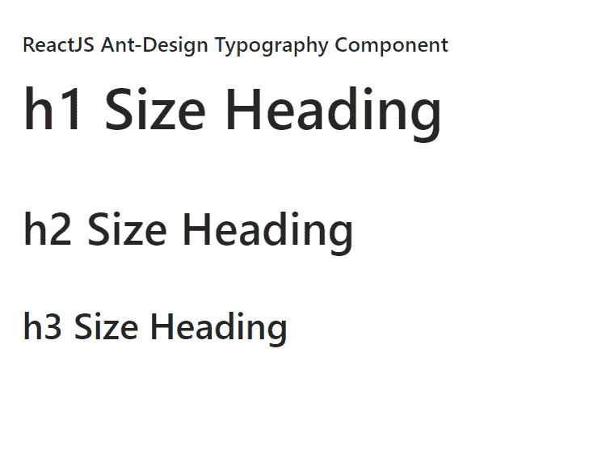

# 重新获取用户界面蚂蚁设计排版组件

> 原文:[https://www . geeksforgeeks . org/reactjs-ui-ant-design-排版-组件/](https://www.geeksforgeeks.org/reactjs-ui-ant-design-typography-component/)

蚂蚁设计库预建了这个组件，也很容易集成。排版组件对于 b asic 文本写作、正文文本(包括标题、列表等)非常有用 。我们可以在 ReactJS 中使用以下方法来使用 Ant 设计排版组件。

**排版。文字道具:**

*   **代码:**用于代码样式。
*   **可复制:**表示是否可复制。
*   **删除:**用于删除的线型。
*   **禁用:**用于禁用内容。
*   **可编辑:**如果设置为可编辑，用于编辑对象时的状态。
*   **省略号:**用于显示文本溢出时的省略号。
*   **键盘:**用于键盘风格。
*   **标记:**用于标记的样式。
*   **onClick:** 用于设置处理点击事件的处理程序。
*   **强:**用于黑体风格。
*   **斜体:**用于斜体样式。
*   **类型:**用于表示内容类型。
*   **下划线:**用于下划线样式。

**排版。标题道具:**

*   **代码:**用于代码样式。
*   **可复制:**表示是否可复制。
*   **删除:**用于删除的线型。
*   **禁用:**用于禁用内容。
*   **可编辑:**如果设置为可编辑，用于编辑对象时的状态。
*   **省略号:**用于显示文本溢出时的省略号。
*   **级别:**用于设置内容重要性。
*   **标记:**用于标记的样式。
*   **onClick:** 用于设置处理点击事件的处理程序。
*   **斜体:**用于斜体样式。
*   **类型:**用于表示内容类型。
*   **下划线:**用于下划线样式。

**排版。段落道具:**

*   **代码:**用于代码样式。
*   **可复制:**表示是否可复制。
*   **删除:**用于删除的线型。
*   **禁用:**用于禁用内容。
*   **可编辑:**如果设置为可编辑，用于编辑对象时的状态。
*   **省略号:**用于显示文本溢出时的省略号。
*   **标记:**用于标记的样式。
*   **onClick:** 用于设置处理点击事件的处理程序。
*   **强:**用于黑体风格。
*   **斜体:**用于斜体样式。
*   **类型:**用于表示内容类型。
*   **下划线:**用于下划线样式。

**可复制道具:**

*   **图标:**用于自定义复制图标。
*   **文本:**用于表示要复制的文本。
*   **工具提示:**用于自定义工具提示文本。
*   **onCopy:** 是复制文本时调用的函数。

**可编辑道具:**

*   **autoSize:** 用于表示 textarea 的 autoSize 属性。
*   **编辑:**表示是否可编辑。
*   **图标:**用于自定义可编辑图标。
*   **maxLength:** 用于表示 textarea 编号的 maxLength 属性。
*   **工具提示:**用于自定义工具提示文本。
*   **onCancel:** 是在键入 ESC 退出可编辑状态时调用的回调函数。
*   **onChange:** 是在 textarea 输入时调用的回调函数。
*   **onEnd:** 是一个回调函数，在输入 ENTER 退出可编辑状态时调用。
*   **onStart:** 是进入可编辑状态时调用的回调函数。
*   **onCancel:** 是在键入 ESC 退出可编辑状态时调用的回调函数。
*   **onEnd:** 是一个回调函数，在键入 ENTER 退出可编辑状态时调用。

**省略号道具:**

*   **可扩展:**表示是否可扩展。
*   **行:**用于表示内容的最大行数。
*   **后缀:**用于表示省略号内容的后缀。
*   **符号:**用于省略号的自定义描述。
*   **工具提示:**用于省略号时显示工具提示。
*   **onEllipsis:** 是进入或离开省略号状态时调用的回调函数。
*   **onExpand:** 是扩展内容时调用的回调函数。

**创建反应应用程序并安装模块:**

*   **步骤 1:** 使用以下命令创建一个反应应用程序:

    ```jsx
    npx create-react-app foldername
    ```

*   **步骤 2:** 在创建项目文件夹(即文件夹名**)后，使用以下命令将**移动到该文件夹:

    ```jsx
    cd foldername
    ```

*   **步骤 3:** 创建 ReactJS 应用程序后，使用以下命令安装所需的****模块:****

    ```jsx
    **npm install antd**
    ```

******项目结构:**如下图。****

****

项目结构**** 

******示例:**现在在 **App.js** 文件中写下以下代码。在这里，App 是我们编写代码的默认组件。****

## ****App.js****

```jsx
**import React from 'react'
import "antd/dist/antd.css";
import { Typography } from 'antd';

const { Title } = Typography;

export default function App() {

  return (
    <div style={{
      display: 'block', width: 700, padding: 30
    }}>
      <h4>ReactJS Ant-Design Typography Component</h4>
      <>
        <Title>h1 Size Heading</Title>
        <Title level={2}>h2 Size Heading</Title>
        <Title level={3}>h3 Size Heading</Title>
      </>
    </div>
  );
}**
```

******运行应用程序的步骤:**从项目的根目录使用以下命令运行应用程序:****

```jsx
**npm start**
```

******输出:**现在打开浏览器，转到***http://localhost:3000/***，会看到如下输出:****

********

******参考:**T2】https://ant.design/components/typography/****