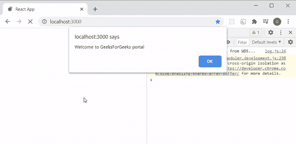

# reactjsunsafe _ component will mount()方法

> 原文:[https://www . geeksforgeeks . org/reactjs-unsafe _ component will mount-method/](https://www.geeksforgeeks.org/reactjs-unsafe_componentwillmount-method/)

[**<u>组件将在</u>**](https://www.geeksforgeeks.org/how-to-use-componentwillmount-in-react-hooks/) **<u>[**<u>DOM</u>**](https://www.geeksforgeeks.org/dom-document-object-model/) (文档对象模型)中加载或安装我们的 React 组件之前调用()方法</u>** 。在 [**<u>反应生命周期</u>**](https://www.geeksforgeeks.org/reactjs-lifecycle-components/) 的挂载阶段，即 [**<u>渲染()之前</u>**](https://www.geeksforgeeks.org/reactjs-rendering-elements/) 调用。它用于通过同步执行 React 代码从组件外部获取数据，这导致我们的组件首先使用空数据进行呈现，因为这个方法在我们的组件第一次呈现之前不返回任何东西。由于提取调用是异步的，我们的组件不会等待这个方法完成，而是继续呈现。

componentWillMount()方法在 React 的最新版本中已被弃用，具体见本[](https://github.com/facebook/react/issues/12495)<u>。建议用 [**<u>componentDidMount()方法</u>**](https://www.geeksforgeeks.org/reactjs-componentdidmount-method/) 代替它，但是如果我们还想用 componentDidMount()的话，我们可以把它叫做**UNSAFE _ componentdidllmount()**来实现。不建议按照 React 使用这种方法，这就是为什么一开始就出现 **UNSAFE** 关键字，给所有 React 开发者一个温和的按摩，让他们停止使用这种方法。这个方法可以用来在我们的 React 组件装入 DOM 之前执行一个操作。</u>

<u>**语法:**</u>

```jsx
class App extends Component {

  UNSAFE_componentWillMount() {

    //action you want to execute

  }
}
```

<u>**创建反应应用程序:**</u>

*   <u>**步骤 1:** 使用以下命令创建一个 [**<u>React 应用程序</u>**](https://www.geeksforgeeks.org/reactjs-setting-development-environment/) 。</u>

     <u>```jsx
    npx create-react-app foldername
    ```</u> 
*   <u>**步骤 2:** 创建项目文件夹(即文件夹名)后，使用以下命令移动到该文件夹。</u>

    ```jsx
    cd foldername
    ```

<u>**项目结构:**如下图。</u>

<u></u>

<u>**示例:**在本例中，我们将构建一个应用程序，在我们的 React 组件加载到 DOM 之前给出一个警告消息。现在在 App.js 文件中写下以下代码。在这里，App 是我们编写代码的默认组件。</u>

## <u>App.js</u>

```jsx
import React from 'react'; 
class App extends React.Component { 

  UNSAFE_componentWillMount() { 
    // Performing an action
    alert(`Welcome to GeeksForGeeks portal`); 

  } 

  render() { 
    return <h1>GeeksForGeeks</h1>; 
  } 

} 

export default App;
```

<u>**运行应用程序的步骤:**从项目的根目录使用以下命令运行应用程序。</u>

```jsx
npm start
```

<u>**输出:**现在打开浏览器，转到 **http://localhost:3000/** ，会看到如下输出。</u>

<u></u>

<u>**解释:**我们通过**UNSAFE _ component willlmount()方法**收到一条警告消息，然后我们的组件被挂载到 DOM 中，然后我们的组件在渲染后加载。这样，我们可以在组件加载之前执行任何操作。如您所见，当我们的组件加载时，控制台上还会出现一条警告消息，明确告诉我们不建议使用这种方法，我们已经在上面讨论过了。</u>