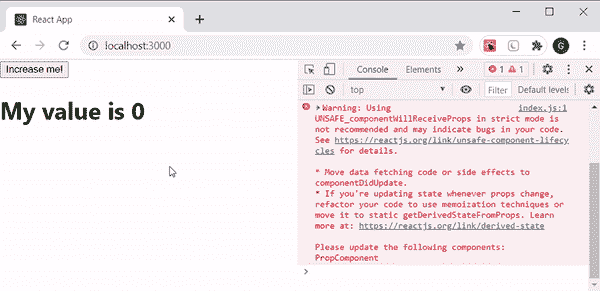

# reactjsunsafe _ component willereceiveprops()方法

> 原文:[https://www . geeksforgeeks . org/reactjs-unsafe _ component willereceiveprops-method/](https://www.geeksforgeeks.org/reactjs-unsafe_componentwillreceiveprops-method/)

**组件将接收道具()**在我们安装的反应组件接收新道具之前被调用。在 [**<u>反应生命周期</u>**](https://www.geeksforgeeks.org/reactjs-lifecycle-components/) 的更新阶段调用。它用于更新状态，以响应我们道具的一些变化。我们不能在挂载期间用初始道具调用这个方法，因为只有当我们组件的道具更新后，React 才会调用这个方法。

componentWillReceiveProps()方法在 React 的最新版本中已被弃用，具体见本 [**<u>发行</u>**T5。建议使用](https://github.com/GeekyAnts/NativeBase/issues/2776)[**<u>getderivedstatefrompols()方法</u>**](https://www.geeksforgeeks.org/react-js-static-getderivedstatefromprops/) 来代替它，但是如果我们还想使用 component willereceptopols()的话，我们可以通过调用它为**UNSAFE _ component willereceptopols()**来实现。不建议按照 React 来使用这个方法，这就是为什么 **UNSAFE** 关键字出现在开头，给所有 React 开发者一个温和的信息，让他们停止使用这个方法。当组件的状态依赖于道具的变化时，可以使用这种方法。

**语法:**

```
class App extends Component {
  UNSAFE_componentWillReceiveProps(newProps) {
    // Action you want to execute
  }
}
```

**参数:**接受一个参数，就是 **newProps** ，这是组件在 [**<u>DOM</u>**](https://www.geeksforgeeks.org/dom-document-object-model/) 中渲染后道具的更新值。

**创建反应应用程序:**

*   **步骤 1:** 使用以下命令创建 [**<u>反应应用程序</u>**](https://www.geeksforgeeks.org/reactjs-setting-development-environment/) :

    ```
    npx create-react-app foldername
    ```

*   **步骤 2:** 创建项目文件夹(即文件夹名)后，使用以下命令移动到该文件夹:

    ```
    cd foldername
    ```

**项目结构:**如下图。


**示例:**在本例中，我们将构建一个应用程序，在控制台上记录更新后的 prop 值。现在在 App.js 文件中写下以下代码。在这里，App 是我们编写代码的默认组件。

## App.js

```
import React from 'react'

class App extends React.Component {

  constructor(props) {
     super(props)

     // Set initial state
     this.state = {
        count: 0
     }

     // Binding this keyword
     this.handleCount = this.handleCount.bind(this)
  };

  handleCount() {
    // Updating state
     this.setState({
       count: this.state.count + 1
     })
  }

  render() {
     return (
        // Passing state as props
        <div>
           <button onClick = 
              {this.handleCount}>Increase me!
           </button>
           <PropComponent data = {this.state.count} />
        </div>
     );
  }
}

class PropComponent extends React.Component {

  UNSAFE_componentWillReceiveProps(newProps) { 

    // Performing an action   
    console.log('Component is receiving new props', newProps);
  }

  render() {
     return (

        // Printing updated props value
        <div>
          <h1>My value is {this.props.data}</h1>
        </div>
     );
  }
}

export default App;
```

**运行应用程序的步骤:**从项目的根目录使用以下命令运行应用程序:

```
npm start
```

**输出:**现在打开浏览器，转到 **http://localhost:3000/** ，会看到如下输出:



**解释:**我们在**应用程序**类组件中创建一个初始值为 0 的计数状态和一个用于将其当前值增加 1 的函数**手柄计数**。当我们点击按钮元素时，后者被触发为 [**<u>onClick 事件</u>**](https://www.geeksforgeeks.org/javascript-events/) 。当我们点击按钮时，我们的状态值增加，这个更新的值作为道具传递给另一个类组件 **PropComponent** 。在我们的道具组件接收新道具之前，它通过**UNSAFE _ component willereceiveprops(new props)方法**将更新后的道具值记录在控制台上。这样，我们可以在组件接收新道具之前执行任何动作。

当我们的组件加载时，控制台顶部还会出现一条警告消息，清楚地告诉我们不建议使用这种方法，我们已经在上面讨论过了。