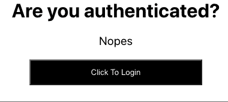

# 反作用使用上下文挂接

> 原文:[https://www.geeksforgeeks.org/reactjs-usecontext-hook/](https://www.geeksforgeeks.org/reactjs-usecontext-hook/)

上下文提供了一种通过组件树传递数据或状态的方法，而不必通过每个嵌套组件手动传递道具。它旨在共享可被视为 React 组件树的全局数据的数据，例如当前经过身份验证的用户或主题(例如颜色、填充、边距、字体大小)。

上下文应用编程接口使用上下文。提供程序和上下文。消费者组件传递数据，但是编写长函数代码来使用这个上下文应用编程接口是非常麻烦的。因此，useContext 钩子有助于使代码更易读、不那么冗长，并且不需要引入消费者组件。useContext 钩子是 React 16.8 中新增的。

**语法:**

```jsx
const authContext = useContext(initialValue);
```

useContext 接受 React.createContext 提供的值，然后每当组件的值发生变化时重新呈现该组件，但是您仍然可以通过使用记忆来优化其性能。

**示例**:演示 useContext Hook 使用的程序。在这个例子中，我们有一个按钮，只要我们点击这个按钮，onClick 处理程序就会被触发，它会在 useContext 钩子的帮助下改变身份验证状态(默认值为 Nopes)。让我们看看上面代码的输出:

*   **auth-context.js**

    ## java 描述语言

    ```jsx
    import React from 'react';

    // Creating the context object and passing the default values.
    const authContext = React.createContext({status:null,login:()=>{}});

    export default authContext;
    ```

*   **App.js**

    ## java 描述语言

    ```jsx
    import React, { useState } from "react";
    import Auth from "./Auth";
    import AuthContext from "./auth-context";

    const App = () => {
      //using the state to dynamicallly pass the values to the context

      const [authstatus, setauthstatus] = useState(false);
      const login = () => {
        setauthstatus(true);
      };
      return (
        <React.Fragment>
          <AuthContext.Provider value={{ status: authstatus, login: login }}>
            <Auth />
          </AuthContext.Provider>
        </React.Fragment>
      );
    };
    export default App;
    ```

*   **Auth.js**

    ## java 描述语言

    ```jsx
    import React, { useContext } from "react";
    import AuthContext from "./auth-context";

    const Auth = () => {
      // Now all the data stored in the context can 
      // be accessed with the auth variable
      const auth = useContext(AuthContext);
      console.log(auth.status);
      return (
        <div>
          <h1>Are you authenticated?</h1>
          {auth.status ? 
    <p>Yes you are</p>
     : 
    <p>Nopes</p>
    }

          <button onClick={auth.login}>Click To Login</button>
        </div>
      );
    };
    export default Auth;
    ```

**输出:**

