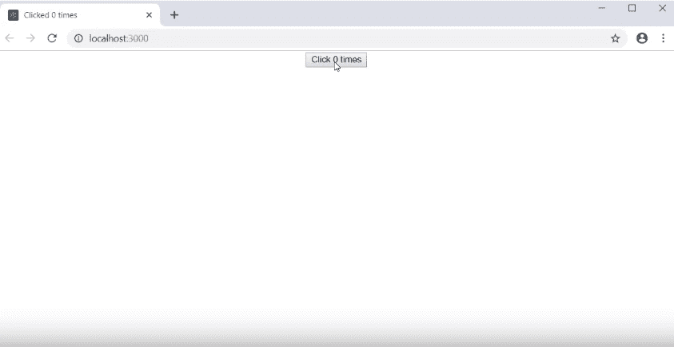

# 反作用|使用效果挂钩

> 原文:[https://www.geeksforgeeks.org/reactjs-useeffect-hook/](https://www.geeksforgeeks.org/reactjs-useeffect-hook/)

引入 useEffect Hook 的动机是为了消除使用基于类的组件的副作用。例如，像更新 DOM、从应用编程接口端点获取数据、设置订阅或计时器等任务可能会导致不必要的副作用。由于渲染方法会很快产生副作用，因此需要使用生命周期方法来观察副作用。例如，考虑将简单计数器组件的文档标题更新为当前值。在初始渲染时，我们将当前点击值设置为 0 次点击。因此，这一部分被编码到 componentDidMount()方法中，该方法在组件生命周期中只执行一次。然后我们创建一个按钮，每次点击时将计数状态值增加 1。随着计数值状态的改变，我们还需要再次更新文档标题，为此，我们需要在 componentDidUpdate()中编写相同的代码。componentDidupdate()方法非常适合在任何状态改变时更新计数器值，但是代码的重复是副作用之一。

## java 描述语言

```
componentDidMount(){
    document.title = `you clicked ${this.state.count} times`;
}

componentDidUpdate(){
    document.title = `you clicked ${this.state.count} times`;
}
```

让我们通过设置计时器来考虑另一个副作用。在 componentDidMount()方法中，我们设置了一个计时器，每 5 秒记录一个字符串“hello”。当组件从 DOM 中移除时，我们可以清除这个计时器。我们在组件卸载()生命周期方法中做到了这一点。计时器的代码如下所示:

## java 描述语言

```
componentDidMount(){
    this.interval = setInterval(this.tick, 1000)
}

componentWillUnmount(){
    clearInterval(this.interval)
}
```

计数器和计时器合并成一个组件时，如下所示:

## java 描述语言

```
componentDidMount(){
    document.title = `you clicked ${this.state.count} times`;
    this.interval = setInterval(this.tick, 1000)

}

componentDidUpdate(){
    document.title = `you clicked ${this.state.count} times`;
    clearInterval(this.interval)
}
```

当您观察上面的代码时，我们倾向于注意到为了更新文档标题，我们编写了两次相同的代码，一次在 componentDidmount()中，一次在 componentDidUpdate()中。要观察的第二件事是代码是如何分解成组件的。与定时器、setInterval 和 clearInterval 相关的代码被放入不同的代码块中(即不同的生命周期方法)。更新 DOM 的代码和设置计时器的代码是完全不相关的，放在同一个生命周期方法中(即在 componentDidMount()中)。如果可以选择不同时重复代码，将同一块中的相关代码组合在一起，效果会更好。这就是 useEffect Hook 出现在图片中的地方。
效果挂钩可以让你在功能组件中执行副作用。它是组件安装()方法、组件更新()方法和组件卸载()方法的近似替代。

**渲染后的 useEffect:**我们知道，useEffect()用于在功能组件中引起副作用，它还能够将基于类的组件的 componentDidMount()、componentDidUpdate()和 componentWillUnmount()生命周期方法处理到功能组件中。让我们看一个例子，说明如何使用 useEffect 钩子作为一个功能，它可以模仿上面提到的生命周期方法，但是在功能组件中。

为了更好地理解，让我们看看代码在下面的类组件中是什么样子，我们将把它命名为“类组件一”

**文件名:src/components/class counterone . js**

## java 描述语言

```
import React, { Component } from 'react'

class ClassCounterOne extends Component {
    constructor(props){
        super(props)
        this.state = {
            count: 0
        }
    }

componentDidMount(){
    document.title = `Clicked ${this.state.count} times`
}

componentDidUpdate(prevProps, prevState){
    document.title = `Clicked ${this.state.count} times`
}

render() {
    return (
        <div>
            <button onClick = {() => this.setState(
                  { count: this.state.count + 1})}>
                Click {this.state.count} times
            </button>
        </div>
    )
}

export default ClassCounterOne
```

现在，我们将该组件包含在 App.js 中

**文件名:src/App.js**

## java 描述语言

```
import React from 'react'
import './App.css'
import ClassCounterOne from './components/classCounterOne'

function App(){
    return(
        <div className='App'>
        <ClassCounterOne />
        </div>
    )
}

export default App
```

现在，如果我们查看浏览器，我们可以观察到最初文档标题是“Clicked 0 次”。



如果我们点击按钮，每次点击计数值增加 1，并更新标题。


现在，让我们尝试用一个功能组件来替换这个功能。出于同样的目的，创建一个新文件并命名它

功能组件如下所示:

**文件名:src/components/hook counterone . js**

## java 描述语言

```
import React, { useState, useEffect } from 'react'

function HookCounterOne() {
    const [count, setCount] = useState(0)

    useEffect(() => {
        document.title = `You clicked ${count} times`

    return (
        <div>
            <button onClick = {() => setCount(count + 1)}>
                  Click {count} times </button>
        </div>
    )
}
export default HookCounterOne
```

现在我们需要在 App.js 文件中导入上述组件。包含 HookCounterOne 组件后，代码如下所示:

**文件名:src/App.js**

## java 描述语言

```
import React from 'react'
import './App.css'
import ClassCounterOne from './components/classCounterOne'

function App(){
    return(
        <div className='App'>
        <HooKCounterOne />
        </div>
    )
}

export default App
```

现在，如果我们查看浏览器，我们可以看到如下的初始状态。最初，文档标题为“您点击了 0 次”。


当您单击按钮时，计数值会增加，文档标题也会更新。正如我们所观察到的行为是意料之中的。


当我们指定 useEffect 时，我们基本上是请求 react 执行我们在 useEffect 函数中作为参数传递的函数，每次组件呈现时。需要注意的第二件事是 useeffect 在组件内部使用，因为这样做我们可以轻松地访问组件状态和道具，而无需编写任何额外的代码。