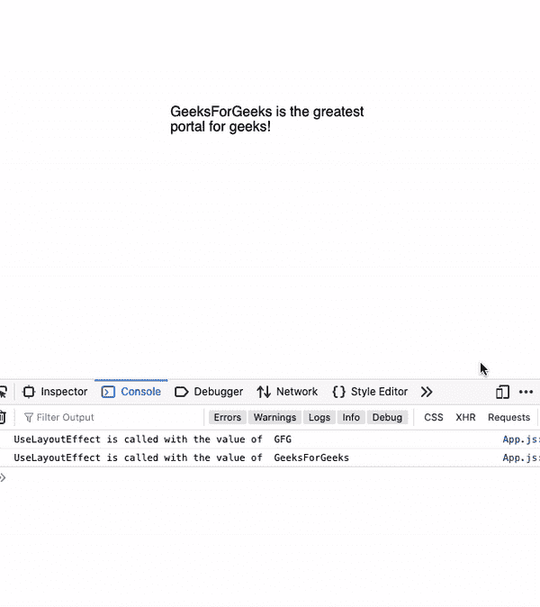

# reactjsuselayout effect Hook

> 原文:[https://www.geeksforgeeks.org/reactjs-uselayouteffect-hook/](https://www.geeksforgeeks.org/reactjs-uselayouteffect-hook/)

useLayoutEffect 的工作方式类似于 useEffect，但更像 useEffect 钩子一样异步工作，它在所有 DOM 加载完成后同步触发。这对于同步重新呈现 DOM 以及从 DOM 中读取布局非常有用。但是为了防止阻塞页面加载，我们应该总是使用 useEffect 钩子。

useLayoutEffect 钩子与 componentDidMount 和 componentDidUpdate 方法在同一个阶段工作。只有当 useEffect 没有输出预期的结果时，我们才应该使用 useLayoutEffect。

**语法**:

```
useLayoutEffect()
```

**创建反应应用程序:**

**步骤 1:** 使用以下命令创建一个反应应用程序:

```
npx create-react-app functiondemo
```

**步骤 2:** 创建项目文件夹(即 functiondemo)后，使用以下命令移动到该文件夹:

```
cd functiondemo
```

**项目结构:**如下图。


项目结构

**示例:**在本例中，我们将构建一个名称转换器应用程序，当调用 useLayoutEffect 钩子时，该应用程序会更改状态的名称。

**App.js:** 现在在 App.js 文件中写下以下代码。在这里，App 是我们编写代码的默认组件。

## java 描述语言

```
import React, { useLayoutEffect, useState } from 'react';

const App = () => {
  const [value, setValue] = useState('GFG');

  useLayoutEffect(() => {
    if (value === 'GFG') {
     // Changing the state 
      setValue('GeeksForGeeks');
    }
    console.log('UseLayoutEffect is called with the value of ', value);
  }, [value]);

  return <div>{value} is the greatest portal for geeks!</div>;
};

export default App;
```

**运行应用程序的步骤:**从项目的根目录使用以下命令运行应用程序:

```
npm start
```

**输出:**

