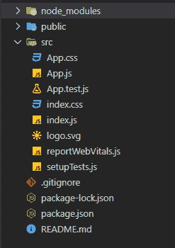

# 反应堆使用参数挂钩

> 原文:[https://www.geeksforgeeks.org/reactjs-useparams-hook/](https://www.geeksforgeeks.org/reactjs-useparams-hook/)

在我们的反应应用程序中，有时我们想访问当前路线的参数，在这种情况下，使用参数挂钩开始起作用。react-router-dom 包有 useParams 钩子，允许您访问当前路由的参数。

**语法:**

```jsx
useParams();
```

创建反应应用程序并安装所需模块:

*   **步骤 1:** 使用以下命令创建一个 React 应用程序。

    ```jsx
    npx create-react-app useparams_react
    ```

*   **步骤 2:** 创建项目文件夹(即 useparams_react)后，使用以下命令移动到该文件夹。

    ```jsx
    cd useparams_react
    ```

*   **步骤 3:** 创建 ReactJS 应用程序后，使用以下命令安装 react-router-dom 和 react-dom 包。

    ```jsx
    npm install --save react-router-dom react-dom
    ```

**项目结构:**



**示例:**现在在 App.js 文件中写下以下代码。在这里，App 是我们编写代码的默认组件。

## App.js

```jsx
import React from "react";

import {
  BrowserRouter as Router,
  Switch,
  Route,
  useParams,
} from "react-router-dom";

function BlogPost() {
  let { id } = useParams();
  return <div style={{ fontSize: "50px" }}>
           Now showing post {id}
         </div>;
}

function Home() {
  return <h3>home page </h3>;
}

function App() {
  return (
    <Router>
      <Switch>
        <Route path="/page/:id">
          <BlogPost />
        </Route>
        <Route path="/">
          <Home />
        </Route>
      </Switch>
    </Router>
  );
}

export default App;
```

**运行应用程序的步骤:**从项目的根目录使用以下命令运行应用程序。

```jsx
npm start
```

**输出:**现在打开浏览器，转到 http://localhost:3000/，会看到如下输出。你可以看到你在网址中传递了什么:id 显示在屏幕上。通过这种方式，您可以访问当前路线的网址参数。

