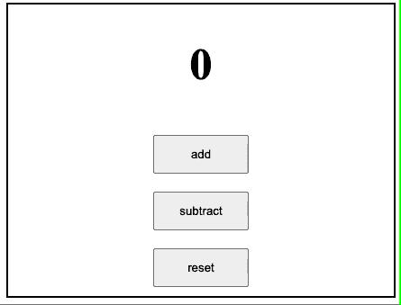

# 反应物用户教育挂钩

> 原文:[https://www.geeksforgeeks.org/reactjs-usereducer-hook/](https://www.geeksforgeeks.org/reactjs-usereducer-hook/)

当您有复杂的状态构建逻辑，或者当下一个状态值依赖于其先前的值，或者当需要优化组件时，用户导出器**钩子是[](https://www.geeksforgeeks.org/reactjs-usestate-hook/)**钩子的更好替代物，并且通常比**用户导出器**钩子更受欢迎。****

****useReducer** 钩子接受三个参数，包括缩减器、初始状态和延迟加载初始状态的函数。**

****语法:****

```
const [state, dispatch] = useReducer(reducer, initialArgs, init);
```

****示例:**这里 reducer 是用户自定义函数，将当前状态与调度方法配对来处理状态，initialArgs 是指初始参数，init 是延迟初始化状态的函数。**

****App.js:** 演示用户导出器挂钩使用的程序:**

## **java 描述语言**

```
import React, { useReducer } from "react";

// Defining the initial state and the reducer
const initialState = 0;
const reducer = (state, action) => {
  switch (action) {
    case "add":
      return state + 1;
    case "subtract":
      return state - 1;
    case "reset":
      return 0;
    default:
      throw new Error("Unexpected action");
  }
};

const App = () => {
    // Initialising useReducer hook
  const [count, dispatch] = useReducer(reducer, initialState);
  return (
    <div>
      <h2>{count}</h2>
      <button onClick={() => dispatch("add")}>
        add
      </button>
      <button onClick={() => dispatch("subtract")}>
        subtract
      </button>
      <button onClick={() => dispatch("reset")}>
        reset
      </button>
    </div>
  );
};

export default App;
```

****输出:****

****