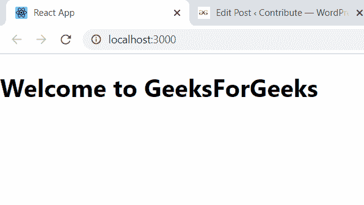
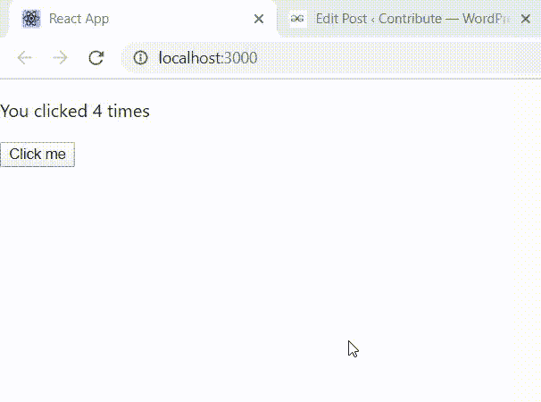
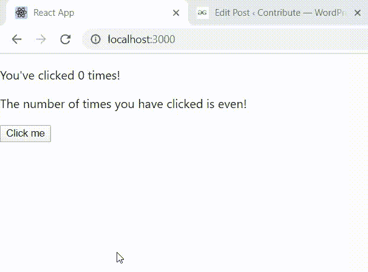
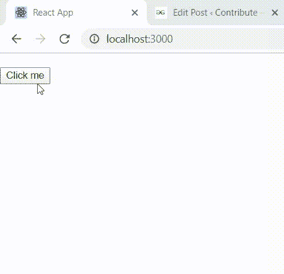
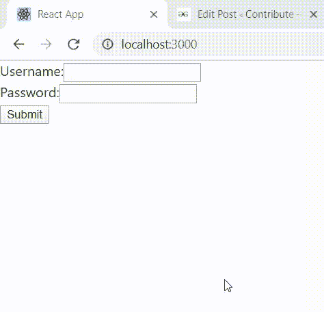

# 重新连接|使用状态钩

> 原文:[https://www.geeksforgeeks.org/reactjs-usestate-hook/](https://www.geeksforgeeks.org/reactjs-usestate-hook/)

功能组件是 ReactJS 中一些更常用的组件。大多数开发人员更喜欢使用功能组件，而不是基于类的组件，原因很简单，功能组件需要更少的编码(对开发人员来说)。然而，当使用功能组件时，该类的两个主要特性会丢失——通过渲染调用保持的专用状态，以及使用生命周期函数来控制组件在其生命周期的不同阶段的外观和行为。
从 16.8 版本开始，ReactJS 增加了一个名为 hooks 的新特性，它展示了基于类的组件的各种特性。最常用的两个钩子是 useState()钩子，它允许功能组件拥有自己的专用状态，以及 [useEffect()](https://www.geeksforgeeks.org/reactjs-useeffect-hook/) 钩子，它允许功能组件在每次渲染之前操纵 DOM 元素(几乎就像在生命周期函数中一样)。
useState()钩子允许在函数内部声明一个状态变量。需要注意的是，useState()的一次使用只能用于声明一个状态变量。
**示例:**程序演示 useState()钩子的基本用法。

**文件名- App.js:** 创建一个 React 应用程序，并将 src 文件夹中的 **App.js** 文件编辑为:

## java 描述语言

```jsx
import React, { useState } from 'react';

function App() {
const click = useState('GeeksForGeeks');
return (
    <h1>Welcome to {click}</h1>
);
}

export default App;
```

**输出:**



useState()返回的值由一个包含两个值的数组组成。第一个值是状态变量的初始值，而第二个值是对可用于更新变量的函数的引用。人们总是可以使用数组析构来同时分配两个值，以便它们可以在组件中使用。当然，也可以通过用 useState()分配一个变量，并将其第一个索引分配给一个变量，将其第二个索引分配给另一个变量来单独分配它们(析构只是使这变得更容易)。
**示例:**演示功能组件中状态变量的使用以及如何相应更新的程序。

**文件名- App.js**

## java 描述语言

```jsx
import React, { useState } from 'react';

function App() {
  const [click, setClick] = useState(0);
  // using array destructuring here
  // to assign initial value 0
  // to click and a reference to the function
  // that updates click to setClick
  return (
    <div>

<p>You clicked {click} times</p>

      <button onClick={() => setClick(click + 1)}>
        Click me
      </button>
    </div>
  );
}

export default App;
```

**输出:**



useState()的工作方式起初可能看起来很奇怪。毕竟，每次渲染，被渲染的函数都是新的——那么“状态”是如何保持的呢？在幕后，内存中有一个代表功能组件的对象，它有自己的堆栈。每当使用 useState()钩子时，状态变量的值都会改变，并且新变量会存储在堆栈中的新单元格中。堆栈指针同时递增，指向最后一个单元格。此堆栈指针指向的值在每次渲染后使用。在用户有意刷新时，堆栈被转储，并在呈现组件时在内存中进行新的分配。
**示例:**程序演示在更新“状态”变量的值时使用最后一个值。
**文件名- App.js**

## java 描述语言

```jsx
import React, { useState } from 'react';

function App() {
  const [click, setClick] = useState(0);

  return (
    <div>

<p>You've clicked {click} times!</p>

<p>The number of times you have clicked
 is {click%2==0?'even!':'odd!'}</p>

      <button onClick={() => setClick(click => click + 1)}>
        Click me
      </button>
    </div>
  );
}

export default App;
```

**输出:**



请注意，在上面的示例中，我们在 setClick()中使用了一个箭头函数，该函数获取 Click 的前一个值，并使用它来用新值更新它。这种形式在需要根据状态变量的值执行数据操作的情况下非常有用。在捕获并更改堆栈中的一个旧值而不是最新值的情况下，传递函数也很有用。
状态变量也可以是数组。当需要处理多个值而不需要使用 useState()声明多个状态变量时，这尤其有用。
**示例:**程序演示数组作为状态变量的使用(使用 useState())。
**文件名- App.js**

## java 描述语言

```jsx
import React, { useState } from 'react';

function App() {
  const [click, setClick] = useState([]);

  const addNumber = () => {
    setClick([
      ...click,
      {
        id: click.length,
        value: Math.random() * 10
      }
    ]);
  };

  return (
    <div>
      <ul>
       {click.map(item => (
          <li key={item.id}>{item.value}</li>
       ))}
      </ul>
      <button onClick={addNumber}>
        Click me
      </button>
    </div>
  );
}

export default App;
```

**输出:**



在使用数组时，useState()的工作方式与 setState()函数(用于更改基于类的组件中状态变量的值)不同。setClick()不会在被调用时将新值与现有值合并，它只是用新值覆盖它们。因此，有必要找到一种附加现有值的变通方法，这是在扩展运算符的帮助下在 addNumber()内部函数中完成的。该函数创建一个具有特定 id 和值的新变量，并将其添加到现有数组中(使用 spread 运算符将其值复制到函数中)。
如果一个人需要同时处理多种类型的数据，那么最好的方法就是使用一个对象。虽然同样的工作可以用单独的状态变量来完成，但从长远来看，对象使工作更加高效(也可以用更少的 useState()声明来完成)。
**示例:**程序演示对象作为状态变量的使用(使用 useState())。
**文件名- App.js**

## java 描述语言

```jsx
import React, { useState } from 'react';

function App() {
  const [data, setData] = useState({
    username: '',
    password: ''
  });
  const [form, setForm] = useState({
    username: '',
    password: ''
  });
  const [submit, submitted] = useState(false);

  const printValues = e => {
    e.preventDefault();
    setForm({
      username: data.username,
      password: data.password
    });
    submitted(true);
  };

  const updateField = e => {
    setData({
      ...data,
      [e.target.name]: e.target.value
    });
  };

  return (
    <div>
    <form onSubmit={printValues}>
      <label>
        Username:
        <input
          value={data.username}
          name="username"
          onChange={updateField}
        />
      </label>
      <br />
      <label>
        Password:
        <input
          value={data.password}
          name="password"
          type="password"
          onChange={updateField}
        />
      </label>
      <br />
      <button>Submit</button>
    </form>

<p>{submit?form.username:null}</p>

<p>{submit?form.password:null}</p>

  </div>
  );
}

export default App;
```

**输出:**



在上面的示例中，“数据”变量用于临时存储用户名和密码字段的输入值。再次使用扩展运算符来复制字段的现有值并相应地更新它。“表单”变量用于存储通过组件中使用的表单提交的值的值，然后显示在表单下方。请注意，在更新“Form”状态变量时，扩展运算符不与 setForm()一起使用，原因很简单，用户不需要担心以前提交的用户名和密码字段的值。