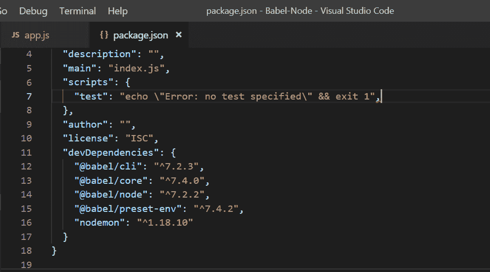
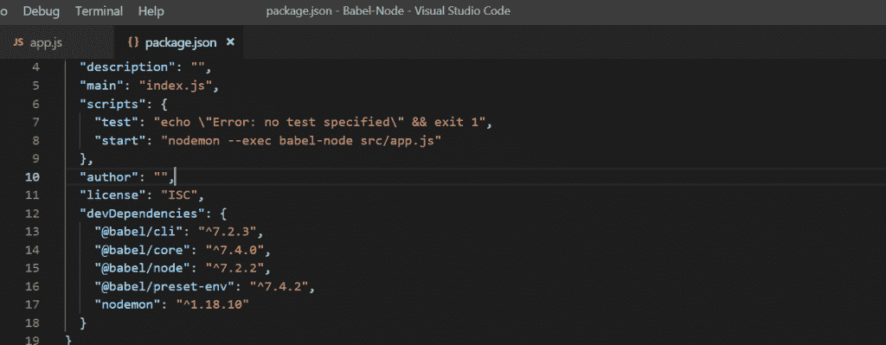
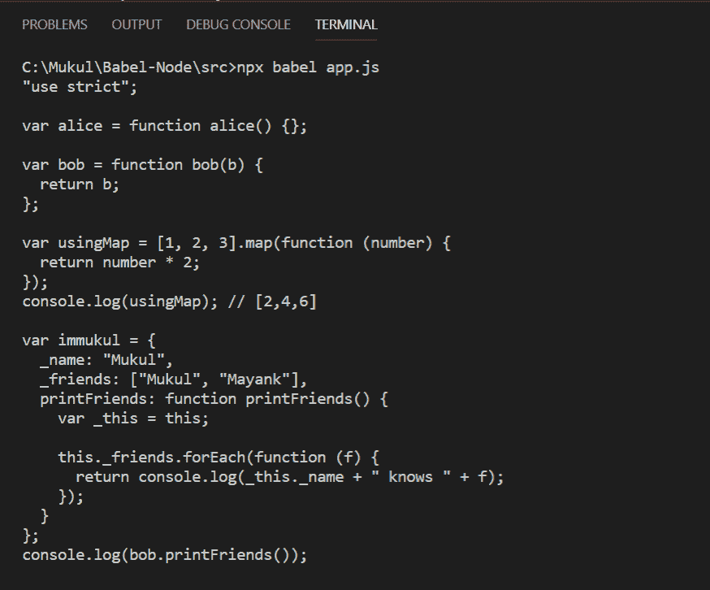

# 反应|使用巴别塔

> 原文:[https://www.geeksforgeeks.org/reactjs-using-babel/](https://www.geeksforgeeks.org/reactjs-using-babel/)

现在我们知道了巴别塔是什么，我们将关注如何使用 node 在您的机器上安装它。按照这些简单的步骤，Babel 可以很容易地安装。
**要求:**

*   像 atom、崇高文本或 Visual studio 代码这样的代码编辑器。
*   节点也应该安装在带有 npm 的机器上。

我们将使用节点安装巴别塔。打开你的文本编辑器，然后创建如下所示的目录结构:

```
  |--node_modules
  |--src
    --app.js
  |--.babelrc
  |--package.json
  |--package.lock.json
```

如果你知道节点是如何工作的，那么你就知道 node_modules、package.json 和 package.lock.json。一旦我们运行一些命令，它们就会自动形成。
现在，打开命令行并设置文件夹目录的路径，然后将这些行写入 cmd:

```
npm install --save-dev @babel/core @babel/cli @babel/preset-env @babel/node
npm install nodemon --save-dev
```

第一个 npm 命令将安装 babel 依赖项，第二个将用于安装 nodemon，它允许我们更新浏览器内容而无需刷新。
输入命令后我们会得到:



从上图中我们可以看到，我们用来安装 babel 依赖项的命令现在在我们的“package.json”文件中可见。
在内侧添加下面的线也很重要。我们项目目录中的 babelrc 文件。

```
// .babelrc
{
  "presets": ["@babel/preset-env"]
}
```

现在，我们终于需要将脚本添加到我们的“package.json”文件中。

```
"start": "nodemon --exec babel-node src/app.js" // inside your scripts tag
```

最终的“package.json”将如下所示:



现在我们都设置好了，我们只需要在我们的 app.js 文件中编写正常的 ES6、7、8 代码，并使用‘npx babel filename’命令运行它，这里的‘filename’被 app.js 替换，我们将在控制台中获得 ES5 输出。
**例:**

## java 描述语言

```
// next generation javascript code
let alice = () => {};

let bob = (b) => b;

const usingMap = [1, 2, 3].map((number) => number * 2);
console.log(usingMap); // [2, 4, 6]

var immukul = { 
    _name: "Mukul", 
    _friends: ["Mukul", "Mayank"],
     printFriends(){
         this._friends.forEach(
             f =>console.log(this._name + " knows " + f)); 
            }
        };

console.log(immukul.printFriends());
```

**输出:**

