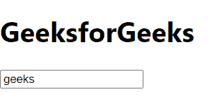
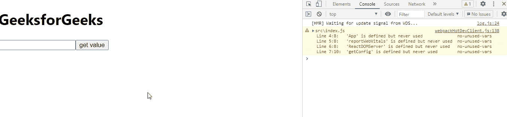

# 反应温度值属性

> 原文:[https://www.geeksforgeeks.org/reactjs-value-attribute/](https://www.geeksforgeeks.org/reactjs-value-attribute/)

React.js 库就是将应用程序拆分成几个组件。每个组件都有自己的生命周期。React 为我们提供了一些内置的方法，我们可以在组件生命周期的特定阶段覆盖这些方法。

在本文中，我们将了解如何使用值属性。value 属性用于设置或获取所选输入字段 textarea 的值。

**创建反应应用程序并安装模块:**

*   **步骤 1:** 使用以下命令创建一个 React 应用程序。

    ```
    npx create-react-app foldername
    ```

*   **步骤 2:** 创建项目文件夹(即文件夹名)后，使用以下命令移动到该文件夹。

    ```
    cd foldername
    ```

**项目结构:**如下图。


**例 1:**

## App.js

```
import React from 'react';
import ReactDOM from 'react-dom';
import './index.css';
import App from './App';
import reportWebVitals from './reportWebVitals';
import ReactDOMServer from 'react-dom/server';

const element = <div>
    <h1>GeeksforGeeks</h1>
      <input value='geeks'/>
</div>;

ReactDOM.render(
  element,
    document.getElementById("root")
);
```

**输出:**



**例 2:**

## App.js

```
import React from 'react';
import ReactDOM from 'react-dom';
import './index.css';
import App from './App';
import reportWebVitals from './reportWebVitals';
import ReactDOMServer from 'react-dom/server';
import { getConfig } from '@testing-library/dom';

const element = <div>
    <h1>GeeksforGeeks</h1>
      <input id={'input'}/>
      <button onClick={ get }>get value</button>
</div>;

function get(){
  var a = document.getElementById('input').value  ;
  console.log(a)
}
ReactDOM.render(
  element,
    document.getElementById("root")
);
```

**输出:**



**参考:**T2】https://reactjs.org/docs/dom-elements.html#value