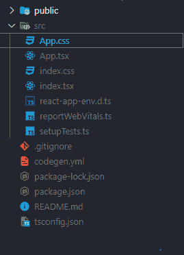

# Redux 工具包在 ReactJS 中编写 Redux 代码的更好方法

> 原文:[https://www . geeksforgeeks . org/redux-toolkit-更好的写入方式-redux-code-in-reactjs/](https://www.geeksforgeeks.org/redux-toolkit-better-way-to-write-redux-code-in-reactjs/)

**Redux Toolkit** 用于编写 Redux 代码，但方式更简洁。Redux Toolkit (RTK)解决了大多数在 react 应用程序中使用 Redux 的开发人员面临的三个更大的问题。

1.  代码太多，无法配置存储。
2.  编写太多样板代码来调度操作并将数据存储在缩减器中。
3.  额外的包，如 Redux-Thunk 和 Redux-Saga，用于执行异步操作。

**创建反应应用程序和安装模块:**

*   **第 1 步:**使用支持类型脚本的以下命令创建一个 react 应用程序:

```jsx
// NPM
npx create-react-app my-app --template typescrip

// Yarn
yarn create react-app my-app --template typescrip
```

*   **步骤 2:** 项目创建后，使用以下命令进入项目文件夹:

```jsx
cd my-app
```

*   **步骤 3:** 现在使用以下命令，在我们创建的项目中通过 npm 或纱线安装 Redux Toolkit:

```jsx
// NPM
npm install @reduxjs/toolkit react-redux

// Yarn
yarn add @reduxjs/toolkit react-redux
```

**项目结构:**会是这样的。



**存储创建:**使用 redux 工具包包中的 configureStore 方法创建一个名为 store.js 的文件，传入应用程序初始化存储所需的 list reducer。

## store.js

```jsx
import { configureStore } from '@reduxjs/toolkit'

export const store = configureStore({
    reducer: {},
})
```

**提供 store to React 应用程序:**一旦创建了 Store，我们就可以使用 react-redux 包中的 Provider 方法将 Store 提供给 React 应用程序。

## App.js

```jsx
import ReactDOM from 'react-dom';
import { Provider } from 'react-redux';
import App from './App';
import { store } from './store.js';

ReactDOM.render(
  <Provider store={store}>
    <App />
  </Provider>,
  document.getElementById('root'),
);
```

**创建 Redux 切片:**创建一个 slice.js 文件。在 redux 工具包中，我们使用 Redux 工具包包中的 createSlice API 创建了一个减速器。通过内部使用，它将动作的创建和减速器的复杂切换情况简化为几行代码。

## slice.js

```jsx
import { createSlice } from '@reduxjs/toolkit';

const initialState = {
  name: [],
  food: [],
};

const customerSlice = createSlice({

  // An unique name of a slice
  name: 'customer',

  // Initial state value of the reducer
  initialState,

  // Reducer methods
  reducers: {
    addCustomer: (state, { payload }) => {
      state.name.push(payload);
    },

    orderFood: (state, { payload }) => {
      state.food.push(payload);
    },
  },
});

// Action creators for each reducer method
export const { addCustomer, orderFood }
            = customerSlice.actions;

export default customerSlice.reducer;
```

即使上面的代码，我们用来推送它的并没有改变状态值，因为 Redux toolkit 内部使用了 immer 库来不变地更新状态。

现在，我们将减速器导入到之前创建的 store.js 文件中。通过在 reducer 参数中定义一个字段，我们告诉存储使用这个 slice reducer 函数来处理对该状态的所有更新。

## store.js

```jsx
import { configureStore } from '@reduxjs/toolkit';
import reducer from './slice.js';

export default configureStore({
  reducer: {
    customers: reducer,
  },
});
```

**使用组件中的 redux 状态和动作:**我们可以使用 react-redux 钩子(useSelectore 和 useDispatch)来读取 redux 存储值，并将动作分派给 Redux。

## 组件. js

```jsx
import React, { useState } from 'react';
import { useDispatch, useSelector } from 'react-redux';
import { orderFood } from './slice.js';

function CustomerCard({ name }) {
  const [orders, setOrders] = useState('');

  // Using useSelector hook we obtain the redux store value
  const food = useSelector((state) => state.customers.food);

  const dispatch = useDispatch();

  // Using the useDispatch hook to send payload back to redux
  const addOrder = () => dispatch(orderFood(orders));

  return (
    <div>
      <div className="customer-food-card-container">
        <p>{name}</p>

        <div className="customer-foods-container">
          {food.map((foo) => (
            <div className="customer-food">{foo}</div>
          ))}

          <div className="customer-food-input-container">
            <input value={orders} onChange={(event) => 
              setOrders(event.target.value)} />

            <button onClick={addOrder}>Add</button>
          </div>
        </div>
      </div>
    </div>
  );
}

export default CustomerCard;
```

**运行应用程序的步骤**:从项目根目录使用以下命令运行应用程序。

```jsx
// NPM
npm start

// yarn
yarn start
```

这就是 redux 工具包如何通过避免所有样板代码来简化 redux 的使用。

**参考:**

*   **Redux 工具包库:**[https://redux-toolkit.js.org/](https://redux-toolkit.js.org/)
*   **项目库:**[https://github.com/vazanth/redux-toolkit](https://github.com/vazanth/redux-toolkit)