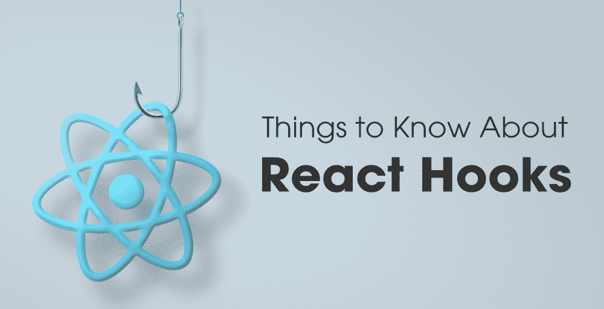

# 关于 React Hooks 你应该知道的事情

> 原文:[https://www . geesforgeks . org/things-you-know-react-hooks/](https://www.geeksforgeeks.org/things-you-should-know-about-react-hooks/)

**反应……**我们都知道这个库在科技行业的重要性。由于 React 的优势和特性，大多数应用程序都在切换到 React。“反应”有很多特点。React hooks 就是其中之一。React hooks 于 2018 年 10 月首次发布。在 React 中，许多开发人员使用生命周期方法，这种方法什么都不是，只是一系列组件。它从 React 组件的诞生到它的死亡一直被使用。



render()，**componentdimount()，componentdupdate()componentdilunmount()所有这些都是生命周期方法。React hooks 是状态管理和生命周期方法的替代方法。有许多不同用途的钩子。其中一些是用户导出器、用户状态、用户回调、用户备忘录、用户界面、用户界面等。**

**在这个博客中，我们将讨论常见的钩子、 [**React 钩子**](https://www.geeksforgeeks.org/introduction-to-react-hooks/) 的好处、React 钩子的规则以及一些例子。**

### **使用反应挂钩的好处**

**钩子为开发者提供了很多好处。它使您的组件变得更好，并且有助于编写清晰、简洁和可维护的代码。它只是从您的组件中删除了所有不必要的代码，并使您的代码更易读。但问题是什么时候使用 React 钩子？**

**当您正在编写一个函数组件，并且您想要向它添加一些状态时，请使用 Hooks。以前这项工作是通过使用类来完成的，但是现在您可以在函数组件中编写钩子。**

### **钩子规则**

**下面是使用 React 钩子的主要规则…**

****1。**始终在顶层调用钩子。不要在循环、条件或嵌套函数中调用它。您将确保每次组件呈现时可以以相同的顺序调用钩子。**

****2。**不能从常规 JavaScript 函数调用 Hooks。可以从 React 函数组件中调用它。一个钩子可以调用另一个钩子。**

### **钩子效应**

**钩子效应允许你在功能组件中执行副作用。Hooks 效应不使用类内组件中可用的函数组件。钩子效果类似于生命周期方法 componentDidMount()，componentDidUpdate()，componentWillUnmount()。**

**钩子效果具有常见的特征如下所示……**

*   **更新 DOM**
*   **从服务器应用编程接口获取和使用数据**
*   **设置订阅**

**下面是的和的例子。**

## **java 描述语言**

```jsx
import React, { useState, useEffect } from 'react';  

function CounterExample() {  
  // Declare a new state variable, which we'll call "count"  
  const [count, setCount] = useState(0);  
  const incerementCount = () =>setCount(count+1);

  useEffect(() => {  
    // Update the document title using the browser API  
    document.title = `You clicked ${count} times`;  
  });

  return (  
    <div>  

<p>You clicked {count} times</p>

      <button onClick={incrementCount}>  
        Click me  
      </button>  
    </div>  
  );  
}  
export default CounterExample;
```

### **上下文挂钩**

**在 React 中有一个上下文挂钩的概念。上下文挂钩用于上下文应用编程接口。您在 React 中创建上下文，这个钩子用于与创建的上下文进行交互。下面给出了一个例子…**

## **java 描述语言**

```jsx
import React, { useContext } from 'react';
const ExampleContext = React.createContext();
function Display() {
   const Examplevalue = useContext(ExampleContext);
   return <div>{Examplevalue}, This value is from context.</div>;
}
function App() {
   return (
      <ExampleContext.Provider value={"Tamil"}>
         <Display />
      </ExampleContext.Provider>
   );
}
```

### **变径钩**

**如果你和 Redux 合作过，你可能听过这个词。变径钩作为状态钩的替代物。当一个状态被改变时，它被捆绑在一个名为 Reducer 的中心函数中。之后，状态将根据操作和现有状态进行更新。下面给出了其中一个例子…你可以重写下面给出的状态挂钩例子…**

## **java 描述语言**

```jsx
import React, { useReducer } from 'react';
const initialState = {count: 0};

function reducer(state, action) {
  switch (action.type) {
    case 'increment': return { count: state.count + 1 };
    case 'decrement': return { count: state.count - 1 };
    default: throw new Error();
  }
}

function App() {
  const [state, dispatch] = useReducer(reducer, initialState);
  return (
    <>
      <h2>Count: {state.count}</h2>
      <button onClick={() => dispatch({type: 'increment'})}>+</button>
      <button onClick={() => dispatch({type: 'decrement'})}>-</button>
    </>
  );
}
```

### ****参考钩****

**引用钩子引用由渲染方法创建的反应元素。下面给出了一个例子…**

## **java 描述语言**

```jsx
import React, { useRef } from 'react';
function App() {
  const newElement = useRef(null);
  const onButtonClick = () => {
    newElement.current.focus();
  };
  return (
    <>
      <input ref={newElement} type="text" />
      <button onClick={onButtonClick}>Focus to Element</button>
    </>
  );
}
```

### **最终想法**

**我们已经通过代码示例讨论了主要的钩子及其用法。这些钩子不限于此。一旦你有了“反应”的经验，你将会使用更多的钩子，比如 useDispatch，useSelect 等等。每一个都有自己的应用。**