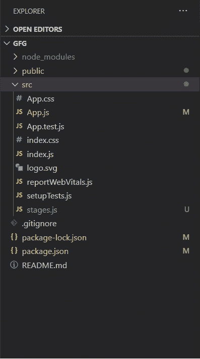
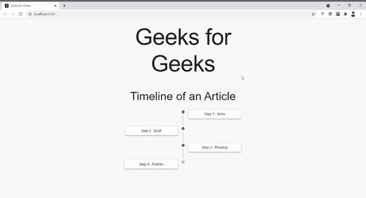

# react . js 中的时间轴组件

> 原文:[https://www . geesforgeks . org/timeline-component-in-react-js/](https://www.geeksforgeeks.org/timeline-component-in-react-js/)

用户界面中经常使用时间线来说明一个循序渐进的过程。它可以向用户描述他们当前处于流程的哪个阶段以及进一步的任务是什么。材料用户界面实验模块提供了一个时间轴组件以及一些其他实用程序组件，使其非常容易包含在我们的反应应用程序中。

**创建反应应用程序并安装模块:**

*   **步骤 1:** 使用以下命令创建一个反应应用程序:

    ```jsx
    npx create-react-app gfg
    ```

*   **第 2 步:**创建项目文件夹后，即 gfg **，**使用以下命令移动到该文件夹:

    ```jsx
    cd gfg
    ```

*   **步骤 3:** 创建 ReactJS 应用程序后，使用以下命令安装 **material-ui** 模块:

    ```jsx
    npm install @material-ui/core
    npm install @material-ui/lab
    ```

作为一个例子，我们将创建一个 Stages 组件，以时间轴的形式说明 GeeksforGeeks 的文章所经历的不同阶段。在 **src** 文件夹中创建一个文件 ***stages.js*** ，我们将在其中定义这个组件。

**项目结构:**如下图。



#### 材料-用户界面中的时间线组件

Material UI 实验室中的时间轴组件按时间顺序显示项目，并允许开发人员在一定程度上自由更改项目的显示方式。它有一些有用的道具:

*   **对齐:**文本内容可以张贴在时间线的左侧、右侧或交替位置。
*   **颜色:**用于表示该阶段时间轴点的颜色。这是我们在时间轴组件中使用的时间轴点组件的道具。

## stages.js

```jsx
import React from 'react';
import Timeline from '@material-ui/lab/Timeline';
import TimelineItem from '@material-ui/lab/TimelineItem';
import TimelineSeparator from '@material-ui/lab/TimelineSeparator';
import TimelineConnector from '@material-ui/lab/TimelineConnector';
import TimelineContent from '@material-ui/lab/TimelineContent';
import TimelineDot from '@material-ui/lab/TimelineDot';
import { Paper } from '@material-ui/core';

const paperstyle={
    padding: '8px 1px',
    textAlign:'center',
}

export default function Stages() {
    return (
        <Timeline align="alternate">
            <TimelineItem>
                <TimelineSeparator>
                    <TimelineDot color="primary" />
                    <TimelineConnector />
                </TimelineSeparator>
                <TimelineContent>
                <Paper elevation={3} style={paperstyle}>Step 1 : Write
                </Paper>
                </TimelineContent>
            </TimelineItem>
            <TimelineItem>
                <TimelineSeparator>
                    <TimelineDot color="primary" />
                    <TimelineConnector />
                </TimelineSeparator>
                <TimelineContent>
                <Paper elevation={3} style={paperstyle}>Step 2 : Draft
                </Paper>
                </TimelineContent>
            </TimelineItem>
            <TimelineItem>
                <TimelineSeparator>
                    <TimelineDot color="primary" />
                    <TimelineConnector />
                </TimelineSeparator>
                <TimelineContent>
                <Paper elevation={3} 
                       style={paperstyle}>Step 3 : Pending
                </Paper>
                </TimelineContent>
            </TimelineItem>
            <TimelineItem>
                <TimelineSeparator>
                    <TimelineDot />
                </TimelineSeparator>
                <TimelineContent>
                <Paper elevation={3} 
                       style={paperstyle}>Step 4 : Publish
                </Paper>
                </TimelineContent>
            </TimelineItem>
        </Timeline>
    );
}
```

现在在 **App.js** 文件中写下以下代码。在这里，App 是我们编写代码的默认组件。

## App.js

```jsx
import React, { Component } from 'react';
import CssBaseline from '@material-ui/core/CssBaseline';
import Container from '@material-ui/core/Container';
import Typography from '@material-ui/core/Typography';
import Stages from './stages';

class GFG extends Component {
    render() {
        return (
            <React.Fragment>
                <CssBaseline />
                <br></br>
                <Container maxWidth="sm">
                    <Typography component="h1" 
                                variant="h1" align="center" 
                    gutterBottom>
                        Geeks for Geeks
                    </Typography>
                    <br />
                    <Typography component="h3" 
                                variant="h3" align="center" 
                    gutterBottom>
                        Timeline of an Article
                    </Typography>
                </Container>
                <Container maxWidth="sm">
                    <Stages></Stages>
                </Container>
            </React.Fragment>
        );
    }
}

export default GFG;
```

**运行应用程序的步骤:**从项目的根目录使用以下命令运行应用程序:

```jsx
npm start
```

**输出:**现在打开浏览器，转到***http://localhost:3000/***，会看到如下输出:

