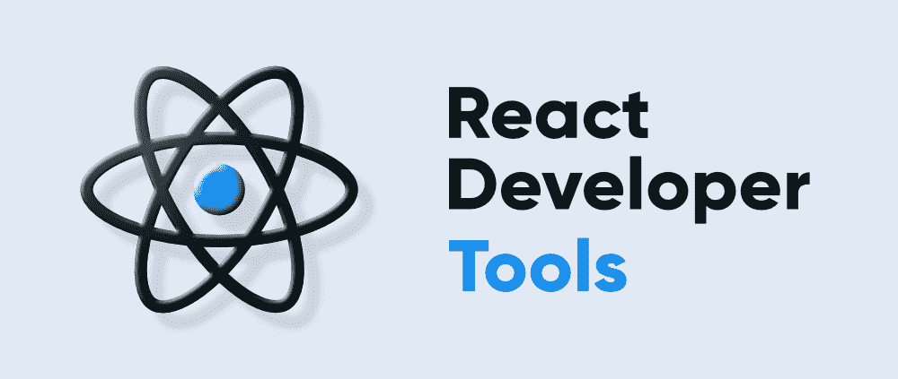
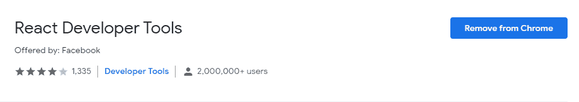
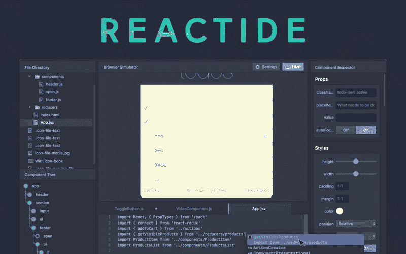
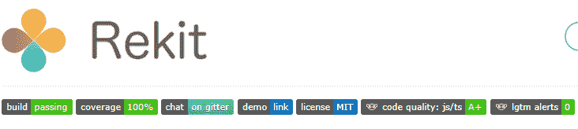
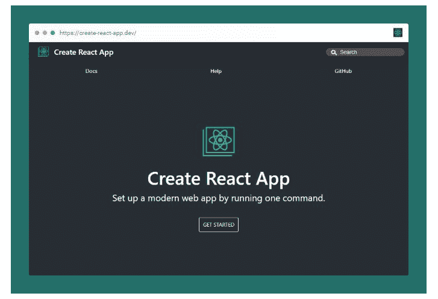

# 2021 年前 5 大反应开发者工具

> 原文:[https://www . geesforgeks . org/top-5-react-developer-tools-in-2021/](https://www.geeksforgeeks.org/top-5-react-developer-tools-in-2021/)

**简介:** React 开发者工具是一系列框架、库和扩展，旨在指导 React 的开发。开发人员使用代码生成器、测试工具、调试扩展和其他 React 工具来使代码更加强大和稳定。在当今的网络开发市场上，React 开发者的需求很高，或者你可以说 React 开发者有很多职位空缺。用一些新技能保持更新并对开发人员做出反应是非常重要的。您必须了解以下五大著名的 react 工具。



现在让我们来看看前 5 大反应开发者工具。

**1。Bit:** 是 Github 上的开源工具。这允许 react 开发人员将他们的应用程序作为独立组件的集合。所以基本上，这是一个制作不同反应成分的好工具。您可以访问第三方商店，并可以执行以下操作:

*   搜索和下载他人开发的组件
*   使它们适合您的项目

**使用方法:** Bit 自带在线平台和 CLI 工具。您只需要发布您的 react 组件。一旦被 Bit 选中，就可以和其他开发者分享了。所以，你需要从头开始开发一切。这也适用于微前端，可以完美地处理所有复杂的代码。


**2。React 开发者工具浏览器扩展:**可以在 chrome、edge、firefox 等多种浏览器中下载 React 开发者工具作为扩展。此工具允许您检查 react 的组件层次结构。该工具的主要功能如下:

*   呈现的组件列表
*   渲染的子组件
*   有助于衡量 React App 的性能
*   可以通过一点点测试来检查每个反应组件
*   轻松识别问题

**如何使用:**是 Chrome 和 Firefox 中可用的****。一旦你在浏览器中添加了这些，你就可以使用不同的功能来调试应用程序。您可以检查 React 树，还可以检查道具、状态和许多其他东西在应用程序中是如何工作的****

********

******3。Reactide:** 它是 Reactide 中第一个为 web 应用程序开发量身定制且最受推荐的 ide。如果你想了解 Reactide，你可以使用 GitHub。可能会有一个问题，为什么这一个如此受欢迎和最推荐，那么你应该经历以下功能****

*   ****流线型配置****
*   ****组件可视化****
*   ****热模块重装****

****因此，由于这些特性，这被认为是 react 开发人员的最佳工具之一。****

******如何使用:**不需要创建服务器配置。借助自定义浏览器模拟器和集成节点服务器，该工具易于使用。这种集成的节点服务器消除了内置工具和服务器配置的依赖性。****

********

******4。Rekit:** 如果您想使用 React、Redux 和 React-router 创建一个 web 应用程序，并且您还希望该应用程序具有可扩展性，那么 Rekit 是您的完美工具。如果您不想关注模式、配置和大型库，只想处理业务逻辑，那么这个工具非常适合您。在这个工具中，您将找到对 Rekit 工作室的访问，该工作室将向您显示所有页面、减速器和组件的概述。那么你还在等什么，把这个工具和你的 React 项目联系起来。****

******如何使用:**您需要使用下面给出的命令安装 Rekit，以便在您的 React 项目中使用它。****

******语法:******

```jsx
**npm install -g rekit  # Install Rekit CLI
npm install -g rekit-studio  # Install Rekit Studio**
```

********

******5。脸书创建反应应用程序:**这是反应开发者社区中最受欢迎的工具之一。为此你会在 GitHub 上找到超过 89K 的星星。基本上是脸书开发的。它最适合初学者和任何新的反应项目。以下是该工具的功能。****

*   ****对构建配置没有要求****
*   ****不要担心最佳的项目结构和支持模块****
*   ****用一个命令设置你的反应应用****

******如何使用:**跟随链接[**创建 React App:设置开发环境**](https://www.geeksforgeeks.org/reactjs-setting-development-environment/) 获取使用它的详细说明。****

********

****因此，开始使用所有这些工具，让我们知道这些工具在您的 react 项目中对您有什么帮助。****