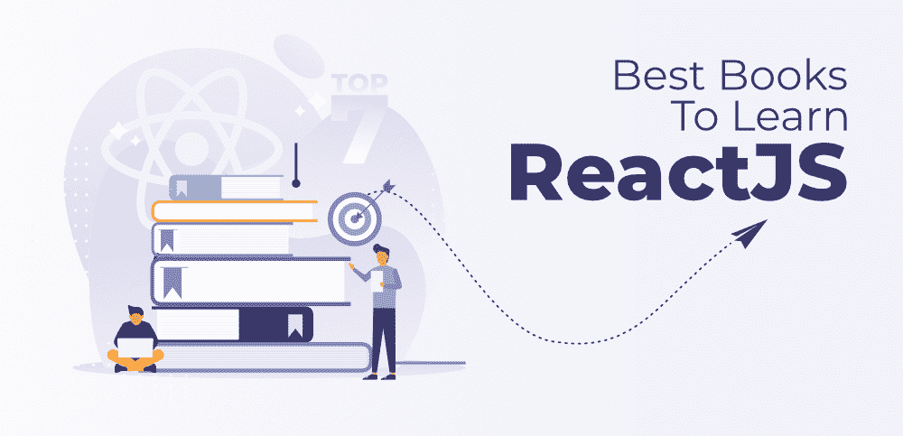

# 7 大最佳学习反应书籍 JS

> 原文:[https://www . geesforgeks . org/top-7-最好的书-学习-反应-js/](https://www.geeksforgeeks.org/top-7-best-books-to-learn-react-js/)

你可能听过这样一句话，**努力是成功的关键**，这在过去可能是相对的，但现在情况变了。现在世界发展得如此之快，只努力并不能保证成功；你必须做聪明的工作。

ReactJs 是最受欢迎的前端库，即 React JS，由脸书和个人开发者社区维护。它用于创建交互式用户界面或用户界面组件或单页应用程序。为了更好地理解 React JS，专家开发人员强烈推荐的一件事是，应该了解 HTML、CSS 和 JavaScript 以及 ES6 概念。

#### 1.全堆叠反应

六位伟大的作者在这本书里提供了知识。如果你从不止一个来源学习 React JS，比如教程、博客等。，你在浪费你宝贵的时间，因为一些博客文章已经过时，教程也不完整，令人困惑。有了这本书，你将建立一个强大的 React JS 基础，随着你的前进，你将在短时间内掌握整个 JavaScript 库。

这本书写得好，组织得好。通过本书给出的例子，你可以了解你的应用程序是如何工作的。当你完成它的时候，你将能够用 React JS 创建可靠的、测试良好的、定制的应用程序。

#### 2.学习反应之路:你掌握简单而务实的反应的旅程

这本书涵盖了带有钩子的 React JS 的所有基础知识，以及像客户端和服务器端搜索这样的高级特性实现。在这里，你会发现，在进入新的章节之前，你必须对上一章有一个清晰的了解，同时，你会在每章结束时解决问题。所以，它是一本教你从零开始 React JS 的初学者的好书。它还可以帮助您逐步创建 React 应用程序。在本书的最后，您将对如何构建和部署一个功能全面的 React 应用程序有一个深入的了解。

#### 3.马克·蒂伦斯·托马斯《行动中的反应》

有了这本书，您将从 React 的介绍和基础知识、使用组件等开始您的旅程。你也会熟悉每章给出的例子。这本书涵盖了渲染、生命周期方法、JSX、数据流、表单、路由等等。随着深入研究，您将了解如何使用第三方库，并测试 React 组件。它对那些通过做实际的事情来学习概念的人很有用。但是，在开始之前，你必须了解 HTML、CSS 和 JavaScript。

#### 4.学习反应，第二版

你是否使用 HTML、CSS 和 JavaScript 创建了一些很酷的东西，你知道这些东西在网络浏览器中是如何协同工作的吗？如果是，那么是时候更新自己了。这本书将教你最流行和广泛使用的 JavaScript 库，叫做 React JS。在这本书里，你将学习函数式编程、最新的 ECMAScript 特性、React 组件等等。

本书涵盖以下主题:

*   使用 React 组件创建应用程序表示层
*   管理数据并减少调试应用程序的时间
*   结合反应挂钩来管理状态和获取数据
*   为单页应用程序功能使用路由解决方案
*   了解如何以服务器为中心构建 React 应用程序

看完这本书，你就有了在 web 应用中使用 React JS 的知识，你就能高效地构建自己的 React 应用。总的来说，这是一本适合那些没有反应或函数编程知识的人的好书。但是你要满足以上条件才能更好的理解这本书。

#### 5.React.js Essentials:一次快节奏的旅行

这本书是另一本 React JS 书，供前端开发人员使用 React JS 为您的 web 应用程序创建可维护和高性能的用户界面。由于它的风格，一步一步的教程，你会很快理解概念，并快速学习 React JS。通过这本书，您将会处理无状态和有状态的反应组件、生命周期方法、Flux 架构的核心元素等等。这本书将带你从安装 React JS 到用 Jest 测试框架测试你的 React 组件。对于那些对前端开发有很好的了解的人来说，这是一本理想的书，其中包含了前端开发中使用的库和框架之类的东西。

#### 6.阿扎特·马登的快速反应

这本书的作者 Azat Mardan 在教授 web 开发工具方面有着丰富的经验，他还写了许多关于其他 web 开发的好书，比如 JavaScript、React 等等。有了这本书，你将能够掌握 React 的基础知识，并通过大量的例子和教程深入理解概念。它还将帮助您构建一个完整的带有数据和路由的 web 应用程序。看完这本书，你会有一个 React JS 创建的大项目。在开始之前，您必须熟悉使用 JavaScript 构建 web 应用程序。

#### 7.反应食谱

这是一本伟大的书，围绕着 66 个实践食谱，涵盖了用户界面开发、动画、组件架构、路由、数据库、测试和使用 React 进行调试。它将有助于使用 React 16 构建快速、高效和高性能的应用程序。您还将熟悉有助于为生产部署 React 应用程序的最佳实践。

本书涵盖以下主题:

*   最新的 ECMAScript 功能
*   复杂的主题，如 Webpack 和服务器端呈现
*   用 Node、Firebase 和 GraphQL 创建应用编程接口
*   使用 React Native 创建移动应用程序
*   在数字海洋上部署 React 应用程序

你有没有反应的知识并不重要。如果你想提高你的反应技能，或者是一个想要学习反应的 JavaScript 开发人员，那么你可以选择这本书。这本书将帮助你成为专家级 React 开发者。

**结论:**最后，你需要知道每本书都满载着要学习的知识 ReactJS，你可以根据自己的要求和方便挑选一个开始！