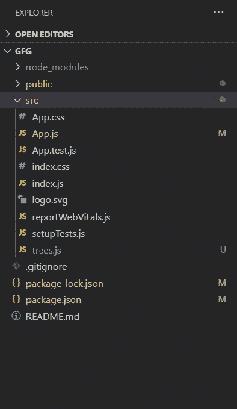
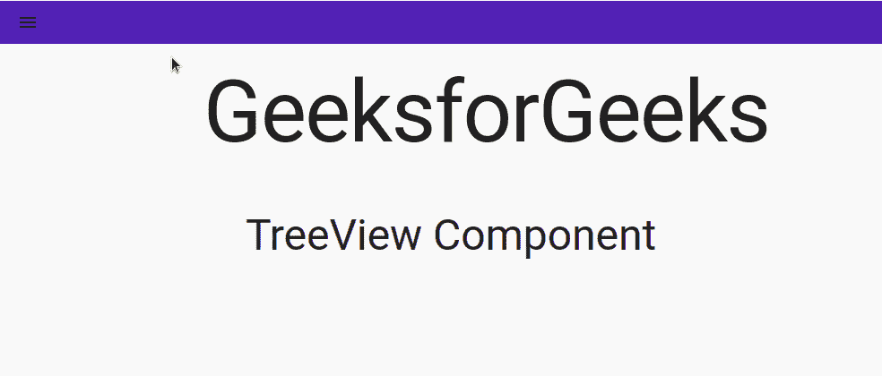

# 反应堆中的树形视图组件

> 原文:[https://www . geesforgeks . org/tree-view-component-in-reactjs/](https://www.geeksforgeeks.org/tree-view-component-in-reactjs/)

树视图通常用于显示文件系统的目录树或分层结构中的多个选项。导航图标表示一个选项是否处于展开状态，然后在其下方的缩进部分显示其中的项目。在像 Gmail 这样的网站的侧栏中，将选项和子选项显示在一起是非常突出的。

**创建反应应用程序并安装模块:**

**步骤 1:** 使用以下命令创建一个 React 应用程序。

```
npx create-react-app gfg
```

**第 2 步:**创建项目文件夹(即 gfg)后，使用以下命令移动到它。

```
cd gfg
```

**步骤 3:** 创建 ReactJS 应用程序后，使用以下命令安装 material-ui 模块。

```
npm install @material-ui/core
npm install @material-ui/icons
npm install @material-ui/lab
```

我们将需要树形视图组件的材质用户界面实验模块和图标的图标模块。在您的终端项目目录中运行以下命令来安装这些模块。

**导入 TreeView:** 可以使用以下代码从@material-ui/lab 导入< TreeView / >组件。

```
import { TreeView } from '@material-ui/lab';
```

**示例:**我们将创建一个类似 GeeksforGeeks 网站边栏中的小树视图。在 src 文件夹中创建一个新的文件 trees.js，我们将在其中定义我们的组件。

**项目目录:**创建 trees.js 文件。



**材质-UI 中的 TreeView 组件:**TreeView 组件有一些有用的道具:

*   默认折叠图标–指定用于折叠节点的图标。
*   defaultexpanddicon–指定用于展开节点的图标。
*   多选–一个布尔值，当为真时，按下 ctrl 和 shift 键会触发多选。

**创建树组件:**geeks forgeeks 网站有一个树状结构的侧边栏菜单，有许多部分，如主页、课程、数据结构、算法等。我们将创建一个类似的小版本来理解如何使用 TreeView 组件。

<treeview>组件是定义整个树结构的最顶层组件。</treeview>

```
<TreeView> </TreeView>
```

然后，使用 TreeItem 组件定义每个节点，该组件有两个主要支柱——唯一的节点 id 和标签。标签是您可以定义节点是什么元素、按钮、样式 div 还是列表项的地方。这里我们将使用列表项。

```
<TreeItem nodeId="1" label={
    <ListItem button component="a" href="#">
        <ListItemText primary="Home" />
    </ListItem>}>
</TreeItem>
```

现在每个这样的节点可以根据需求进一步嵌套，从而定义一个树状结构。

**示例:**

**文件名:trees.js**

## java 描述语言

```
import React, { Component } from 'react';
import { makeStyles } from '@material-ui/core/styles';
import clsx from 'clsx';
import AppBar from '@material-ui/core/AppBar';
import Toolbar from '@material-ui/core/Toolbar';
import IconButton from '@material-ui/core/IconButton';
import MenuIcon from '@material-ui/icons/Menu';
import List from '@material-ui/core/List';
import ListItem from '@material-ui/core/ListItem';
import ListItemText from '@material-ui/core/ListItemText';
import Drawer from '@material-ui/core/Drawer';
import { useTheme } from '@material-ui/core/styles';
import { TreeView } from '@material-ui/lab';
import TreeItem from '@material-ui/lab/TreeItem';

const drawerWidth = 240;

const useStyles = makeStyles((theme) => ({
    root: {
        flexGrow: 1,
        paddingTop: 5,
    },
    appbar: {
        background: 'transparent',
        boxShadow: 'none',
    },
    drawerPaper: {
        position: 'relative',
        whiteSpace: 'nowrap',
        width: drawerWidth,
        transition: theme.transitions.create('width', {
            easing: theme.transitions.easing.sharp,
            duration: theme.transitions.duration.enteringScreen,
        }),
    },
    drawerPaperClose: {
        overflowX: 'hidden',
        transition: theme.transitions.create('width', {
            easing: theme.transitions.easing.sharp,
            duration: theme.transitions.duration.leavingScreen,
        }),
        width: theme.spacing(7),
        [theme.breakpoints.up('sm')]: {
            width: theme.spacing(9),
        },
    },
}));

export default function Trees() {
    const theme = useTheme();
    const classes = useStyles(theme);
    const [open, setOpen] = React.useState(false);
    function handleDrawer() {
        setOpen(!open);
    }
    return (
        <div className={classes.root}>
        {/* AppBar part - Only contains a menu icon*/}
            <AppBar position="static" color="primary" elevation={0}>
                <Toolbar variant="dense">
                {/* Menu icon onclick handler should open the drawer, 
                hence we change the state 'open' to true*/}
                    <IconButton edge="start"
                    style={{ color: theme.palette.secondary.icons }} 
                    aria-label="menu" onClick={() => { handleDrawer() }}>
                        <MenuIcon />
                    </IconButton>
                </Toolbar>
            </AppBar>
            {/* Drawer (can be placed anywhere in template) */}
            <Drawer
                variant="temporary"
                classes={{
                    paper: clsx(classes.drawerPaper, 
                    !open && classes.drawerPaperClose),
                }}
                open={open}>
                <List>
                    <div>
                    {/* Tree Structure */}
                        <TreeView>
                            <TreeItem nodeId="1" label={
                                <ListItem button component="a" href="#">
                                    <ListItemText primary="Home" />
                                </ListItem>}>
                            </TreeItem>
                            <TreeItem nodeId="2" label={
                                <ListItem button component="a" href="#">
                                    <ListItemText primary="Data Structures" />
                                </ListItem>}>
                                <TreeItem nodeId="6" label={
                                    <ListItem button component="a" href="#">
                                        <ListItemText primary="Arrays" />
                                    </ListItem>}>
                                </TreeItem>
                                <TreeItem nodeId="7" label={
                                    <ListItem button component="a" href="#">
                                        <ListItemText primary="Linked List" />
                                    </ListItem>}>
                                </TreeItem>
                            </TreeItem>
                            <TreeItem nodeId="3" label={
                                <ListItem button component="a" href="#">
                                    <ListItemText primary="Algortihms" />
                                </ListItem>}>
                                <TreeItem nodeId="8" label={
                                    <ListItem button component="a" href="#">
                                        <ListItemText primary="Searching" />
                                    </ListItem>}>
                                </TreeItem>
                                <TreeItem nodeId="9" label={
                                    <ListItem button component="a" href="#">
                                        <ListItemText primary="Sorting" />
                                    </ListItem>}>
                                </TreeItem>
                            </TreeItem>
                            <TreeItem nodeId="4" label={
                                <ListItem button component="a" href="#">
                                    <ListItemText primary="Languages" />
                                </ListItem>}>
                                <TreeItem nodeId="10" label={
                                    <ListItem button component="a" href="#">
                                        <ListItemText primary="C++" />
                                    </ListItem>}>
                                </TreeItem>
                                <TreeItem nodeId="11" label={
                                    <ListItem button component="a" href="#">
                                        <ListItemText primary="Java" />
                                    </ListItem>}>
                                </TreeItem>
                                <TreeItem nodeId="12" label={
                                    <ListItem button component="a" href="#">
                                        <ListItemText primary="Python" />
                                    </ListItem>}>
                                </TreeItem>
                                <TreeItem nodeId="13" label={
                                    <ListItem button component="a" href="#">
                                        <ListItemText primary="JavaScript" />
                                    </ListItem>}>
                                </TreeItem>
                            </TreeItem>
                            <TreeItem nodeId="5" label={
                                <ListItem button component="a" href="#">
                                    <ListItemText primary="GBlog" />
                                </ListItem>}></TreeItem>
                        </TreeView>
                    </div>
                </List>
            </Drawer>
            {/* End-Drawer */}
        </div>
    );
}
```

**文件名:App.js**

## java 描述语言

```
import React, { Component } from 'react';
import CssBaseline from '@material-ui/core/CssBaseline';
import Container from '@material-ui/core/Container';
import Typography from '@material-ui/core/Typography';
import Trees from './trees';

class GFG extends Component {
    render() {

        return (
            <React.Fragment>
                <CssBaseline />
                <Trees></Trees>
                <br></br>
                <Container maxWidth="sm">
                    <Typography component="h1" variant="h1"
                     align="center" gutterBottom>
                        Geeks for Geeks
                    </Typography>
                    <br />
                    <Typography component="h3" variant="h3"
                     align="center" gutterBottom>
                        TreeView Component
                    </Typography>
                </Container>
            </React.Fragment>

        );
    }
}

export default GFG;
```

**运行应用程序的步骤:**从项目的根目录使用以下命令运行应用程序。

```
npm start
```

**输出:**



**参考链接:**[https://material-ui.com/components/tree-view/](https://material-ui.com/components/tree-view/)