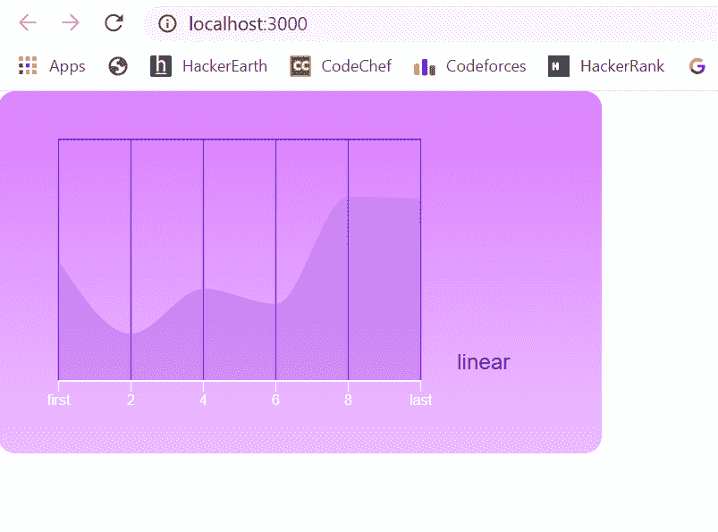

# ReactJS 中的 VISX 库

> 原文:[https://www.geeksforgeeks.org/visx-library-in-reactjs/](https://www.geeksforgeeks.org/visx-library-in-reactjs/)

**VISX** 是一个库，它允许我们毫无问题地将设计添加到我们的 React 应用程序中。在下面的例子中，我们展示了如何利用它将地区对比图添加到我们的 React 应用程序中。

**模块安装:**我们必须安装由 **Visx** 库提供的大量模块，以制作面积差异图。为此，请从您的终端运行以下命令。

```
$ npm install --save @visx/axis @visx/curve 
@visx/gradient @visx/grid @visx/group @visx/mock-data 
@visx/react-spring @visx/responsive @visx/shape 
@visx/scale react-spring
```

**注意:*****@ visx/mock-data***库中有我们可以在视觉图表中使用的 mock 数据。

**创建反应应用程序:**

**步骤 1:** 使用以下命令创建一个反应应用程序:

```
npx create-react-app foldername
```

**步骤 2:** 创建项目文件夹(即文件夹名)后，使用以下命令移动到该文件夹:

```
cd foldername
```

**项目结构:**如下图。


项目结构

**示例:**要添加填充线图，我们编写以下代码。

**文件名:App.js**

## java 描述语言

```
import React, { useState, useMemo } from "react";
import AreaClosed from "@visx/shape/lib/shapes/AreaClosed";
import { curveMonotoneX } from "@visx/curve";
import {
  scaleUtc,
  scaleLinear,
  scaleLog,
  scaleBand,
  coerceNumber
} from "@visx/scale";
import { Orientation } from "@visx/axis";
import {
  AnimatedAxis,
  AnimatedGridRows,
  AnimatedGridColumns
} from "@visx/react-spring";
import { LinearGradient } from "@visx/gradient";
import { timeFormat } from "d3-time-format";

export const backgroundColor = "#da7cff";
const axisColor = "#fff";
const tickLabelColor = "#fff";
export const labelColor = "#340098";
const gridColor = "#6e0fca";
const margin = {
  top: 40,
  right: 150,
  bottom: 20,
  left: 50
};

const tickLabelProps = () => ({
  fill: tickLabelColor,
  fontSize: 12,
  fontFamily: "sans-serif",
  textAnchor: "middle"
});

const getMinMax = (vals) => {
  const numericVals = vals.map(coerceNumber);
  return [Math.min(...numericVals),
          Math.max(...numericVals)];
};

function Example({
  width: outerWidth = 800,
  height: outerHeight = 800,
  showControls = true
}) {
  const width = outerWidth - margin.left - margin.right;
  const height = outerHeight - margin.top - margin.bottom;
  const [dataToggle] = useState(true);
  const [animationTrajectory] = useState("center");

  const axes = useMemo(() => {
    const linearValues = dataToggle ? [0, 2, 4, 6, 8, 10] :
                                      [6, 8, 10, 12];

  return [
      {
        scale: scaleLinear({
          domain: getMinMax(linearValues),
          range: [0, width]
        }),
        values: linearValues,
        tickFormat: (v, index, ticks) =>
          index === 0
            ? "first"
            : index === ticks[ticks.length - 1].index
            ? "last"
            : `${v}`,
        label: "linear"
      }
    ];
  }, [dataToggle, width]);

  if (width < 10) return null;

  const scalePadding = 40;
  const scaleHeight = height / axes.length - scalePadding;

  const yScale = scaleLinear({
    domain: [100, 0],
    range: [scaleHeight, 0]
  });

  return (
    <>
      <svg width={outerWidth} height={outerHeight}>
        <LinearGradient
          id="visx-axis-gradient"
          from={backgroundColor}
          to={backgroundColor}
          toOpacity={0.5}
        />
        <rect
          x={0}
          y={0}
          width={outerWidth}
          height={outerHeight}
          fill={"url(#visx-axis-gradient)"}
          rx={14}
        />
        <g transform={`translate(${margin.left},${margin.top})`}>
          {axes.map(({ scale, values, label, tickFormat }, i) => (
            <g
              key={`scale-${i}`}
              transform={`translate(0, ${i * (scaleHeight + scalePadding)})`}
            >
              <AnimatedGridRows
                key={`gridrows-${animationTrajectory}`}
                scale={yScale}
                stroke={gridColor}
                width={width}
                numTicks={dataToggle ? 1 : 3}
                animationTrajectory={animationTrajectory}
              />
              <AnimatedGridColumns
                key={`gridcolumns-${animationTrajectory}`}
                scale={scale}
                stroke={gridColor}
                height={scaleHeight}
                numTicks={dataToggle ? 5 : 2}
                animationTrajectory={animationTrajectory}
              />
              <AreaClosed
                data={values.map((x) => [
                  (scale(x) ?? 0) +
                    ("bandwidth" in scale &&
                    typeof scale.bandwidth !== "undefined"
                      ? scale.bandwidth() / 2
                      : 0),
                  yScale(10 + Math.random() * 90)
                ])}
                yScale={yScale}
                curve={curveMonotoneX}
                fill={gridColor}
                fillOpacity={0.2}
              />
              <AnimatedAxis
                key={`axis-${animationTrajectory}`}
                orientation={Orientation.bottom}
                top={scaleHeight}
                scale={scale}
                tickFormat={tickFormat}
                stroke={axisColor}
                tickStroke={axisColor}
                tickLabelProps={tickLabelProps}
                tickValues={
                  label === "log" || label === "time" ? undefined : values
                }
                numTicks={label === "time" ? 6 : undefined}
                label={label}
                labelProps={{
                  x: width + 30,
                  y: -10,
                  fill: labelColor,
                  fontSize: 18,
                  strokeWidth: 0,
                  stroke: "#fff",
                  paintOrder: "stroke",
                  fontFamily: "sans-serif",
                  textAnchor: "start"
                }}
                animationTrajectory={animationTrajectory}
              />
            </g>
          ))}
        </g>
      </svg>
    </>
  );
}

export default function App() {
  return (
    <div>
      <Example width="500" height="300" />
    </div>
  );
}
```

**说明:**我们加入 *backgroundColor* 设置基础色调， *axisColor* 有枢纽色调， *tickLabelColor* 有 x-hub tick 名称的色调， *labelColor* 有 y-hub 名称的色调， *gridColor* 有网络色调。

我们使用*标签页面*工作来更改内容样式。为了添加图表内容，我们添加了轴簇。我们从*数据切换*对象中注册图表的质量，*线性值*具有直接的比例权重。我们有 y-Scale 对象来添加 y-pivot 元素。在我们返回的 JSX 中，我们添加了 SVG、*矩形*方形组件，然后在*轴*中添加。*图*回调，我们返回图表。图表中有带有 SVG 聚集的 *g-* 组件，*动画网格行*有活跃的网格列。

我们将 y-Scale 激励传递给它，以显示 *y 轴，笔划*设置笔划，*宽度*设置宽度，*animatedgrindcolumns*具有框架部分， *numTicks* 允许我们设置 x 轴上的刻度数。我们用 *AnimatedGridColumns* 段添加了部分，用 *AreaClosed* 填充了折线图，用 *AnimatedAxis* 激活了 x 轴。我们用*标签设置名称样式，而 tickValues* 有刻度线。

**运行应用程序的步骤:**从项目的根目录使用以下命令运行应用程序:

```
npm start
```

**输出:**

