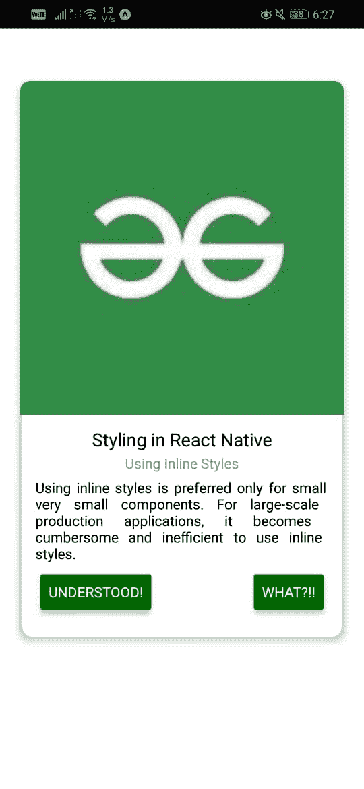
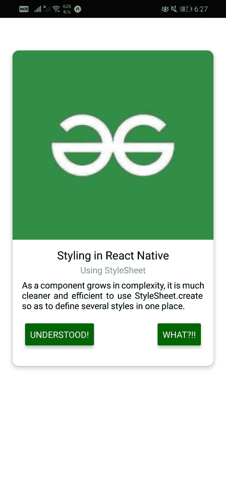

# react native 组件中有哪些不同的造型方式？

> 原文:[https://www . geeksforgeeks . org/什么是不同风格的反应式原生组件/](https://www.geeksforgeeks.org/what-are-different-ways-of-styling-in-a-react-native-component/)

反应原生中的风格不同于普通的 CSS。对于 React Native 中的样式元素，使用了 JavaScript 对象。React Native 中的每个核心组件都接受*样式*道具，该道具接受一个包含 CSS 属性名的 JavaScript 对象作为键。例如，这些对象中使用的任何 CSS 属性都遵循 camel case 约定。使用*背景色*而不是*背景色。*

**创建反应应用和模块安装:**

*   **步骤 1:** 打开终端，通过以下命令安装 expo-cli。

    ```
    npm install -g expo-cli
    ```

*   **步骤 2:** 现在通过以下命令创建一个项目。

    ```
    expo init demo-app
    ```

*   **第三步:**现在进入你的项目文件夹，即演示应用程序

    ```
    cd demo-app
    ```

**项目结构:**如下图。


**方法 1:使用内联样式:**仅对于非常小的组件，最好使用内联样式。对于大规模的生产应用程序，使用内联样式会变得麻烦和低效。

## App.js

```
import React from "react";
import { View, Image, Text, Button } from "react-native";

export default function App() {
  return (
    <View
      style={{
        height: 550,
        margin: 20,
        marginTop: 80,
        shadowColor: "#000",
        elevation: 5,
        borderRadius: 10,
      }}>
      <View
        style={{
          width: "100%",
          height: "60%",
          borderTopLeftRadius: 10,
          borderTopRightRadius: 10,
          overflow: "hidden",
        }}>
        <Image
          style={{
            width: "100%",
            height: "100%",
          }}
          source={{
            uri: 
"https://media.geeksforgeeks.org/wp-content/uploads/20210709182202/download.jpeg",
          }}
        />
      </View>
      <View
        style={{
          alignItems: "center",
          height: "20%",
          padding: 10,
        }}>
        <Text
          style={{
            fontSize: 18,
            marginVertical: 2,
          }}>
          Styling in React Native
        </Text>
        <Text
          style={{
            fontSize: 14,
            color: "#888",
          }}>
          Using Inline Styles
        </Text>
        <Text
          style={{
            fontSize: 14,
            textAlign: "justify",
            margin: 5,
          }}>
          Using inline styles is preferred only for small
          very small components. For large-scale production
          applications, it becomes cumbersome and 
          inefficient to use inline styles.
        </Text>
      </View>
      <View
        style={{
          flexDirection: "row",
          justifyContent: "space-between",
          alignItems: "center",
          height: "20%",
          paddingHorizontal: 20,
          marginTop: 10,
        }}>
        <Button color="#006600" title="Understood!" />
        <Button color="#006600" title="What?!!" />
      </View>
    </View>
  );
}
```

使用以下命令启动服务器。

```
npm run android
```

**输出:**如果你的模拟器没有自动打开，那么你需要手动打开。首先，去你的安卓工作室运行模拟器。现在再次启动服务器。



**方法 2:使用样式表:**随着组件复杂性的增加，使用*样式表. create* 在一个地方定义几个样式会更加干净和高效。

## App.js

```
import React from "react";
import { View, Image, Text, Button, StyleSheet } from "react-native";

export default function App() {
  return (
    <View style={styles.product}>
      <View style={styles.imageContainer}>
        <Image
          style={styles.image}
          source={{
            uri: 
"https://media.geeksforgeeks.org/wp-content/uploads/20210709182202/download.jpeg",
          }}
        />
      </View>
      <View style={styles.details}>
        <Text style={styles.title}>Styling in React Native</Text>
        <Text style={styles.subtitle}>Using StyleSheet</Text>
        <Text style={styles.description}>
          As a component grows in complexity, it is much cleaner 
          and efficient to use StyleSheet.create so as to define 
          several styles in one place.
        </Text>
      </View>
      <View style={styles.buttons}>
        <Button color="#006600" title="Understood!" />
        <Button color="#006600" title="What?!!" />
      </View>
    </View>
  );
}

const styles = StyleSheet.create({
  product: {
    height: 500,
    margin: 20,
    marginTop: 80,
    shadowColor: "#000",
    shadowOpacity: 0.26,
    shadowOffset: { width: 0, height: 2 },
    shadowRadius: 8,
    elevation: 5,
    borderRadius: 10,
    backgroundColor: "#fff",
  },
  imageContainer: {
    width: "100%",
    height: "60%",
    borderTopLeftRadius: 10,
    borderTopRightRadius: 10,
    overflow: "hidden",
  },
  image: {
    width: "100%",
    height: "100%",
  },
  details: {
    alignItems: "center",
    height: "20%",
    padding: 10,
  },
  title: {
    fontSize: 18,
    marginVertical: 2,
  },
  subtitle: {
    fontSize: 14,
    color: "#888",
  },
  description: {
    fontSize: 14,
    textAlign: "justify",
    margin: 5,
  },
  buttons: {
    flexDirection: "row",
    justifyContent: "space-between",
    alignItems: "center",
    height: "20%",
    paddingHorizontal: 20,
  },
});
```

使用以下命令启动服务器。

```
npm run android
```

**输出:**如果你的模拟器没有自动打开，那么你需要手动打开。首先，去你的安卓工作室运行模拟器。现在再次启动服务器。



**参考:**T2】https://reactnative.dev/docs/stylesheet