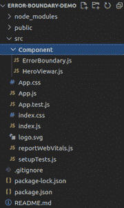
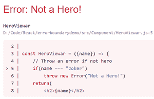
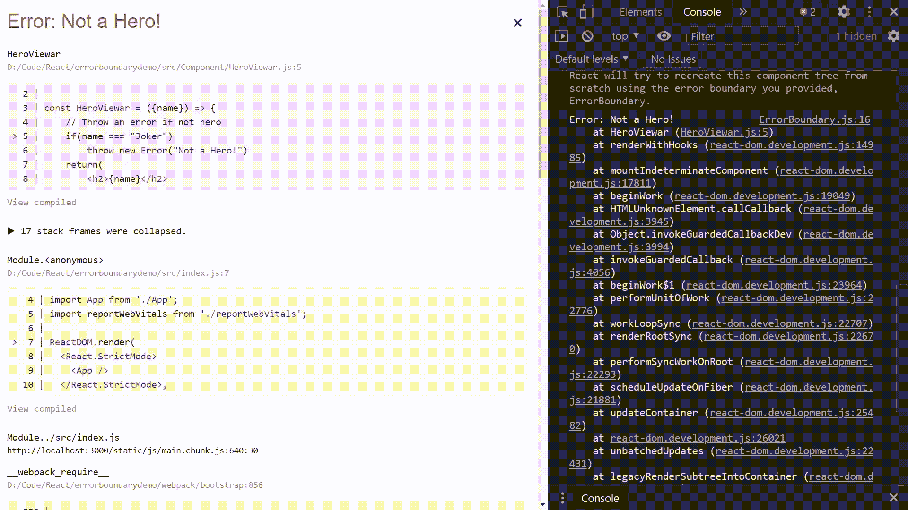

# ReactJS(16)中的错误边界是什么？

> 原文:[https://www . geeksforgeeks . org/reactjs-16/](https://www.geeksforgeeks.org/what-are-error-boundaries-in-reactjs-16/)中的错误边界是什么

呈现期间的运行时错误可能会使应用程序处于崩溃状态。React 基本上卸载了孔 react 组件树。如果我们能在他们的组件树的任何地方捕捉到错误，记录这些错误，并显示一个回退用户界面，那就太好了。这就是误差边界成为焦点的地方。实现一个或两个生命周期方法的**类组件**成为错误边界。**静态 GetDeriveStateFromError()**用于在抛出错误后呈现回退 UI。***componentdiccatch()***用于记录错误信息。

**错误边界不会捕捉到以下错误:**

*   事件处理程序
*   异步代码(例如设置超时或网络请求)
*   服务器端渲染
*   在错误边界本身(而不是其子级)中引发的错误

我们来看一个例子**不使用** ***错误边界*** 。

#### 创建反应应用程序:

**步骤 1:** 使用以下命令创建一个反应应用程序:

```
npx create-react-app error-boundary-demo
```

**第 2 步:**创建项目文件夹后，即*错误-边界-演示*，使用以下命令移动到该文件夹:

```
cd error-boundary-demo
```

**第三步:**创建一个目录并命名为 ***组件*** 。

```
mkdir Component
```

**项目结构:**如下图。



**第四步:**在这一步中，我们将创建 *HeroViewar* 组件来打印英雄的名字。如果英雄的名字是*【小丑】*，这个组件会抛出一个错误。在*组件*目录中创建***heroviewar . js*****并写下以下代码。**

## **英雄观.js**

```
import React from 'react'

const HeroViewar = ({name}) => {

    // Throw an error if not hero
    if(name === "Joker")
        throw new Error("Not a Hero!")
    return(
        <h2>{name}</h2>
    )
}

export default HeroViewar
```

****第五步:**在这一步中，我们将从 ***导入 ***HeroViewar*** 来打印一些英雄的名字。将英雄的名字作为道具传递给 ***HeroViewar*** 组件。在 ***App.js*** 文件中写下以下代码。*****

## **App.js**

```
import React from 'react'
import HeroViewar from './Component/HeroViewar'

const App = () => {
  return (
    <>
      <HeroViewar name="Superman" />
      <HeroViewar name="Batman" />
      <HeroViewar name="Joker" />
    </>
  )
}

export default App
```

****运行应用程序的步骤:**从项目的根目录使用以下命令运行应用程序:**

```
npm start
```

#### **输出:**

****

****说明:**我们的英雄有一个名字叫*【小丑】*，所以 *HeroViewar* 抛出了一个错误。如果你现在看看浏览器，你会看到整个应用程序崩溃。显然，这不好。我们想要的是，如果一个特定的组件抛出一个错误，那么只有那个组件应该返回到一个用户界面中，而其余的组件应该不受影响。**

****步骤 6:** 为了克服上述问题，React 16 引入了“错误边界”的新概念。错误边界捕获组件树中任何地方的错误，并显示一个回退用户界面。我们来补充一下。在*组件*目录中创建 ***错误边界. js*** ，并写下以下代码。**

## **ErrorBoundary.js**

```
import React, { Component } from 'react'

class ErrorBoundary extends Component {
    constructor(props) {
        super(props)
        this.state = { hasError: false }
    }

    static getDerivedStateFromError(error){

        // Update state so the next render
        // will show the fallback UI.
        return { hasError: true }
    }

    componentDidCatch(error, errorInfo) {

        // You can also log the error to
        // an error reporting service
        console.log(error, errorInfo)
    }

    render() {
        if (this.state.hasError) {

          // You can render any custom fallback UI
          return <h2>Something went wrong!</h2>
        }    
        return this.props.children 
      }
}

export default ErrorBoundary
```

****第七步:**更新 ***App.js*** 将每一个 **HeroViewar** 用 **ErrorBoundary** 包装，如:**

```
<ErrorBoundary>
    <HeroViewar name="..." />
</ErrorBoundary>
```

**写下以下代码到 ***App.js*****

## **App.js**

```
import React from 'react'
import ErrorBoundary from './Component/ErrorBoundary'
import HeroViewar from './Component/HeroViewar'

const App = () => {
  return (
    <>
    <ErrorBoundary>
      <HeroViewar name="Superman" />
    </ErrorBoundary>
    <ErrorBoundary>
      <HeroViewar name="Batman" />
    </ErrorBoundary>
    <ErrorBoundary>
      <HeroViewar name="Joker" />
    </ErrorBoundary>
    </>
  )
}

export default App
```

#### **输出:**

****