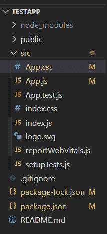
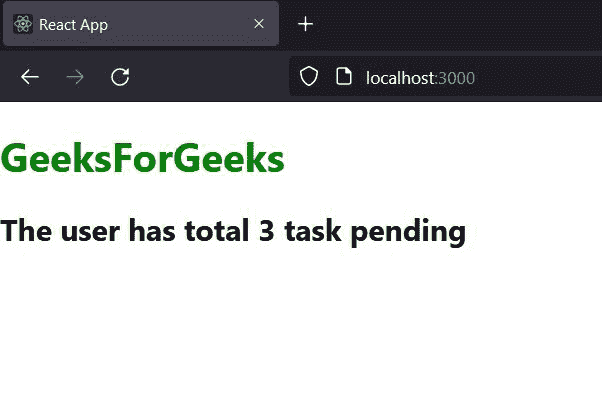
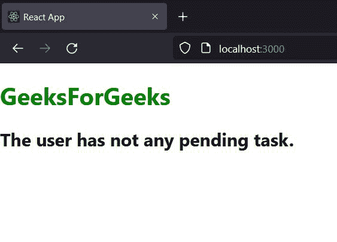

# ReactJS 中的内联条件表达式是什么？

> 原文:[https://www . geesforgeks . org/what-in-inline-conditional-expressions-in-reactjs/](https://www.geeksforgeeks.org/what-are-inline-conditional-expressions-in-reactjs/)

在 react 中，[条件渲染](https://www.geeksforgeeks.org/reactjs-conditional-rendering/)是基于特定条件显示组件的过程。例如，在构建待办事项列表应用程序时，开发人员应该仅在任何未决任务可用时才显示任务，否则他们会显示类似“没有未决任务可用”的消息

在本教程中，我们将介绍 React 中内联条件渲染的概念。正如内联条件所暗示的，我们可以将条件写在一行中。在 React 中有几种内联条件呈现的方法。

用户需要首先在他们的本地计算机上设置 react 项目环境。

**创建新的反应项目**

**第一步:**要[创建一个新的 react app](https://www.geeksforgeeks.org/reactjs-setting-development-environment/) ，运行下面的命令到你的终端。

```jsx
npx create-react-app testapp
```

**步骤 2:** 现在，使用下面的命令在项目目录中移动。

```jsx
cd testapp
```

**项目目录:**应该如下图所示。



**方法 1:内联 if-else 条件(三元)运算符**

程序员可以使用三元运算符(？: )作为一个简短的 if-else 语句。三元运算符是一个简单的 javascript 运算符，它接受 3 个操作数。

**语法:**

在使用三元运算符时，开发人员需要将整个表达式包装在大括号中。为了提高代码的可读性，用户可以将操作数包装在括号内。

```jsx
{
condition ? ("condition is true") : ("condition is false")
}
```

当条件为真时，返回“*条件为真*，否则返回“c *条件为假*”。在这里，开发人员可以包含组件作为操作数，而不是 HTML 元素。

**示例:**

现在，编辑 App.js 文件，并将下面的代码添加到其中。

**文件名:App.js**

在这个文件中，我们将声明一个变量名' *totalTask'* ，并为此赋值。接下来，我们将使用三元运算符根据“ *totalTask* 变量的值显示不同的消息。

## java 描述语言

```jsx
import React, { Component } from 'react';

// rendering differen message according to the
// value of total task variable
class App extends Component {
  render() {
    const todoList = ['write article', 'read article', 'Review article'];
    const totalTask = todoList.length;
    return (
      <div>
         <h1 style={{color: "green"}}>GeeksForGeeks</h1>
         <b>{totalTask > 0 ? 
         (<h2>The user has total {totalTask} task pending</h2>) : 
         (<h2>The user has not any task pending</h2>) }</b>       
      </div>
    );
  }
}

export default App;
```

**运行命令:**

```jsx
npm start
```

**输出:**



在上面的输出图像中，用户可以看到它显示“用户有 3 个未完成的任务”，因为用户总共有 3 个任务要做。

### **方法 2:** 内联 If 与逻辑& &运算符

这里，逻辑&&运算符是一个布尔运算符，它在 React 中的工作方式与在 Javascript 中的工作方式相同。它采用 2 个条件作为操作数。如果第一个条件为*真，*只评估第二个条件。这里，我们可以添加 react 组件，而不是添加条件作为第二个操作数。因此，如果第一个条件变为真，它只呈现 react 组件。

**语法:**

开发人员需要用大括号嵌入表达式。如果需要，他们可以将操作数包装在括号内，以保持代码干净。

```jsx
{
   (condition) && (React component or HTML code)
}
```

当条件评估*为真时，*返回右侧部分(反应组件或 HTML 代码)作为输出…

**示例:**

**文件名:App.js**

在这个文件中，我们将根据' *totalTask'* 变量的值编写一个代码来呈现消息。

## java 描述语言

```jsx
import React, { Component } from 'react';

// using inline if with logical && operator
class App extends Component {
  render() {
    const todoList = [];
    const totalTask = todoList.length;
    return (
      <div>
        <h1 style={{color: "green"}}>GeeksForGeeks</h1>
         { 
           (totalTask > 0) &&
           (<h2>The user has total {totalTask} task pending</h2>) 
         }
         {
           (totalTask === 0) &&
           (<h2>The user has not any pending task.</h2>)
         }     
      </div>
    );
  }
}

export default App;
export default App;
```

**运行命令:**

```jsx
npm start
```

**输出:**



在上面的图像中，用户可以看到，当它评估(toalTask === 0)条件为真时，它显示消息“用户没有挂起的任务”。