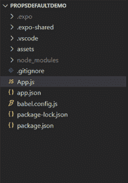
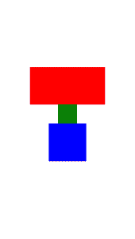
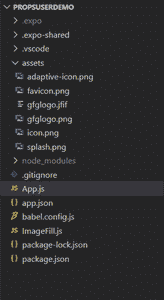
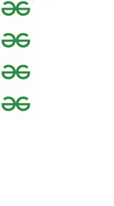

# 反应原生中有哪些道具？

> 原文:[https://www . geeksforgeeks . org/什么是反应道具-原生/](https://www.geeksforgeeks.org/what-are-props-in-react-native/)

道具用于为组件提供属性，使用这些属性可以修改和自定义组件。这些属性在组件创建时传递给组件。道具在用户定义的组件和默认组件中使用，以扩展它们的功能。这些道具是不可变的，并且在组件创建后不能更改。

```jsx
<View>
    // Remaining application code

<Component prop1 = {some value} 
    prop2 = {some value} ... propn = {some value} />

     // Remaining application code
</View>
```

组件的道具值包含在大括号中，以便在 JSX 中嵌入表达式。

**示例 1:默认组件中的道具:**在本例中，我们将看到默认情况下我们可用的组件内部道具的使用情况。

**创建反应本地应用程序:**

*   **步骤 1:** 使用以下命令创建反应原生应用程序:

    ```jsx
    expo init PropsDefaultDemo
    ```

*   **步骤 2:** 创建项目文件夹后，即 propstefaultdemo**，**使用以下命令移动到该文件夹:

    ```jsx
    cd PropsDefaultDemo
    ```

**项目结构:**会是这样的。



**实现:**在 *App.js* 中写下以下代码，展示道具的功能。这里我们将显示几个视图，其中每个视图都有不同的属性。

## App.js

```jsx
import { StatusBar } from 'expo-status-bar';
import React from 'react';
import { StyleSheet, Text, View } from 'react-native';

// Exporting default component
export default function App() {
  return (
    <View style={styles.container}>
      <View style = {styles.style1} />
      <View style = {styles.style2}/>
      <View style = {styles.style3}/>
      <View style = {styles.style4}/>
    </View>
  );
}

// Creating styles
const styles = StyleSheet.create({
  container: {
    flex: 1,
    backgroundColor: '#fff',
    alignItems: 'center',
    justifyContent: 'center',
  },
  style1:{
    backgroundColor: "red",
    height: 100,
    width: 200
  },
  style2:{
    backgroundColor: "green",
    height: 50,
    width: 50
  },
  style3:{
    backgroundColor: "blue",
    height: 100,
    width: 100
  }
});
```

**运行应用程序的步骤:**使用以下命令运行服务器。

```jsx
npm start
```

**输出:**



**示例 2:用户组件中的道具**在本节中，我们将看到用户定义的组件中道具的使用。

**创建反应本地应用程序:**

*   **步骤 1:** 使用以下命令创建反应原生应用程序:

    ```jsx
    expo init PropsUserDemo
    ```

*   **步骤 2:** 创建项目文件夹后，即 propseuderemo**，**使用以下命令移动到该文件夹:

    ```jsx
    cd PropsUserDemo
    ```

**项目结构:**会是这样的。



**实现:**创建一个名为 *ImageFill.js* 的新组件文件，该文件将在名为 count 的道具中显示指定为道具的指定次数的图像。

## image fill . js-影像填充. js

```jsx
import { View, Image, StyleSheet, ScrollView } from 'react-native';
import React from 'react';

function ImageFill(props) {
    return (
        <View style={styles.contStyle}>
            {[...Array(props.count)].map(
        () => (
          <Image source={props.image} style = {{height: 100,width: 100, 
          flex:1, flexWrap:'wrap'}}/>
        )
      )}
        </View>
    );
}

// Creating styles
const styles = StyleSheet.create({
    contStyle:{
        flex:1,
        alignItems: 'center',
        justifyContent: 'center',
        width: "100%"  
    }
});

// Exporting ImageFill Component
export default ImageFill;
```

## App.js

```jsx
import { StatusBar } from 'expo-status-bar';
import React from 'react';
import { StyleSheet, Text, View, ScrollView } from 'react-native';
import ImageFill from './ImageFill';

// Exporting default component
export default function App() {
  return (
    <ScrollView style={styles.container}>
      <ImageFill image = {require('./assets/gfglogo.png')} 
      count = {4}/>
    </ScrollView>
  );
}

// Creating styles
const styles = StyleSheet.create({
  container: {
    flex: 1,
    backgroundColor: '#fff',
    flexDirection: 'column',
    flexWrap: 'wrap',
  },
});
```

**运行应用程序的步骤:**使用以下命令运行服务器。

```jsx
npm start
```

**输出:**

